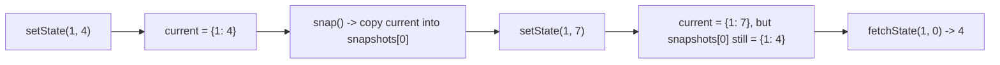

# Feature #8: Distributed Process Coordinator

## The problem

A coordinator splits a big task across `n` worker nodes and tracks each node's progress as a `state` (number of subtasks completed so far, starting at `0`). For fault tolerance, we need to be able to snapshot the entire system's state at any moment, and later ask "what was node `idx`'s state back at snapshot `snapshotId`?"

Three operations:
- `setState(idx, state)` — update a node's current progress.
- `snap()` — save the current state of all nodes, return a `snapshotId` (an incrementing counter — the 1st snapshot is id `0`, the 2nd is id `1`, etc.).
- `fetchState(idx, snapshotId)` — return node `idx`'s state as it was at the time of that snapshot.

Example: 3 nodes, all start at state `0`. `setState(1, 4)` → node 1 is now `4`. `snap()` → saves this as snapshot `0`. `setState(1, 7)` → node 1 is now `7` (but snapshot 0 still remembers `4`). `fetchState(1, 0)` → returns `4`.

This is the **Snapshot Array** pattern.

## Solution

Keep two things:

- `current: Map<idx, state>` — only nodes that have actually had `setState` called are stored (nodes default to `0` if never touched — no need to pre-fill all `n` of them).
- `snapshots: List<Map<idx, state>>` — one entry per snapshot taken, each a full copy of `current` at that moment. The list index *is* the `snapshotId`.

Operations:

- **`setState(idx, state)`:** just `current.put(idx, state)`. `O(1)`.
- **`snap()`:** copy `current` into a new map, append it to `snapshots`, and return `snapshots.size() - 1` (the id of the snapshot just taken). Copying is `O(n)` in the number of nodes touched so far.
- **`fetchState(idx, snapshotId)`:** if `snapshotId` is out of range, no such snapshot exists — return `null`. Otherwise look up `idx` in `snapshots.get(snapshotId)`; if it was never set at that point, return `0` (its default state).



## Code

```java
import java.util.*;

class Snapshot {
    private final Map<Integer, Integer> current;
    private final List<Map<Integer, Integer>> snapshots;

    public Snapshot() {
        current = new HashMap<>();
        snapshots = new ArrayList<>();
    }

    public void setState(int idx, int state) {
        current.put(idx, state);
    }

    public int snap() {
        snapshots.add(new HashMap<>(current));
        return snapshots.size() - 1;
    }

    public Integer fetchState(int idx, int snapshotId) {
        if (snapshotId < 0 || snapshotId >= snapshots.size()) {
            return null;
        }
        return snapshots.get(snapshotId).getOrDefault(idx, 0);
    }

    public static void main(String[] args) {
        Snapshot coordinator = new Snapshot();
        coordinator.setState(1, 4);
        int snap0 = coordinator.snap();          // 0
        coordinator.setState(1, 7);
        System.out.println(coordinator.fetchState(1, snap0)); // 4
        System.out.println(coordinator.fetchState(1, 5));     // null (no such snapshot)
    }
}
```

## Complexity measures

Let **n** be the number of nodes that have ever had `setState` called, and **m** be the number of snapshots taken.

| Method | Time Complexity |
|---|---|
| `setState()` | `O(1)` |
| `snap()` | `O(n)` |
| `fetchState()` | `O(1)` |

### Space Complexity

`O(n × m)` — each of the `m` snapshots stores up to `n` node states.
