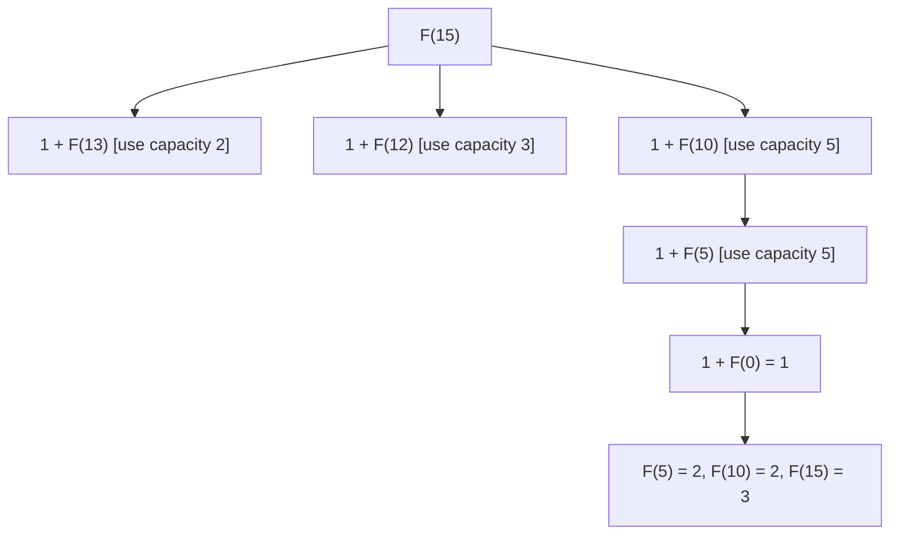

# Feature #9: Finding Minimum Servers

## The problem

We have `n` types of servers, each with a fixed workload capacity `{c0, c1, ..., cn-1}`, and an unlimited supply of each type. Given a `demand` (total workload to handle), find the **minimum number of servers** whose combined capacity is at least the demand — deploying each server has a fixed cost, so fewer servers is better.

Example: capacities `{2, 3, 5}`, demand `15` → the best combination is `5 + 5 + 5` = **3 servers**.

This is the classic **Coin Change** problem (minimum number of coins to make an amount), with "coins" replaced by "server capacities."

## Solution

Define `F(W)` = minimum number of servers needed to exactly cover workload `W`. This has optimal substructure: if the last server used has capacity `c`, then `F(W) = 1 + F(W - c)`, and we want the best choice of `c` across all server types:

```
F(W) = min over every capacity c <= W of [1 + F(W - c)]
F(0) = 0
```

Computed naively, this recursion recomputes the same sub-demands over and over (e.g. `F(1)` might get requested a dozen times from different branches) — classic overlapping subproblems, so **memoize**: cache `F(W)` in a table the first time it's computed, and look it up instantly on repeat.



If a workload can't be exactly met by any combination (e.g. capacities `{2, 4, 8}` can never sum to an odd number), that sub-demand has no valid answer — represent this with a sentinel (`-1`, or "infinity") so it's correctly excluded from the `min`.

## Code

```java
import java.util.Arrays;

class Solution {

    public static int findMinimumServers(int[] workload, int demand) {
        if (demand < 1) {
            return 0;
        }

        int[] memo = new int[demand + 1];
        Arrays.fill(memo, -2); // -2 = not yet computed
        return calculateMinimumServers(workload, demand, memo);
    }

    private static int calculateMinimumServers(int[] workload, int remaining, int[] memo) {
        if (remaining == 0) {
            return 0;
        }
        if (remaining < 0) {
            return -1; // no server fits -- dead end
        }
        if (memo[remaining] != -2) {
            return memo[remaining];
        }

        int best = -1;
        for (int capacity : workload) {
            int subResult = calculateMinimumServers(workload, remaining - capacity, memo);
            if (subResult != -1 && (best == -1 || subResult + 1 < best)) {
                best = subResult + 1;
            }
        }

        memo[remaining] = best;
        return best;
    }

    public static void main(String[] args) {
        System.out.println(findMinimumServers(new int[]{2, 3, 5}, 15)); // 3 (5+5+5)
        System.out.println(findMinimumServers(new int[]{2, 4, 8}, 6));  // 2 (2+4) -- the 8-capacity branch is a dead end
        System.out.println(findMinimumServers(new int[]{3, 5}, 1));     // -1 (impossible)
    }
}
```

## Complexity measures

Let **n** be the `demand` and **m** be the number of server types.

### Time Complexity

`O(n × m)` — there are `n` distinct sub-demands to solve (memoized, so each solved once), and each one tries all `m` server types.

### Space Complexity

`O(n)` for the memoization table.
