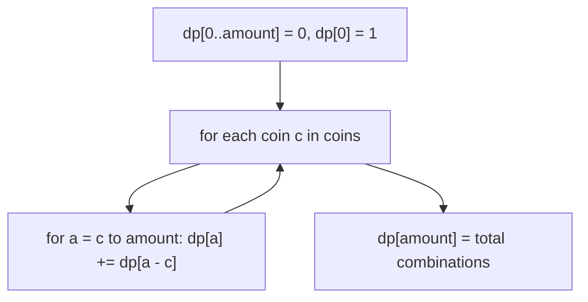

# DIY: Coin Change 2

## Problem statement

Given an `amount` and a list of unique coin denominations `coins` (unlimited supply of each), count the total number of **distinct combinations** that add up to `amount`. Return `0` if none exist.

**Constraints:** `1 <= coins.length <= 300`, `1 <= coin[i] <= 5000`, all coin values unique, `0 <= amount <= 5000`.

### Input / Output

```java
coins = [1, 2, 5], amount = 5  ->  4   // {1,1,1,1,1}, {1,1,1,2}, {1,2,2}, {5}
coins = [4],        amount = 6  ->  0   // no combination of 4s sums to 6
coins = [5],        amount = 5  ->  1   // {5}
coins = [1, 2, 5], amount = 0  ->  1   // the empty combination
```

## Coding exercise

Implement `change(coins, amount)`.

This is a sibling of the earlier coin-change problems ([Feature #9](09-feature-9-finding-minimum-servers.md), [DIY: Coin Change](19-diy-coin-change.md)) — same "unlimited supply, unbounded knapsack" family, but now **counting combinations** instead of minimizing coin count. That switch changes the DP shape: instead of `min` over choices, we **sum** over choices, and the *order* we process coins in actually matters (to avoid double-counting `{1,2}` and `{2,1}` as different combinations).

## Solution

Build `dp[a]` = number of ways to make amount `a`, with `dp[0] = 1` (there's exactly one way to make `0`: use nothing).

The key trick to avoid counting the same combination twice (as different *orderings*): process **one coin type at a time**, fully updating the `dp` array for that coin before moving to the next. For each coin `c`, for every amount `a` from `c` up to the target, add in the ways that use at least one more `c`: `dp[a] += dp[a - c]`.

Because we finish incorporating one coin type across *all* amounts before touching the next coin type, a combination is only ever built up in one fixed order (smallest-index coin first) — so `{1,1,2}` is counted exactly once, never also as `{1,2,1}` or `{2,1,1}`.



## Code

```java
class Solution {
    public static int change(int[] coins, int amount) {
        int[] dp = new int[amount + 1];
        dp[0] = 1;

        for (int coin : coins) {
            for (int a = coin; a <= amount; a++) {
                dp[a] += dp[a - coin];
            }
        }

        return dp[amount];
    }

    public static void main(String[] args) {
        System.out.println(change(new int[]{1, 2, 5}, 5)); // 4
        System.out.println(change(new int[]{4}, 6));        // 0
        System.out.println(change(new int[]{5}, 5));        // 1
        System.out.println(change(new int[]{1, 2, 5}, 0));  // 1
    }
}
```

## Complexity measures

Let **n** be `amount` and **m** be the number of coin denominations.

- **Time:** `O(n × m)`.
- **Space:** `O(n)` for the `dp` array.
