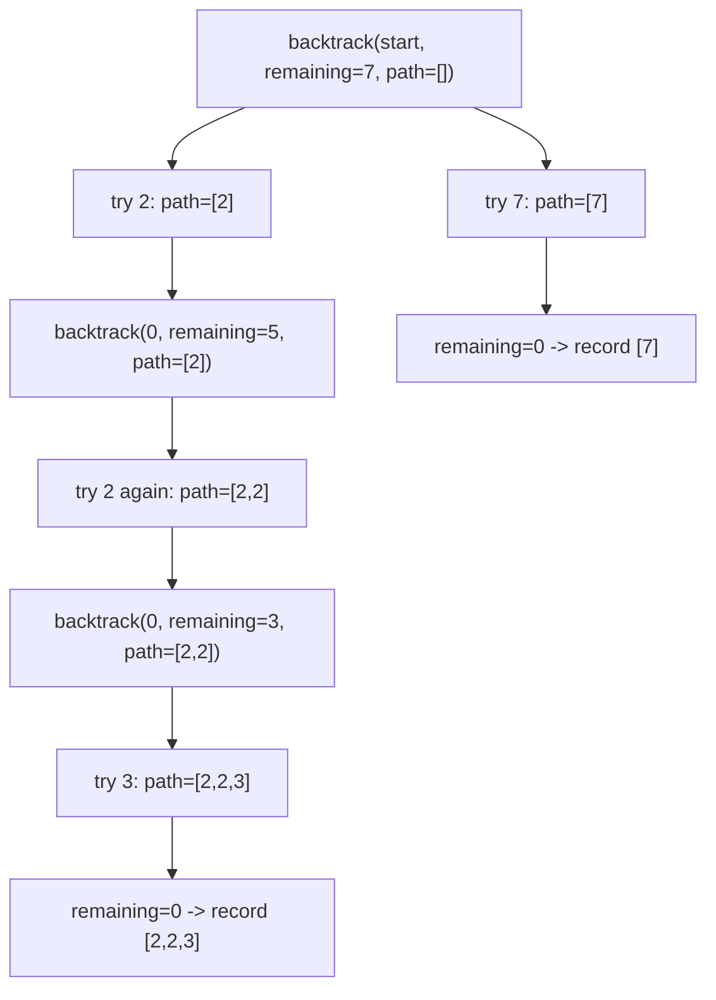

# DIY: Combination Sum

## Problem statement

Given a list of distinct integers `contenders` and a `target`, find every unique combination of numbers (each reusable an unlimited number of times) that sums to `target`. Two combinations are different if they differ in the count of at least one number. Order within the output doesn't matter.

**Constraints:** `1 <= contenders.length <= 30`, `1 <= contender[i] <= 200`, all values unique, `1 <= target <= 500`, guaranteed at most 150 unique combinations.

### Input / Output

```java
contenders = [2, 3, 6, 7], target = 7  ->  [[2,2,3], [7]]
contenders = [2, 3, 5],    target = 8  ->  [[2,2,2,2], [2,3,3], [3,5]]
contenders = [2],           target = 1  ->  []
contenders = [1],           target = 1  ->  [[1]]
contenders = [1],           target = 2  ->  [[1,1]]
```

## Coding exercise

Implement `combinationSum(contenders, target)`.

Another backtracking problem, in the same family as [Feature #9: Movie Combinations of a Genre](../01-netflix/09-feature-9-movie-combinations-of-a-genre.md) and [Feature #11: Generate Movie Viewing Orders](../01-netflix/11-feature-11-generate-movie-viewing-orders.md) — try a choice, recurse, undo, try the next. The twist here: a number can be **reused**, so the recursive call doesn't move past the current index unless it chooses to skip that number.

## Solution

Sort `contenders` first — this lets the search **prune early**: once a candidate number exceeds the remaining target, every later (larger) candidate will too, so the loop can `break` instead of checking them all.

Backtrack with `(startIndex, remaining, path)`:

1. If `remaining == 0`, `path` is a complete valid combination — record a copy of it.
2. For each candidate at index `i` from `startIndex` to the end: if `contenders[i] > remaining`, stop (everything after it is even bigger, thanks to sorting). Otherwise, add it to `path`, recurse with `(i, remaining - contenders[i], path)` — passing `i`, not `i + 1`, allows the same number to be picked again — then remove it from `path` (undo) before trying the next candidate.



## Code

```java
import java.util.*;

class Solution {

    public static List<List<Integer>> combinationSum(int[] contenders, int target) {
        Arrays.sort(contenders);
        List<List<Integer>> result = new ArrayList<>();
        backtrack(contenders, target, 0, new ArrayList<>(), result);
        return result;
    }

    private static void backtrack(int[] contenders, int remaining, int start,
                                   List<Integer> path, List<List<Integer>> result) {
        if (remaining == 0) {
            result.add(new ArrayList<>(path));
            return;
        }

        for (int i = start; i < contenders.length; i++) {
            if (contenders[i] > remaining) {
                break;
            }

            path.add(contenders[i]);
            backtrack(contenders, remaining - contenders[i], i, path, result);
            path.remove(path.size() - 1);
        }
    }

    public static void main(String[] args) {
        System.out.println(combinationSum(new int[]{2, 3, 6, 7}, 7));
        // [[2, 2, 3], [7]]
        System.out.println(combinationSum(new int[]{2, 3, 5}, 8));
        // [[2, 2, 2, 2], [2, 3, 3], [3, 5]]
    }
}
```

## Complexity measures

Let **t** be `target` and **n** be the number of contenders.

- **Time:** `O(n^(t/min(contenders)))` in the worst case — exponential, bounded in practice by the pruning and the guarantee of at most 150 valid combinations.
- **Space:** `O(t / min(contenders))` for the recursion depth (excluding the output storage).
