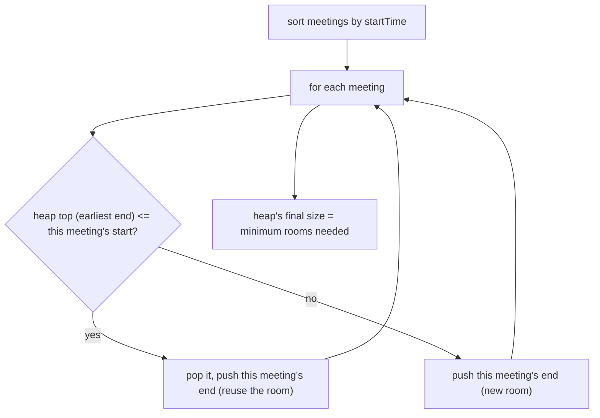

# Feature #1: Find Meeting Rooms

## The problem

Given a set of meetings, each with a `startTime` and `endTime`, find the minimum number of rooms needed so no two overlapping meetings share a room.

```java
meetings = {{2,8}, {3,4}, {3,9}, {5,11}, {8,20}, {11,15}}
```

Giving every meeting its own room would need 6 — wasteful. Looking closely, `{2,8}`, `{3,4}`, and `{3,9}` all overlap each other at some point, so those three alone force at least 3 simultaneous rooms. The whole schedule can actually be handled with just **3 rooms**.

This is the classic **Meeting Rooms II** problem.

## Solution

Think of it as room *reuse*: process meetings in start-time order, and whenever a room becomes free (its current meeting has ended), reuse that room for the next meeting instead of allocating a new one.

To always know "which room frees up soonest," keep a **min heap of end times** — one entry per room currently in use, keyed by when that room's current meeting ends.

1. Sort meetings by `startTime`.
2. Give the first meeting a room; push its `endTime` onto the heap.
3. For each subsequent meeting (in start-time order): peek the heap's smallest end time. If that end time is `<=` the current meeting's start time, the earliest-freeing room is actually free by now — pop it and push the current meeting's `endTime` in its place (reusing that room).
4. If the smallest end time is still *after* the current meeting's start (no room is free yet), push a new end time onto the heap — this meeting needs a brand-new room.
5. After processing every meeting, the heap's final size is the minimum number of rooms needed (the peak number of rooms ever in simultaneous use).



## Code

```java
import java.util.Arrays;
import java.util.PriorityQueue;

class Solution {

    public static int minMeetingRooms(int[][] meetingTimes) {
        if (meetingTimes.length == 0) {
            return 0;
        }

        Arrays.sort(meetingTimes, (a, b) -> a[0] - b[0]);

        PriorityQueue<Integer> endTimes = new PriorityQueue<>();
        endTimes.offer(meetingTimes[0][1]);

        for (int i = 1; i < meetingTimes.length; i++) {
            int start = meetingTimes[i][0];
            int end = meetingTimes[i][1];

            if (endTimes.peek() <= start) {
                endTimes.poll();
            }
            endTimes.offer(end);
        }

        return endTimes.size();
    }

    public static void main(String[] args) {
        int[][] meetings = {{2, 8}, {3, 4}, {3, 9}, {5, 11}, {8, 20}, {11, 15}};
        System.out.println(minMeetingRooms(meetings)); // 3
    }
}
```

## Complexity measures

Let **n** be the number of meetings.

### Time Complexity

`O(n log n)` — sorting is `O(n log n)`, and each of the `n` meetings does at most one push and one pop on a heap of size `O(n)`.

### Space Complexity

`O(n)` — the heap holds at most one entry per room, up to `n` in the worst case (all meetings mutually overlapping).
