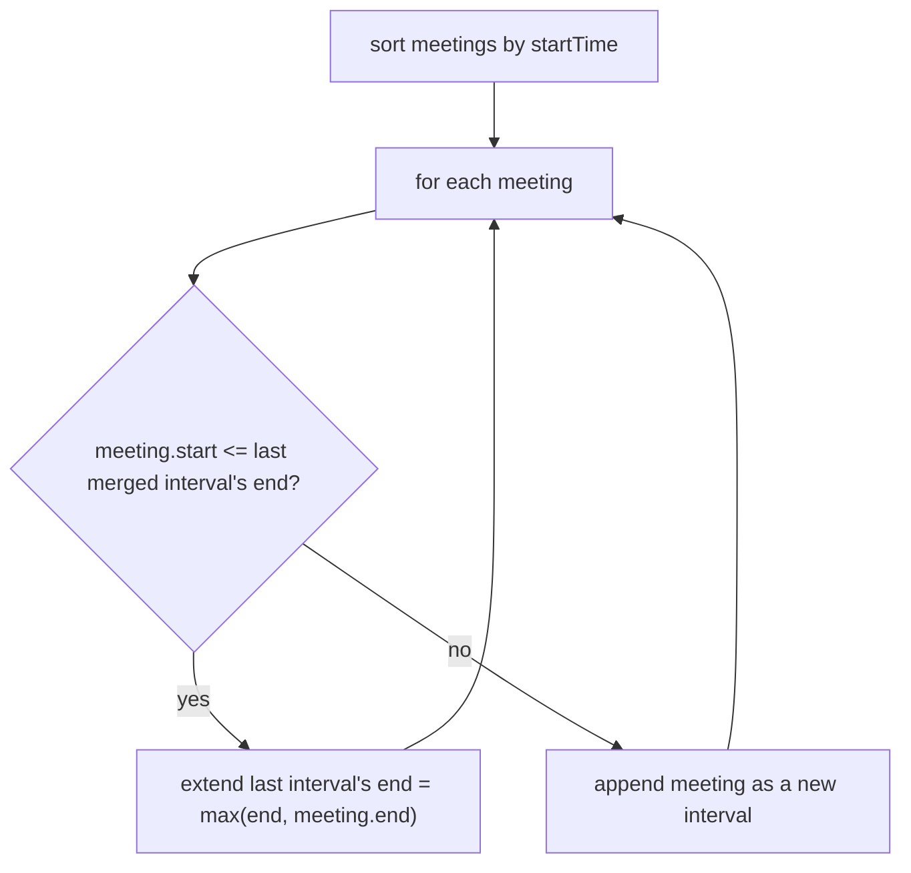

# Feature #2: Show Busy Schedule

## The problem

Show a user's busy hours to others, without exposing individual meeting details. Overlapping or back-to-back meetings should be merged into single busy blocks.

```java
meetings = [[1,4], [2,5], [6,8], [7,9], [10,13]]
```

`[1,4]` and `[2,5]` overlap, as do `[6,8]` and `[7,9]`. Merged: `[[1,5], [6,9], [10,13]]`.

This is the classic **Merge Intervals** problem.

## Solution

Sort by start time first — once sorted, any two intervals that should merge are guaranteed to be **adjacent** in the sorted order, so a single linear pass suffices.

1. Sort meetings by `startTime`.
2. Walk through them, keeping a `merged` list. For each meeting, compare it to the **last** interval already placed in `merged`:
   - If the current meeting's `startTime` is `<=` that last interval's `endTime`, they overlap (or touch) — merge them by extending the last interval's `endTime` to `max(last.endTime, current.endTime)`.
   - Otherwise, the current meeting starts a new busy block — append it to `merged` as-is.
3. `merged` now holds the fully consolidated busy schedule.



## Code

```java
import java.util.ArrayList;
import java.util.Arrays;

class Solution {
    public static int[][] mergeMeetings(int[][] meetingTimes) {
        if (meetingTimes.length == 0) {
            return new int[0][0];
        }

        Arrays.sort(meetingTimes, (a, b) -> Integer.compare(a[0], b[0]));

        ArrayList<int[]> merged = new ArrayList<>();
        merged.add(meetingTimes[0]);

        for (int i = 1; i < meetingTimes.length; i++) {
            int[] last = merged.get(merged.size() - 1);
            int[] current = meetingTimes[i];

            if (current[0] <= last[1]) {
                last[1] = Math.max(last[1], current[1]);
            } else {
                merged.add(current);
            }
        }

        return merged.toArray(new int[0][]);
    }

    public static void main(String[] args) {
        int[][] meetings = {{1, 4}, {2, 5}, {6, 8}, {7, 9}, {10, 13}};
        int[][] busy = mergeMeetings(meetings);
        for (int[] block : busy) {
            System.out.println("[" + block[0] + ", " + block[1] + "]");
        }
        // [1, 5]
        // [6, 9]
        // [10, 13]
    }
}
```

## Complexity measures

Let **n** be the number of meetings.

### Time Complexity

`O(n log n)` — dominated by the sort; the merge pass itself is `O(n)`.

### Space Complexity

`O(1)` extra (excluding the output list, which holds at most `n` merged intervals).
