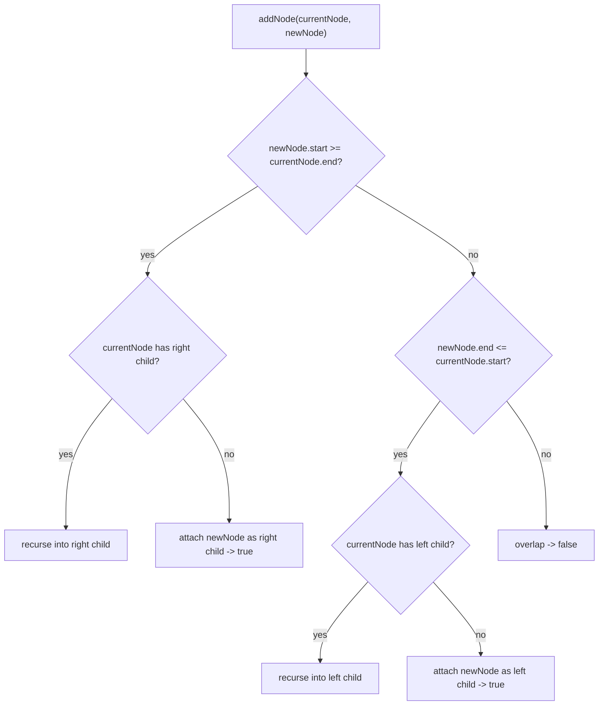

# Feature #3: Check if Meeting is Possible

## The problem

Before scheduling a meeting with User B, check whether it conflicts with anything already on User B's calendar. (User A is assumed already free — no need to check their side.)

Given User B's existing non-overlapping meetings `{{1,3}, {4,6}, {8,10}, {10,12}, {13,15}}`:
- A proposed meeting `{7,8}` doesn't overlap anything → schedulable, `true`.
- A proposed meeting `{9,11}` overlaps both `{8,10}` and `{10,12}` → not schedulable, `false`.

This is the **My Calendar I** pattern.

## Solution

A brute-force scan against every existing meeting works, but a **Binary Search Tree** keyed by time ranges makes each check `O(log n)` (with a balanced tree) instead of scanning everything.

Each BST node holds a meeting's `(start, end)`. To insert (or check) a new meeting against the tree:

- If the new meeting starts at or after the current node's `end` (`newNode.start >= currentNode.end`), there's no conflict with this node — it belongs somewhere in the **right** subtree (later meetings). Recurse right.
- Else if the new meeting ends at or before the current node's `start` (`newNode.end <= currentNode.start`), it belongs in the **left** subtree (earlier meetings). Recurse left.
- Otherwise, the two ranges overlap — return `false`, no valid placement exists.

This works because the tree maintains the invariant "no two nodes overlap," so each node cleanly splits time into "everything before me" and "everything after me."



## Code

```java
class Node {
    int start;
    int end;
    Node left;
    Node right;

    Node(int start, int end) {
        this.start = start;
        this.end = end;
    }
}

class BST {
    private Node root;

    public boolean insert(int start, int end) {
        Node newNode = new Node(start, end);
        if (root == null) {
            root = newNode;
            return true;
        }
        return addNode(root, newNode);
    }

    private boolean addNode(Node currentNode, Node newNode) {
        if (newNode.start >= currentNode.end) {
            if (currentNode.right == null) {
                currentNode.right = newNode;
                return true;
            }
            return addNode(currentNode.right, newNode);
        } else if (newNode.end <= currentNode.start) {
            if (currentNode.left == null) {
                currentNode.left = newNode;
                return true;
            }
            return addNode(currentNode.left, newNode);
        }
        return false; // overlap
    }
}

class Solution {
    public static boolean checkMeeting(int[][] existingMeetings, int[] newMeeting) {
        BST schedule = new BST();
        for (int[] meeting : existingMeetings) {
            schedule.insert(meeting[0], meeting[1]);
        }
        return schedule.insert(newMeeting[0], newMeeting[1]);
    }

    public static void main(String[] args) {
        int[][] existing = {{1, 3}, {4, 6}, {8, 10}, {10, 12}, {13, 15}};

        System.out.println(checkMeeting(existing, new int[]{7, 8}));  // true
        System.out.println(checkMeeting(existing, new int[]{9, 11})); // false
    }
}
```

## Complexity measures

Let **n** be the number of existing meetings.

### Time Complexity

`O(n²)` in the worst case (a degenerate, chain-like tree), but `O(n log n)` with a self-balancing BST (e.g. an AVL tree).

### Space Complexity

`O(n)` for the tree's nodes.
