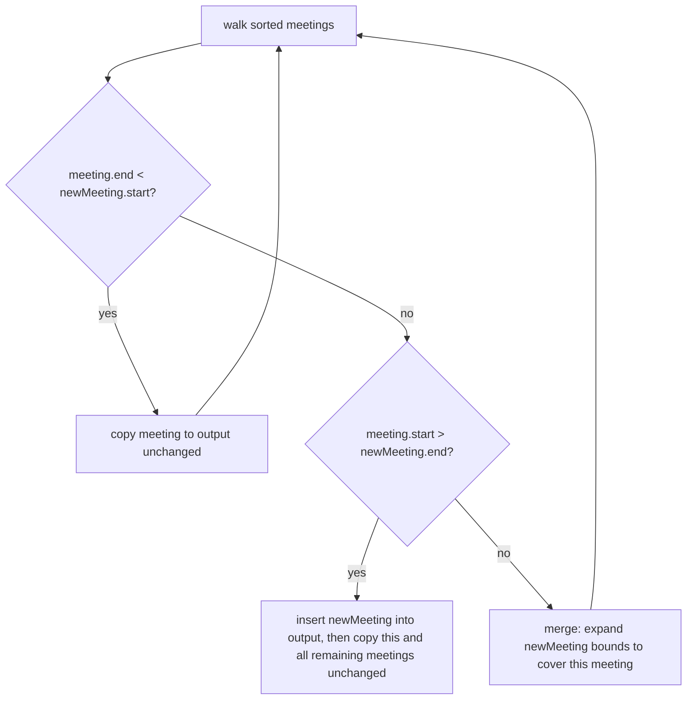

# Feature #4: Schedule a New Meeting

## The problem

Insert a new meeting into an already non-overlapping schedule, merging it with any existing meetings it overlaps or touches.

```java
existing = {{1,3}, {4,6}, {8,10}, {10,12}, {13,15}, {16,18}}
newMeeting = {9, 13}
```

`{9,13}` overlaps `{8,10}` and `{10,12}`, and after merging becomes `{8,13}` — which is now adjacent to `{13,15}`, so that gets folded in too. Final: `{{1,3}, {4,6}, {8,15}, {16,18}}`.

This is the classic **Insert Interval** problem.

## Solution

Since the existing schedule is already sorted and non-overlapping, walk through it once and bucket each meeting into one of three groups relative to the new meeting:

1. **Meetings entirely before the new meeting** (`meeting.end < newMeeting.start`): no overlap possible — copy them to the output as-is.
2. **Meetings that overlap or touch the new meeting** (everything that isn't clearly before or after): fold each one into the new meeting by expanding its bounds — `newMeeting.start = min(newMeeting.start, meeting.start)`, `newMeeting.end = max(newMeeting.end, meeting.end)`. Don't add these individually; they're being absorbed.
3. Once we hit a meeting that starts after the (possibly now-expanded) new meeting ends, the merging phase is over — add the fully-merged `newMeeting` to the output, then copy the rest of the meetings (**entirely after**) unchanged.



## Code

```java
import java.util.ArrayList;
import java.util.List;

class Solution {

    public static int[][] scheduleNewMeeting(int[][] meetings, int[] newMeeting) {
        List<int[]> output = new ArrayList<>();
        int i = 0;
        int n = meetings.length;
        int start = newMeeting[0];
        int end = newMeeting[1];

        // 1. Meetings entirely before the new one.
        while (i < n && meetings[i][1] < start) {
            output.add(meetings[i]);
            i++;
        }

        // 2. Meetings overlapping or touching the new one -- absorb them.
        while (i < n && meetings[i][0] <= end) {
            start = Math.min(start, meetings[i][0]);
            end = Math.max(end, meetings[i][1]);
            i++;
        }
        output.add(new int[]{start, end});

        // 3. Meetings entirely after the new one.
        while (i < n) {
            output.add(meetings[i]);
            i++;
        }

        return output.toArray(new int[0][]);
    }

    public static void main(String[] args) {
        int[][] existing = {{1, 3}, {4, 6}, {8, 10}, {10, 12}, {13, 15}, {16, 18}};
        int[][] result = scheduleNewMeeting(existing, new int[]{9, 13});

        for (int[] meeting : result) {
            System.out.println("[" + meeting[0] + ", " + meeting[1] + "]");
        }
        // [1, 3]
        // [4, 6]
        // [8, 15]
        // [16, 18]
    }
}
```

## Complexity measures

Let **n** be the number of existing meetings.

### Time Complexity

`O(n)` — each meeting is visited exactly once across the three phases.

### Space Complexity

`O(n)` for the output list.
