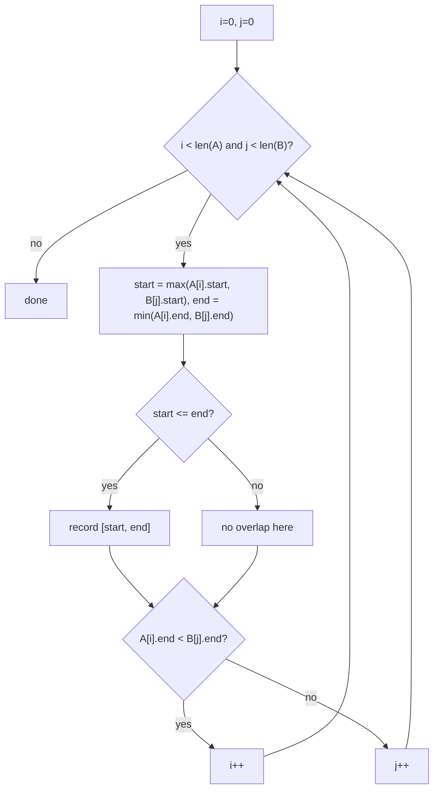

# Feature #5: Find Common Meeting Times

## The problem

Given two users' schedules (each internally non-overlapping and sorted by start time), find every time interval when **both** users are busy.

```java
meetingsA = {{1,3}, {5,6}, {7,9}}
meetingsB = {{2,3}, {5,7}}
```

Both busy during: `{{2,3}, {5,6}}`.

This is the **Interval List Intersections** problem.

## Solution

Two pointers, one per schedule — a merge-style sweep, similar in spirit to merging two sorted lists.

1. `i = 0`, `j = 0`, walking `meetingsA` and `meetingsB` respectively.
2. At each step, check whether `meetingsA[i]` and `meetingsB[j]` overlap: the overlap's start is `max(A[i].start, B[j].start)` and its end is `min(A[i].end, B[j].end)`. If `start <= end`, that's a genuine overlap — record `[start, end]`.
3. Advance whichever pointer's meeting **ends first**: if `A[i].end < B[j].end`, increment `i` (meeting A[i] can't overlap anything further in B); otherwise increment `j`. This is the same "advance the one that finishes earlier" logic used in [Feature #2](02-feature-2-show-busy-schedule.md)-style interval sweeps.
4. Stop when either pointer runs off the end of its list.



## Code

```java
import java.util.ArrayList;
import java.util.List;

class Solution {

    public static int[][] findCommonMeetingTimes(int[][] meetingsA, int[][] meetingsB) {
        List<int[]> result = new ArrayList<>();
        int i = 0, j = 0;

        while (i < meetingsA.length && j < meetingsB.length) {
            int start = Math.max(meetingsA[i][0], meetingsB[j][0]);
            int end = Math.min(meetingsA[i][1], meetingsB[j][1]);

            if (start <= end) {
                result.add(new int[]{start, end});
            }

            if (meetingsA[i][1] < meetingsB[j][1]) {
                i++;
            } else {
                j++;
            }
        }

        return result.toArray(new int[0][]);
    }

    public static void main(String[] args) {
        int[][] meetingsA = {{1, 3}, {5, 6}, {7, 9}};
        int[][] meetingsB = {{2, 3}, {5, 7}};

        int[][] common = findCommonMeetingTimes(meetingsA, meetingsB);
        for (int[] interval : common) {
            System.out.println("[" + interval[0] + ", " + interval[1] + "]");
        }
        // [2, 3]
        // [5, 6]
    }
}
```

## Complexity measures

Let **n** and **m** be the number of meetings in `meetingsA` and `meetingsB`.

### Time Complexity

`O(n + m)` — each pointer advances at least once per iteration, so combined they can't take more than `n + m` steps.

### Space Complexity

`O(max(n, m))` for the output, since the number of overlaps is bounded by the smaller schedule's meeting count.
