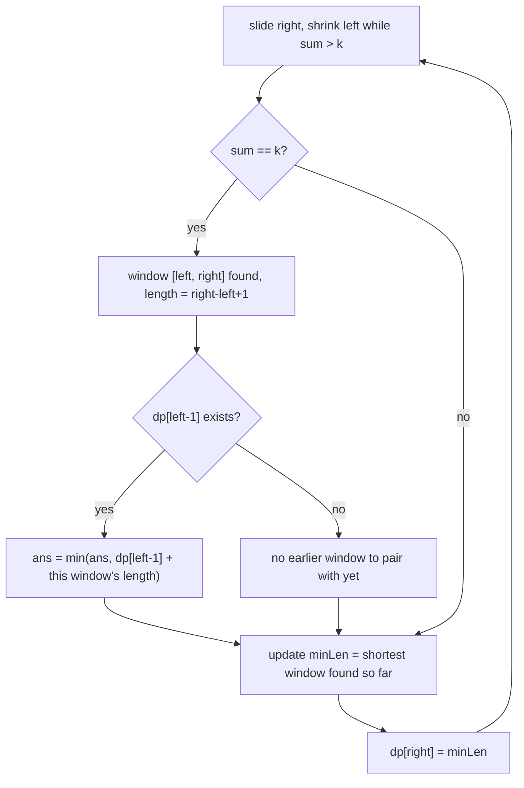

# Feature #6: Find Two Sets of Consecutive Days

## The problem

Schedule two separate board-selection meetings, each spanning **consecutive days**, each needing exactly `k` mutually-free hours total. The second meeting can't start on the very last day of the first (no overlap), but doesn't need to start immediately after either. Each meeting should span as few days as possible, and we want the combined total days across both meetings minimized.

We're given the number of mutually-free hours for each day in a row: `hoursPerDay`. Find two **non-overlapping** contiguous windows, each summing to exactly `k`, minimizing their combined length.

```java
hoursPerDay = {1, 2, 2, 3, 2, 6, 7, 2, 1, 4, 8}
k = 5
```

Windows summing to exactly 5: `{1,2,2}` (3 days), `{3,2}` (2 days), `{1,4}` (2 days). The two shortest, non-overlapping windows are `{3,2}` and `{1,4}` — 2 + 2 = **4** total days.

This is the **Two Non-Overlapping Subarrays Each With Target Sum** problem.

## Solution

Since every value is non-negative (hours can't be negative), a **sliding window** finds windows summing to exactly `k` in one linear pass: expand `right`, and whenever the running sum exceeds `k`, shrink from `left` until it's back at or under `k`.

The harder part is picking the best **pair** of non-overlapping windows. The trick: maintain `dp[i]` = the shortest valid window (summing to `k`) that ends anywhere at or before index `i`. Then, whenever the sliding window finds a valid window `[left, right]`, it can potentially pair with an earlier one — look up `dp[left - 1]` (the best window ending strictly before this one starts) and combine: `dp[left - 1] + (right - left + 1)`.

Track the best such combination seen across the whole scan as `ans`.



Because `dp[i]` only ever looks *backward* (windows ending before the current one starts), every pair considered is guaranteed non-overlapping.

## Code

```java
import java.util.Arrays;

class Solution {

    public static int twoSetsOfDays(int[] hoursPerDay, int k) {
        int n = hoursPerDay.length;
        int[] dp = new int[n];
        Arrays.fill(dp, Integer.MAX_VALUE / 2);

        int left = 0;
        int sum = 0;
        int minLen = Integer.MAX_VALUE / 2;
        int ans = Integer.MAX_VALUE;

        for (int right = 0; right < n; right++) {
            sum += hoursPerDay[right];
            while (sum > k) {
                sum -= hoursPerDay[left];
                left++;
            }

            if (sum == k) {
                int curLen = right - left + 1;
                if (left - 1 >= 0 && dp[left - 1] < Integer.MAX_VALUE / 2) {
                    ans = Math.min(ans, dp[left - 1] + curLen);
                }
                minLen = Math.min(minLen, curLen);
            }

            dp[right] = minLen;
        }

        return ans == Integer.MAX_VALUE ? -1 : ans;
    }

    public static void main(String[] args) {
        int[] hoursPerDay = {1, 2, 2, 3, 2, 6, 7, 2, 1, 4, 8};
        System.out.println(twoSetsOfDays(hoursPerDay, 5)); // 4
    }
}
```

## Complexity measures

Let **n** be the length of `hoursPerDay`.

### Time Complexity

`O(n)` — the sliding window pointers each advance at most `n` times total.

### Space Complexity

`O(n)` for the `dp` array.
