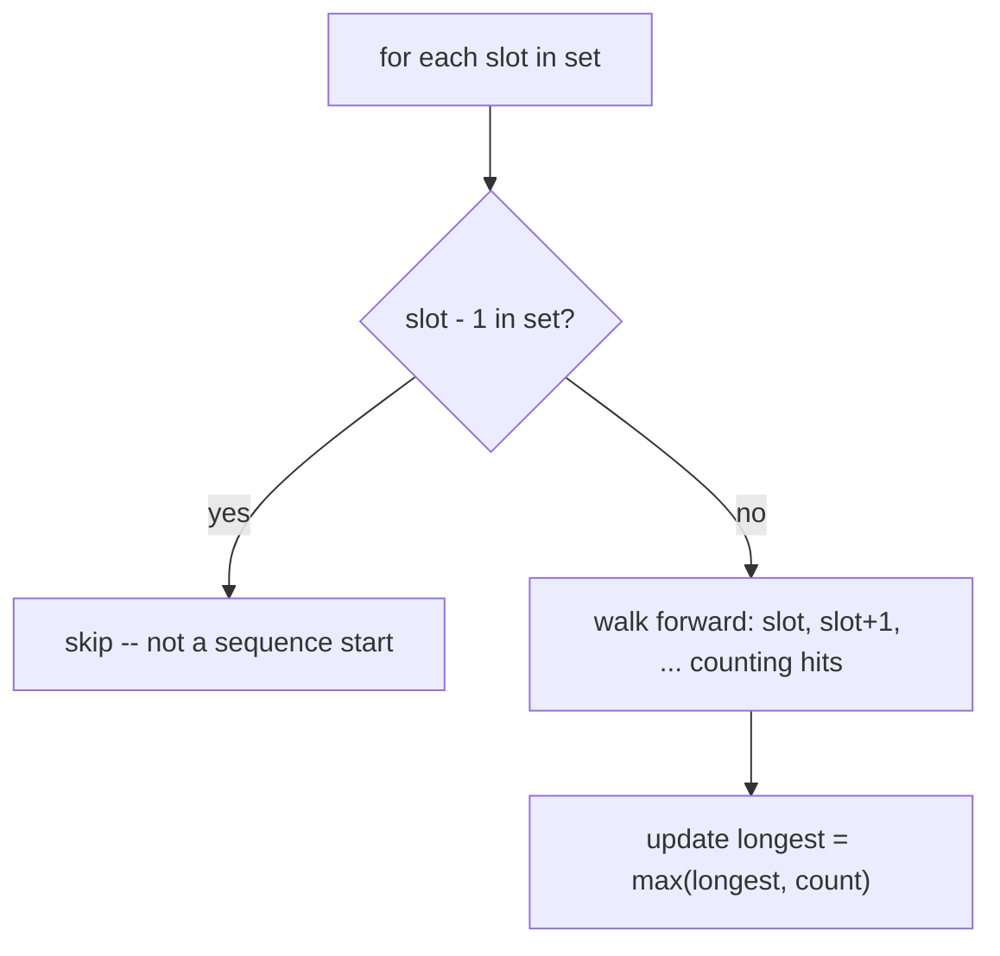

# Feature #7: Longest Busy Period

## The problem

A workday is divided into 15-minute slots numbered `1, 2, 3, ...`. Given a jumbled list of slots that are booked, find the length of the longest run of **consecutive** busy slots.

```java
busySlots = {3, 1, 15, 5, 2, 12, 10, 4, 8, 9}
```

The longest consecutive run is `{1,2,3,4,5}` — length **5**.

This is the classic **Longest Consecutive Sequence** problem.

## Solution

The naive approach — for every slot, walk forward checking `slot+1`, `slot+2`, ... in the array — costs `O(n)` per lookup, `O(n²)` overall. Put every slot into a **HashSet** instead, so "is this slot booked?" becomes `O(1)`.

The key optimization to hit `O(n)` overall: only start counting a sequence from a slot that is a **true starting point** — i.e., `slot - 1` is *not* in the set. If `slot - 1` is present, this slot is the middle (or end) of some sequence that will get counted when we reach its actual start; skip it here.

1. Put every busy slot into a `HashSet`.
2. For each slot in the set: if `slot - 1` is also in the set, skip it (not a sequence start).
3. Otherwise, this slot starts a fresh sequence — walk forward (`slot, slot+1, slot+2, ...`) counting how many consecutive slots are in the set.
4. Track the maximum count seen.



Because the inner "walk forward" loop only ever runs from genuine sequence starts, and every slot belongs to exactly one sequence, the total work across *all* forward-walks combined is `O(n)` — even though it looks like a nested loop, it's not quadratic (each slot is visited by the inner walk at most once, ever).

## Code

```java
import java.util.HashSet;
import java.util.Set;

class Solution {

    public static int longestBusyPeriod(int[] busySlots) {
        Set<Integer> schedule = new HashSet<>();
        for (int slot : busySlots) {
            schedule.add(slot);
        }

        int longest = 0;

        for (int slot : schedule) {
            if (schedule.contains(slot - 1)) {
                continue; // not a sequence start
            }

            int currentSlot = slot;
            int count = 1;
            while (schedule.contains(currentSlot + 1)) {
                currentSlot++;
                count++;
            }

            longest = Math.max(longest, count);
        }

        return longest;
    }

    public static void main(String[] args) {
        int[] busySlots = {3, 1, 15, 5, 2, 12, 10, 4, 8, 9};
        System.out.println(longestBusyPeriod(busySlots)); // 5
    }
}
```

## Complexity measures

Let **n** be the number of busy slots.

### Time Complexity

`O(n)` — building the set is `O(n)`, and the combined work of every forward-walk across the whole algorithm is also `O(n)`, since each slot is only ever extended from once.

### Space Complexity

`O(n)` for the `HashSet`.
