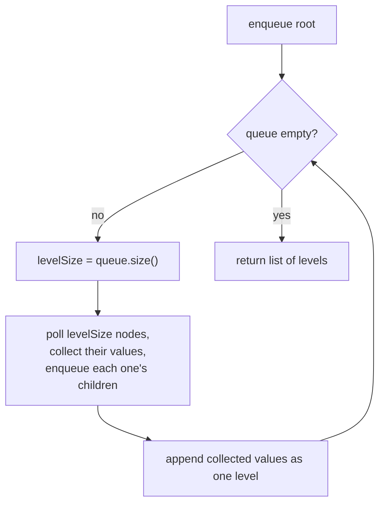

# Feature #1: Traversing DOM Tree

## The problem

Before any stock data can be found on a page, the scraper needs a way to walk the page's structure. A website's HTML is naturally a tree: the `<body>` tag is the root, and every nested tag is a child node. Unlike a binary tree, though, a `<body>` (or `<div>`, or `<nav>`) can have any number of children — this is an **n-ary tree**.

Given the root node of this tree, we need to return the values of every level, left to right, in separate groups, so each level's content can be analyzed on its own:

```html
<body>
  <nav>
    <a>About</a>
  </nav>
  <p>Paragraph</p>
</body>
```

For this tiny page, the level-by-level output should be:

```
[[body], [nav, p], [a]]
```

This is exactly the classic **N-ary Tree Level Order Traversal** problem.

## Solution

Since every node on the same level needs to be grouped together before moving to the next level, this calls for **Breadth-First Search (BFS)**. A queue naturally processes nodes level by level, as long as we're careful to only drain the nodes that belong to the *current* level before letting the next level's nodes in.

1. Push the root node onto a queue.
2. While the queue isn't empty, first record its current size — that's exactly how many nodes belong to the level about to be processed.
3. Poll that many nodes off the queue, collecting their values into a list for the current level, and as each node is polled, push all of its children onto the queue (they'll be processed on the next iteration).
4. Add the current level's list to the result, then repeat until the queue is empty.



## Code

```java
import java.util.*;

class TreeNode {
    String val;
    List<TreeNode> children;

    TreeNode(String x) {
        val = x;
        children = new ArrayList<>();
    }
}

class Solution {

    public static List<List<String>> levelOrder(TreeNode root) {
        List<List<String>> result = new ArrayList<>();
        if (root == null) {
            return result;
        }

        Queue<TreeNode> queue = new LinkedList<>();
        queue.offer(root);

        while (!queue.isEmpty()) {
            int levelSize = queue.size();
            List<String> currentLevel = new ArrayList<>();

            for (int i = 0; i < levelSize; i++) {
                TreeNode node = queue.poll();
                currentLevel.add(node.val);
                for (TreeNode child : node.children) {
                    queue.offer(child);
                }
            }

            result.add(currentLevel);
        }

        return result;
    }

    public static void main(String[] args) {
        // <body><nav><a>About</a></nav><p>Paragraph</p></body>
        TreeNode body = new TreeNode("body");
        TreeNode nav = new TreeNode("nav");
        TreeNode p = new TreeNode("p");
        TreeNode a = new TreeNode("a");
        body.children.add(nav);
        body.children.add(p);
        nav.children.add(a);

        System.out.println(levelOrder(body));
        // [[body], [nav, p], [a]]
    }
}
```

## Complexity measures

Let **n** be the total number of nodes in the DOM tree.

### Time Complexity

`O(n)` — every node is enqueued and dequeued exactly once.

### Space Complexity

`O(n)` — the result holds every node's value, and the queue can hold up to `O(n)` nodes at the widest level of the tree.
