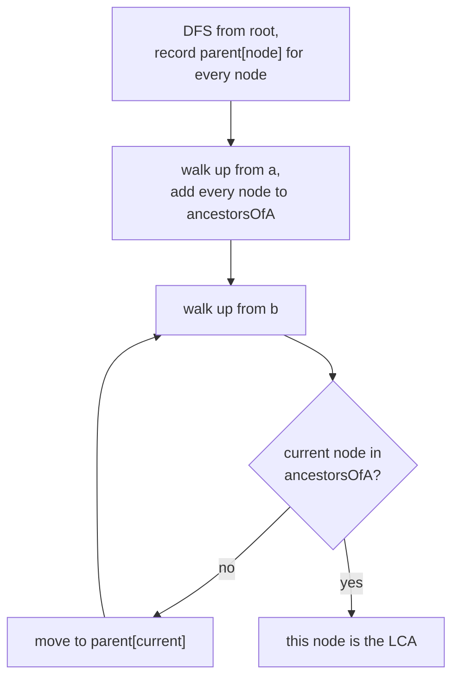

# Feature #2: Locating Stock Data

## The problem

Now that the DOM tree can be traversed, the next challenge is figuring out *where* in that tree the stock data actually lives. The data we care about is a set of dates paired with stock price percentage changes — but finding them in an arbitrary page's HTML is hard, since every site lays its content out differently.

The approach: score every node on how likely it is to be a **date** or a **stock percentage**, based on the text inside it.

A node looks like a date if:
- its text starts with a capital letter,
- its text ends in a number,
- its text contains a `#` symbol,
- its text is under ten characters.

A node looks like a stock percentage if:
- its text is short,
- its text contains a number,
- its text contains a `+` or `-` sign,
- its text contains a `%` sign.

After scoring, we're left with two standout nodes: the one with the highest date score, and the one with the highest stock-percentage score. Once we have those two nodes, we compute their **Lowest Common Ancestor (LCA)** in the tree — in practice, that ancestor's subtree contains essentially all the dates and matching percentages, so the scraper never has to search the rest of the page.

For example, in a tree rooted at `1`, if the highest-scoring date node is `4` and the highest-scoring percentage node is `5` (both children of `2`), their LCA is `2` — and node `2`'s subtree is exactly where the scraper should keep looking.

## Solution

Call the two identified nodes `a` and `b`. The idea is to record each node's parent while traversing the tree, then walk upward from both nodes until their paths to the root meet.

1. Traverse the tree from the root (a simple DFS with a stack works fine), recording every node's parent in a dictionary as it's visited.
2. Once traversal is complete, walk from `a` up through its recorded parents all the way to the root, adding every node encountered — including `a` itself — into an **ancestors set**.
3. Walk from `b` up through its parents. The first node in that walk that's already in the ancestors set is the LCA — it's the first point where the two upward paths converge.



## Code

```java
import java.util.*;

class TreeNode {
    int val;
    List<TreeNode> children;

    TreeNode(int x) {
        val = x;
        children = new ArrayList<>();
    }
}

class Solution {

    public static TreeNode lca(TreeNode root, TreeNode a, TreeNode b) {
        Map<TreeNode, TreeNode> parent = new HashMap<>();
        parent.put(root, null);

        Deque<TreeNode> stack = new ArrayDeque<>();
        stack.push(root);

        // Traverse until both target nodes have a recorded parent.
        while (!parent.containsKey(a) || !parent.containsKey(b)) {
            TreeNode node = stack.pop();
            for (TreeNode child : node.children) {
                parent.put(child, node);
                stack.push(child);
            }
        }

        Set<TreeNode> ancestorsOfA = new HashSet<>();
        TreeNode curr = a;
        while (curr != null) {
            ancestorsOfA.add(curr);
            curr = parent.get(curr);
        }

        curr = b;
        while (!ancestorsOfA.contains(curr)) {
            curr = parent.get(curr);
        }

        return curr;
    }

    public static void main(String[] args) {
        //         1
        //        / \
        //       2   3
        //      / \
        //     4   5
        TreeNode root = new TreeNode(1);
        TreeNode n2 = new TreeNode(2);
        TreeNode n3 = new TreeNode(3);
        TreeNode n4 = new TreeNode(4);
        TreeNode n5 = new TreeNode(5);
        root.children.add(n2);
        root.children.add(n3);
        n2.children.add(n4);
        n2.children.add(n5);

        System.out.println(lca(root, n4, n5).val); // 2 (highest date/percent scores under the same subtree)
        System.out.println(lca(root, n4, n3).val); // 1
    }
}
```

## Complexity measures

Let **n** be the number of nodes in the DOM tree.

### Time Complexity

`O(n)` — in the worst case, the DFS visits every node once to build the parent map, and both upward walks are bounded by the tree's height (at most `n`).

### Space Complexity

`O(n)` — the parent map, the ancestors set, and the DFS stack can each hold up to `n` entries.
