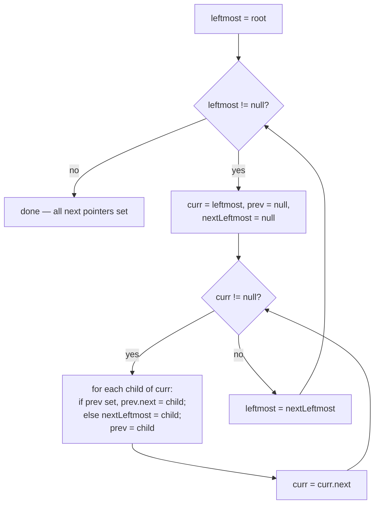

# Feature #3: Traversing DOM Tree II

## The problem

The BFS-with-a-queue traversal from Feature #1 works, but it costs `O(n)` extra space for the queue — and with how many pages this scraper might crawl, that space adds up fast. We want a leaner way to walk the tree, level by level, without a queue.

The fix: build a **shadow tree** where every node gets an extra `next` pointer, linking it to the next node at the same level (or `null` if it's the last node on that level). Once every node has its `next` pointer set, the whole tree can be walked level by level like a set of linked lists — no queue required.

Given the root of an n-ary tree (again, the `<body>` tag), the task is to set every node's `next` pointer to point at its immediate right neighbor on the same level.

## Solution

The DOM tree pulled from a real page is arbitrary — a node might have one child or fifty, and there's no guarantee of anything like a perfect tree shape. So instead of assuming structure, the trick is to exploit one fact: **whenever we're standing on a node at level L, we already have direct access to all of its children (level L + 1)** — this is exactly the right moment to wire up their `next` pointers.

To avoid connecting children of *different* parents out of order, we only descend to level L + 1 once every node at level L has had its `next` pointer set.

1. Start at the root. It's the only node on level 1, so its `next` is already `null` — nothing to do there. Instead, begin by wiring up the `next` pointers of *its* children (level 2).
2. To walk across level L (whose `next` pointers were already set while processing level L − 1), keep a `curr` pointer and follow the chain of `next` links like a linked list — no queue needed.
3. For each `curr` node visited, connect its children to each other in order: keep a `prev` pointer that starts `null`; every time a new child is found, if `prev` isn't null, set `prev.next` to that child, then advance `prev` to it.
4. Track the leftmost node of the *next* level (the first child found while sweeping the current level) — that becomes the new `curr` starting point once this level is fully wired.
5. Repeat until a level produces no children — that's the last level, and the traversal is done.



## Code

```java
import java.util.*;

class TreeNode {
    String val;
    TreeNode next;
    List<TreeNode> children;

    TreeNode(String x) {
        val = x;
        next = null;
        children = new ArrayList<>();
    }
}

class Solution {

    public static TreeNode connect(TreeNode root) {
        if (root == null) {
            return null;
        }

        TreeNode leftmost = root;
        while (leftmost != null) {
            TreeNode curr = leftmost;
            TreeNode prev = null;
            TreeNode nextLeftmost = null;

            while (curr != null) {
                for (TreeNode child : curr.children) {
                    if (prev != null) {
                        prev.next = child;
                    } else {
                        nextLeftmost = child;
                    }
                    prev = child;
                }
                curr = curr.next;
            }

            leftmost = nextLeftmost;
        }

        return root;
    }

    public static void main(String[] args) {
        // <body><nav><a>About</a></nav><p>Paragraph</p></body>
        TreeNode body = new TreeNode("body");
        TreeNode nav = new TreeNode("nav");
        TreeNode p = new TreeNode("p");
        TreeNode a = new TreeNode("a");
        body.children.add(nav);
        body.children.add(p);
        nav.children.add(a);

        connect(body);
        // body.next == null
        // nav.next == p, p.next == null
        // a.next == null
        System.out.println(body.next);           // null
        System.out.println(nav.next.val);         // p
        System.out.println(p.next);               // null
        System.out.println(a.next);                // null
    }
}
```

## Complexity measures

Let **n** be the total number of nodes in the tree.

### Time Complexity

`O(n)` — every node is visited exactly once to wire up its children's `next` pointers.

### Space Complexity

`O(1)` extra space — no queue is used; only a handful of pointers (`leftmost`, `curr`, `prev`, `nextLeftmost`) are needed regardless of tree size.
