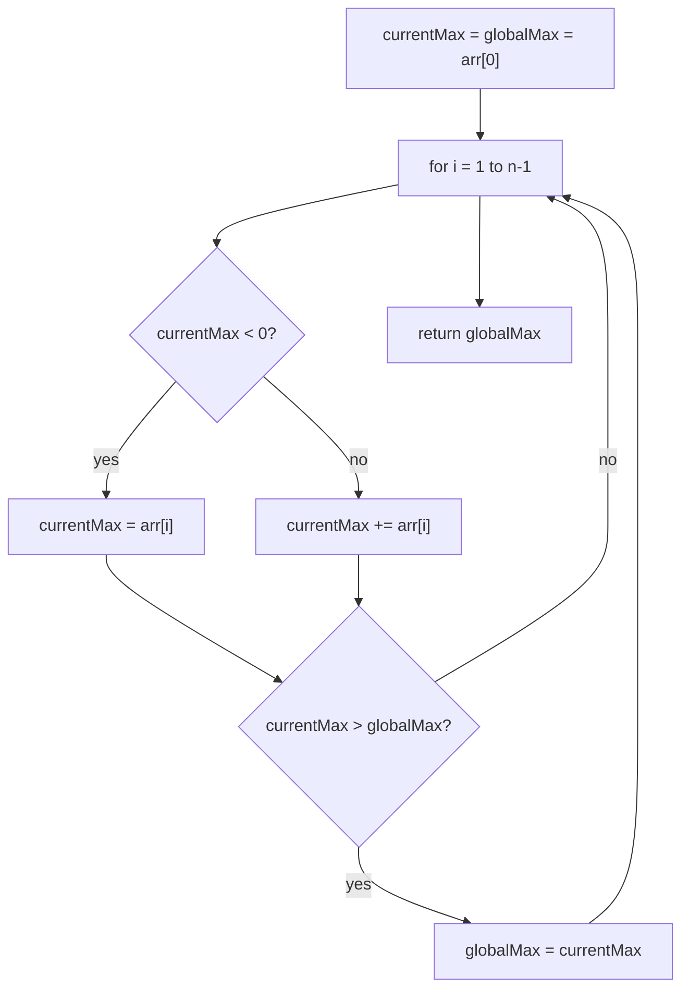

# Feature #4: Maximum Profit

## The problem

Once the scraper has pulled a stock's daily increase and decrease percentages out of the DOM (rounded to whole numbers to keep things simple), those numbers form an array — one entry per consecutive day. Positive means the stock went up that day, negative means it went down.

The question: over this whole period, what's the largest total gain achievable by summing up some *contiguous* run of days? Sometimes there's no genuinely good run at all, and the best "profit" is actually a loss — the algorithm should still surface that minimum-loss stretch.

```java
percentages = {-4, 2, -5, 1, 2, 3, 6, -5, 1}
```

The days `1, 2, 3, 6` (indexes 3 through 6) sum to **12** — the largest possible contiguous sum in this array.

This is the classic **Maximum Subarray** problem, usually solved with **Kadane's algorithm**.

## Solution

Scan the array once, and at every position ask: "what's the best sum of a subarray that *ends here*?" Keep two running values as you go:

- `currentMax` — the best sum of a subarray ending at the current index.
- `globalMax` — the best `currentMax` seen so far, across the whole scan.

1. Initialize both `currentMax` and `globalMax` to the array's first element.
2. Walk the array starting from the second element. For each element:
   - If `currentMax` has dropped below zero, it's dragging down any subarray it's extended into — reset `currentMax` to just the current element (start fresh from here).
   - Otherwise, extend the run: add the current element to `currentMax`.
3. After updating `currentMax`, compare it against `globalMax` and keep the larger of the two.
4. After the full scan, `globalMax` holds the answer.



## Code

```java
class Solution {

    public static int maxProfit(int[] percentages) {
        if (percentages.length < 1) {
            return 0;
        }

        int currentMax = percentages[0];
        int globalMax = percentages[0];

        for (int i = 1; i < percentages.length; i++) {
            if (currentMax < 0) {
                currentMax = percentages[i];
            } else {
                currentMax += percentages[i];
            }

            if (currentMax > globalMax) {
                globalMax = currentMax;
            }
        }

        return globalMax;
    }

    public static void main(String[] args) {
        int[] percentages = {-4, 2, -5, 1, 2, 3, 6, -5, 1};
        System.out.println(maxProfit(percentages)); // 12
    }
}
```

## Complexity measures

Let **n** be the number of days (array length).

### Time Complexity

`O(n)` — the array is scanned exactly once.

### Space Complexity

`O(1)` — only two running variables (`currentMax`, `globalMax`) are kept, regardless of array size.
