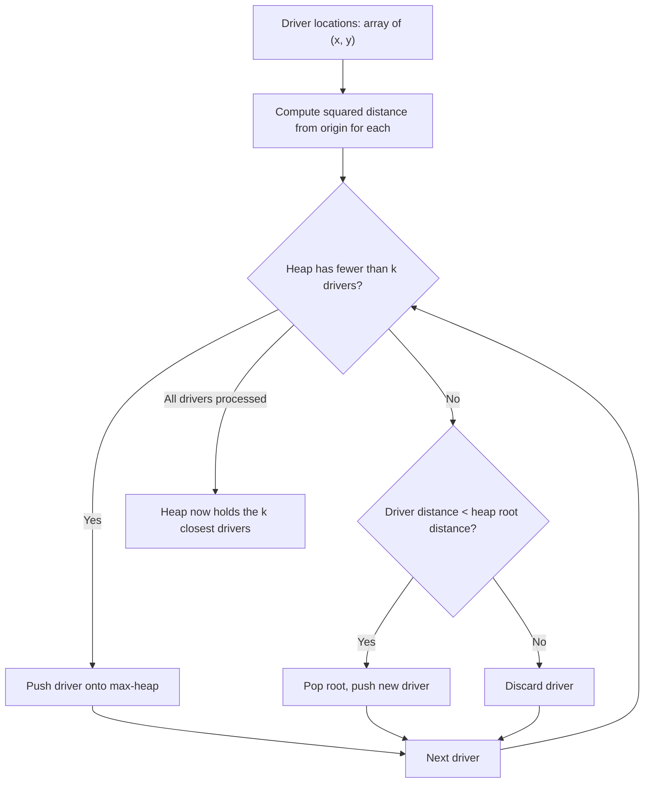

# Feature #1: Select Closest Drivers

## The problem

Picture the city as a Cartesian plane, with the user sitting right at the origin **(0, 0)**. Scattered around are Uber drivers, each at their own `(x, y)` coordinate. When a user requests a ride, we want to find the **k** drivers closest to them — not necessarily sorted, just the k nearest — while ignoring everyone farther away.

For example, say the drivers are at `(1, 3)`, `(-2, 2)`, `(2, -2)`, and we want the `k = 2` closest to the user at `(0, 0)`. We shouldn't have to sort every driver in the city by exact distance just to answer this — that's wasteful when the city might have thousands of drivers online and we only care about a handful of them.

## Solution

The distance from a driver at `(x, y)` to the user at the origin is the Euclidean distance, `sqrt(x^2 + y^2)`. Since we only ever *compare* distances, we can skip the square root entirely and compare squared distances — cheaper, and no loss of correctness since squaring preserves ordering for non-negative numbers.

The key realization: we don't need the exact sorted order of all drivers, just the k smallest. That's exactly what a **max-heap of size k** is built for.

1. Push the first k drivers onto a max-heap, keyed by squared distance.
2. For every remaining driver, compare their distance to the heap's root (the current *largest* of our k candidates).
3. If the new driver is closer than that root, pop the root and push the new driver in its place.
4. After scanning everyone, the heap holds exactly the k closest drivers — in no particular order, but that's fine, we just need the set.

The max-heap trick is what keeps this fast: at any moment, the heap holds our "best k so far," and the root is the only one worth kicking out.



## Code

```java
import java.util.*;

class Solution {
    public static int[][] kClosestDrivers(int[][] locations, int k) {
        // Max-heap ordered by squared distance from the origin — root is the farthest of our k so far.
        PriorityQueue<int[]> maxHeap = new PriorityQueue<>(
            (a, b) -> (b[0] * b[0] + b[1] * b[1]) - (a[0] * a[0] + a[1] * a[1])
        );

        for (int[] location : locations) {
            maxHeap.offer(location);
            if (maxHeap.size() > k) {
                maxHeap.poll(); // evict the current farthest driver
            }
        }

        return maxHeap.toArray(new int[0][]);
    }

    public static void main(String[] args) {
        int[][] driverLocations = {{1, 3}, {-2, 2}, {2, -2}};
        int[][] closest = kClosestDrivers(driverLocations, 2);
        for (int[] driver : closest) {
            System.out.println(Arrays.toString(driver));
        }
        // [2, -2]
        // [-2, 2]
        // (order may vary — these are the 2 closest to (0,0); (1,3) is farther away)
    }
}
```

## Complexity measures

Let **n** be the number of drivers and **k** the number we want to keep.

### Time Complexity

`O(n × log k)` — every driver is compared against the heap root in `O(1)`, and a push/pop when it qualifies costs `O(log k)`.

### Space Complexity

`O(k)` — the heap never holds more than k drivers at a time.
