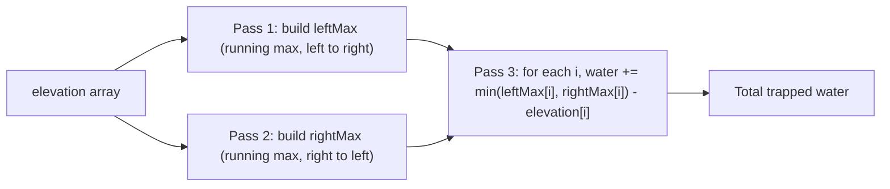

# Feature #2: Path Cost

## The problem

Now that we've shortlisted nearby drivers, we need to know how expensive it'll be for each of them to actually reach the user. Part of that cost comes from rainwater pooling on broken or uneven roads — a road-condition API gives us the road's elevation profile between two checkpoints as an array of heights, and we need to figure out how much water has collected in the dips.

For example, given the elevation profile `[0, 1, 0, 2, 1, 0, 1, 3, 2, 1, 2, 1]`, water collects in every low spot that has a taller "wall" on both sides. Here, the total trapped water works out to **6** units.

## Solution

Think of each index as a 1-unit-wide column. Water can only sit above a column if there's something taller on *both* the left and the right to hold it in — and the amount of water above that column is limited by whichever of those two walls is shorter (water spills over the short side otherwise).

That gives us a clean formula for the water above any index `X`:

```
water(X) = min(leftMax, rightMax) - elevation[X]
```

where `leftMax` is the tallest bar anywhere to the left of X (including X), and `rightMax` is the tallest bar anywhere to the right of X (including X).

So the plan is:

1. Sweep left to right, building a `leftMax` array where `leftMax[i]` is the highest elevation seen from the start up to `i`.
2. Sweep right to left, building a `rightMax` array the same way, from the end back to `i`.
3. Sweep once more, and for each index add `min(leftMax[i], rightMax[i]) - elevation[i]` to a running total (this is always ≥ 0, since `leftMax[i]` and `rightMax[i]` both include `elevation[i]` itself).

Three linear passes, no nested loops — each index only ever needs to know the tallest wall to either side of it.



## Code

```java
class Solution {
    // Computes the total water trapped between checkpoints, given the road's elevation profile.
    public static int pathCost(int[] elevationMap) {
        int n = elevationMap.length;
        if (n == 0) return 0;

        int[] leftMax = new int[n];
        int[] rightMax = new int[n];

        leftMax[0] = elevationMap[0];
        for (int i = 1; i < n; i++) {
            leftMax[i] = Math.max(leftMax[i - 1], elevationMap[i]);
        }

        rightMax[n - 1] = elevationMap[n - 1];
        for (int i = n - 2; i >= 0; i--) {
            rightMax[i] = Math.max(rightMax[i + 1], elevationMap[i]);
        }

        int water = 0;
        for (int i = 0; i < n; i++) {
            water += Math.min(leftMax[i], rightMax[i]) - elevationMap[i];
        }
        return water;
    }

    public static void main(String[] args) {
        int[] elevationMap = {0, 1, 0, 2, 1, 0, 1, 3, 2, 1, 2, 1};
        System.out.println(pathCost(elevationMap));
        // 6
    }
}
```

## Complexity measures

Let **n** be the length of the elevation profile.

### Time Complexity

`O(n)` — three separate passes over the array, each linear.

### Space Complexity

`O(n)` — the `leftMax` and `rightMax` arrays each hold n values.
