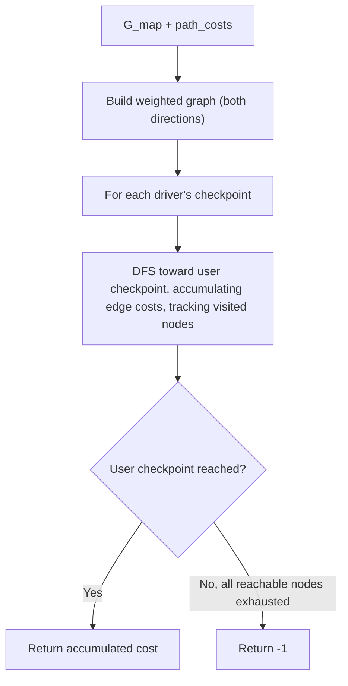

# Feature #3: Plot and Select Path

## The problem

We've got a shortlist of nearby drivers and we know how to cost a single road segment. Now we need to string those segments together: given the city map as a list of checkpoint-to-checkpoint roads (each with a cost), and a list of candidate drivers sitting at various checkpoints, find whether each driver actually has a path to the user — and if so, what it costs to get there.

A driver might *not* have a path at all — maybe they're mid-ride and their checkpoint is disconnected from the user's location in our current map view, or they've just gone offline. In that case we report `-1` for them instead of a cost.

For example, say the city map `G_map` is `[["a","b"], ["b","c"], ["a","e"], ["d","e"]]` with matching `path_costs = [12, 23, 26, 18]`, the candidate `drivers` are `["c", "d", "e", "f"]`, and the `user` is at checkpoint `"a"`. Driver `c` has to go `c → b → a`, costing `23 + 12 = 35`. Driver `d` goes `d → e → a`, costing `18 + 26 = 44`. Driver `e` goes straight to `a`, costing `26`. Driver `f` isn't connected to anything in the map at all, so the answer for `f` is `-1`.

## Solution

Strip away the ride-hailing story and this is just: "does a path exist between two nodes in a graph, and if so, what's its total edge weight?" That's a textbook graph traversal problem.

1. **Build the graph** from `G_map` and `path_costs` — treat each checkpoint as a node, and each entry in `G_map` as an edge between two checkpoints, weighted by the matching cost. Roads work both ways, so add the edge in both directions.
2. **For each driver**, run a DFS from the driver's checkpoint, looking for the user's checkpoint, accumulating edge costs along the way and keeping a visited set so we don't loop forever on cycles.
3. If the DFS reaches the user, return the accumulated cost. If it exhausts every reachable node without finding the user (or the driver's checkpoint doesn't exist in the graph at all), return `-1`.

DFS is the natural fit here because we just need *a* path (any path) and its cost — we're not hunting for the shortest one, just confirming reachability and totaling the cost along the way.



## Code

```java
import java.util.*;

class Solution {
    // Builds the weighted graph, then for each driver finds the cost of the path to the user (or -1).
    public static double[] getTotalCost(List<List<String>> gMap, double[] pathCosts,
                                         List<String> drivers, String user) {
        Map<String, Map<String, Double>> city = new HashMap<>();

        // Step 1: build the city graph from the map and its per-edge costs.
        for (int i = 0; i < gMap.size(); i++) {
            String source = gMap.get(i).get(0);
            String dest = gMap.get(i).get(1);
            city.computeIfAbsent(source, k -> new HashMap<>()).put(dest, pathCosts[i]);
            city.computeIfAbsent(dest, k -> new HashMap<>()).put(source, pathCosts[i]);
        }

        double[] result = new double[drivers.size()];
        for (int i = 0; i < drivers.size(); i++) {
            result[i] = dfs(city, drivers.get(i), user, new HashSet<>());
        }
        return result;
    }

    // Returns the accumulated cost from `current` to `target`, or -1 if no path exists.
    private static double dfs(Map<String, Map<String, Double>> city, String current,
                               String target, Set<String> visited) {
        if (current.equals(target)) return 0;
        if (!city.containsKey(current)) return -1; // driver isn't even on the map

        visited.add(current);
        for (Map.Entry<String, Double> neighbor : city.get(current).entrySet()) {
            if (!visited.contains(neighbor.getKey())) {
                double rest = dfs(city, neighbor.getKey(), target, visited);
                if (rest != -1) {
                    return rest + neighbor.getValue();
                }
            }
        }
        return -1;
    }

    public static void main(String[] args) {
        List<List<String>> gMap = Arrays.asList(
            Arrays.asList("a", "b"),
            Arrays.asList("b", "c"),
            Arrays.asList("a", "e"),
            Arrays.asList("d", "e")
        );
        double[] pathCosts = {12, 23, 26, 18};
        List<String> drivers = Arrays.asList("c", "d", "e", "f");

        double[] costs = getTotalCost(gMap, pathCosts, drivers, "a");
        System.out.println(Arrays.toString(costs));
        // [35.0, 44.0, 26.0, -1.0]
    }
}
```

## Complexity measures

Let **n** be the number of checkpoints in `G_map` and **m** be the number of drivers.

### Time Complexity

`O(n)` to build the graph, plus `O(m × n)` in the worst case since each of the m drivers may DFS across all n checkpoints — an overall `O(m × n)`.

### Space Complexity

`O(m + n)` — `O(n)` for the graph's adjacency structure and `O(n)` for the visited set per DFS call, plus `O(m)` for the result array.
