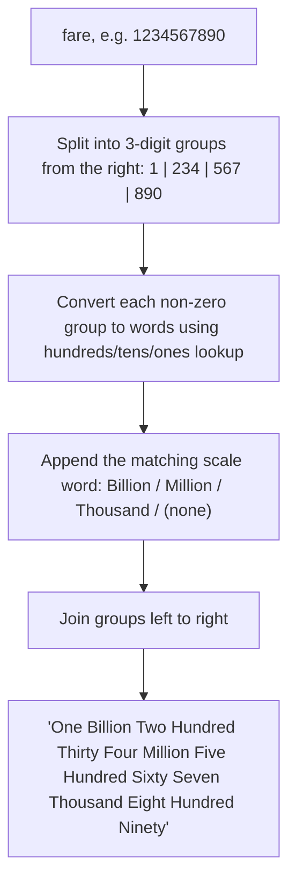

# Feature #4: Fare in Words

## The problem

At the end of a ride, the app shows the fare as a number. For accessibility, we also want to *speak* it out loud through a text-to-speech engine — which means converting the numeric fare into its English word form. For example, a fare of `120` should become `"One Hundred Twenty"` (dollars). Fares could realistically run into the billions in some currencies, so the solution needs to handle large numbers, not just two or three digits.

## Solution

Big numbers are naturally chunked into groups of three digits — thousands, millions, billions — and English happens to name each of those groups. `1234567890` splits into `1 | 234 | 567 | 890`, which reads as `One Billion Two Hundred Thirty Four Million Five Hundred Sixty Seven Thousand Eight Hundred Ninety`. So the whole problem reduces to two smaller ones:

1. **How do I convert any 3-digit chunk (0-999) into words?** Split it into hundreds, tens, and ones. The hundreds digit is easy (`"X Hundred"`). The tens and ones need a bit of care because English is irregular from 10-19 (`"Eleven"`, `"Twelve"`, ... aren't built from a pattern) — so those get their own lookup table, and only 20+ follows the regular `"Twenty"`, `"Thirty"`, ... + ones-digit pattern.
2. **How do I stitch the chunks together?** Walk the number in groups of three from the *right*, converting each chunk with step 1, and append the matching scale word (`"Thousand"`, `"Million"`, `"Billion"`) — skipping any chunk that's all zeros (so `1,000,090` doesn't end up with a stray `"Zero Thousand"`).



## Code

```java
class Solution {
    private static final String[] BELOW_20 = {
        "", "One", "Two", "Three", "Four", "Five", "Six", "Seven", "Eight", "Nine", "Ten",
        "Eleven", "Twelve", "Thirteen", "Fourteen", "Fifteen", "Sixteen", "Seventeen", "Eighteen", "Nineteen"
    };
    private static final String[] TENS = {
        "", "", "Twenty", "Thirty", "Forty", "Fifty", "Sixty", "Seventy", "Eighty", "Ninety"
    };
    private static final String[] THOUSANDS = {"", "Thousand", "Million", "Billion"};

    public static String fareInWords(int fare) {
        if (fare == 0) return "Zero";

        StringBuilder result = new StringBuilder();
        int group = 0;

        while (fare > 0) {
            if (fare % 1000 != 0) {
                String chunk = threeDigitsToWords(fare % 1000);
                String scale = THOUSANDS[group].isEmpty() ? "" : " " + THOUSANDS[group];
                result.insert(0, chunk + scale + " ");
            }
            fare /= 1000;
            group++;
        }

        return result.toString().trim();
    }

    // Converts a number from 0-999 into words.
    private static String threeDigitsToWords(int n) {
        StringBuilder sb = new StringBuilder();
        if (n >= 100) {
            sb.append(BELOW_20[n / 100]).append(" Hundred ");
            n %= 100;
        }
        if (n >= 20) {
            sb.append(TENS[n / 10]).append(" ");
            n %= 10;
        }
        if (n > 0) {
            sb.append(BELOW_20[n]).append(" ");
        }
        return sb.toString().trim();
    }

    public static void main(String[] args) {
        System.out.println(fareInWords(120));
        // One Hundred Twenty

        System.out.println(fareInWords(1234567890));
        // One Billion Two Hundred Thirty Four Million Five Hundred Sixty Seven Thousand Eight Hundred Ninety
    }
}
```

## Complexity measures

Let **n** be the number of digits in the fare.

### Time Complexity

`O(n)` — the number is processed in groups of 3 digits, a constant amount of work per group.

### Space Complexity

`O(1)` — aside from the output string, we only use a few fixed-size lookup tables.
