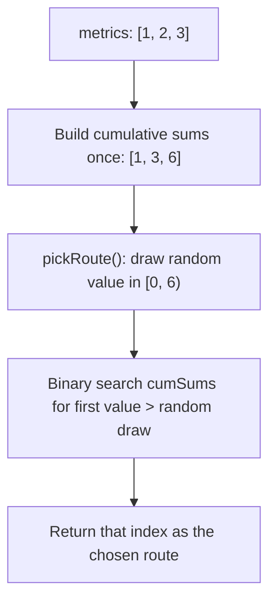

# Feature #5: Uber Pool

## The problem

Uber Pool lets a driver pick up multiple passengers on overlapping routes, splitting the fare between them. A driver who's just picked up a pool passenger might have several route options toward the destination, and each route has been assigned a "likelihood metric" — a rough measure of how likely they are to pick up *another* pool passenger along that route.

We don't want to always send the driver down the single highest-probability route — that's too rigid, and it also concentrates all pool pickups onto the same few streets. Instead, we want to pick a route *randomly*, but weighted by its metric, so a route with a bigger number gets picked more often, without ever being guaranteed.

For example, given `metrics = [1, 2, 3]`, route `2` (metric 3) should get picked roughly half the time, route `1` (metric 2) roughly a third of the time, and route `0` (metric 1) roughly a sixth of the time — proportional to `1 : 2 : 3`.

## Solution

The trick is to turn the metrics array into a number line. Lay the metrics end-to-end as segments: `[0, 1)`, `[1, 3)`, `[3, 6)` for `metrics = [1, 2, 3]`. Each segment's length equals that route's metric. Now pick a uniformly random point between `0` and the total (`6` here) — the segment it lands on is chosen with probability exactly proportional to that segment's length, which is exactly the metric-weighted probability we want.

To make "which segment did it land on" fast to answer, precompute the running (cumulative) sums of the metrics array once — `[1, 3, 6]` for our example. Since that array is sorted (it's strictly increasing), finding which segment a random value falls into is just a binary search for the first cumulative sum greater than the random value.

1. **Constructor:** build the cumulative-sums array once, so we don't redo this work on every pick.
2. **pickRoute():** generate a random value between `0` and the last cumulative sum (the total). Binary-search the cumulative-sums array for the first value strictly greater than the random pick. That index is the chosen route.



## Code

```java
import java.util.*;

class Solution {
    private int[] cumSums;
    private int total;
    private Random random = new Random();

    public Solution(int[] metrics) {
        cumSums = new int[metrics.length];
        int sum = 0;
        for (int i = 0; i < metrics.length; i++) {
            sum += metrics[i];
            cumSums[i] = sum;
        }
        total = sum;
    }

    // Picks a route index at random, weighted by each route's metric.
    public int pickRoute() {
        double target = random.nextDouble() * total;

        int lo = 0, hi = cumSums.length - 1;
        while (lo < hi) {
            int mid = lo + (hi - lo) / 2;
            if (cumSums[mid] <= target) {
                lo = mid + 1;
            } else {
                hi = mid;
            }
        }
        return lo;
    }

    public static void main(String[] args) {
        Solution router = new Solution(new int[]{1, 2, 3});

        // Sample many picks to show the distribution matches the 1:2:3 weighting.
        int[] counts = new int[3];
        for (int i = 0; i < 60000; i++) {
            counts[router.pickRoute()]++;
        }
        System.out.println(Arrays.toString(counts));
        // roughly [10000, 20000, 30000] -- a 1:2:3 ratio, matching the metrics
    }
}
```

## Complexity measures

Let **n** be the number of candidate routes.

### Time Complexity

Constructor: `O(n)` to build the cumulative-sums array. `pickRoute()`: `O(log n)` for the binary search.

### Space Complexity

Constructor: `O(n)` for the cumulative-sums array. `pickRoute()`: `O(1)` extra space per call.
