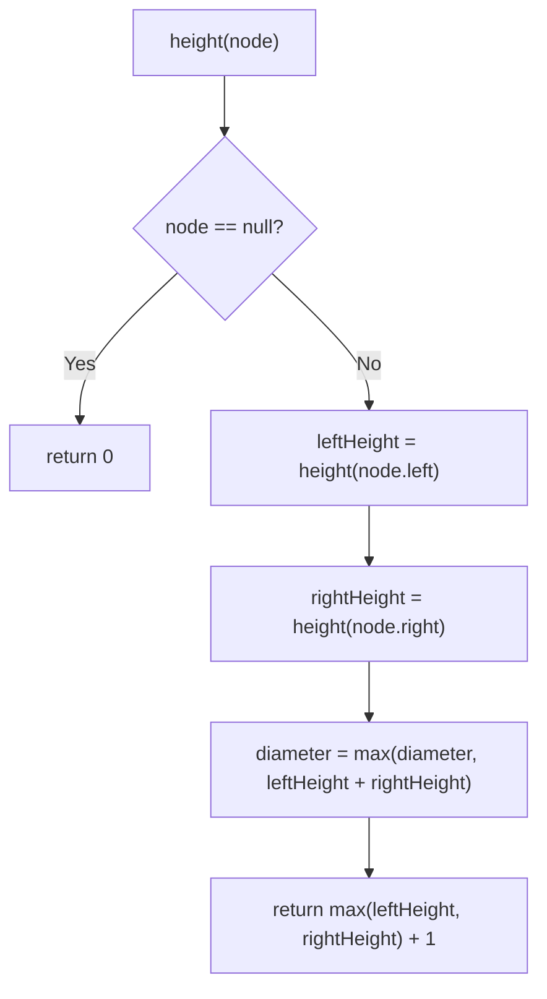

# Feature #6: Longest Route

## The problem

A city's road network isn't a straight line — it forks and branches at intersections. If we model the city as a binary tree, each node is a checkpoint, and the furthest-out checkpoints (the leaves) mark the edges of Uber's service area. We want to recommend brand-new drivers a route that maximizes their odds of finding a customer on day one — which means the **longest possible route** through this tree, since a longer route passes more checkpoints and more potential customers.

For example, take the tree:

```
        1
       / \
      2   3
     / \
    4   5
   /
  6
```

The longest path here runs from checkpoint `6` up through `4`, `2`, `1`, and back down to `3` — that's 4 edges (`6-4`, `4-2`, `2-1`, `1-3`), so the longest route has length **4**.

## Solution

The longest path in a tree — its **diameter** — either passes through a given node or it doesn't:

- **A path passing through node X**: the longest such path runs from the deepest leaf in X's left subtree, up through X, down to the deepest leaf in X's right subtree. Its length is `height(X.left) + height(X.right) + 1` (the `+1` accounts for the two edges connecting X to each subtree's deepest node... more precisely, the height already counts edges down to the deepest leaf on each side, and adding them together plus the root gives the edge count through X). Whatever the exact bookkeeping, the intuition is: **the two "deepest arms" of X, added together**, plus one, give the longest path funneling through X.
- **A path *not* passing through node X**: it lives entirely within the left subtree or entirely within the right subtree — so recursively, it's just the diameter of one of those smaller trees.

Since we don't know in advance which case wins, we compute both at every node and keep a running maximum:

```
diameter = max(all nodes' "path through this node" values)
```

The clean way to compute this in one pass: write a recursive `height(node)` function that, as a side effect, updates a global "best diameter seen so far" every time it's called — because computing height bottom-up naturally visits every node exactly once, and at each node we already have both subtrees' heights on hand to test the "passes through here" case.



## Code

```java
import java.util.*;

class TreeNode {
    int val;
    TreeNode left;
    TreeNode right;

    TreeNode(int val) {
        this.val = val;
    }
}

class Solution {
    private static int diameter;

    // Longest route (in edges) between any two checkpoints in the city tree.
    public static int longestRoute(TreeNode root) {
        diameter = 0;
        height(root);
        return diameter;
    }

    // Returns the height of the subtree rooted at `node`, updating `diameter` along the way.
    private static int height(TreeNode node) {
        if (node == null) return 0;

        int leftHeight = height(node.left);
        int rightHeight = height(node.right);

        // The longest path funneling through this node uses both of its "arms."
        diameter = Math.max(diameter, leftHeight + rightHeight);

        return Math.max(leftHeight, rightHeight) + 1;
    }

    public static void main(String[] args) {
        //         1
        //        / \
        //       2   3
        //      / \
        //     4   5
        //    /
        //   6
        TreeNode root = new TreeNode(1);
        root.left = new TreeNode(2);
        root.right = new TreeNode(3);
        root.left.left = new TreeNode(4);
        root.left.right = new TreeNode(5);
        root.left.left.left = new TreeNode(6);

        System.out.println(longestRoute(root));
        // 4
    }
}
```

## Complexity measures

Let **n** be the number of checkpoints (nodes) in the city tree.

### Time Complexity

`O(n)` — each node's height is computed exactly once, and each computation does constant work beyond the recursive calls.

### Space Complexity

`O(n)` in the worst case (a skewed tree), for the recursive call stack — `O(log n)` if the tree is balanced.
