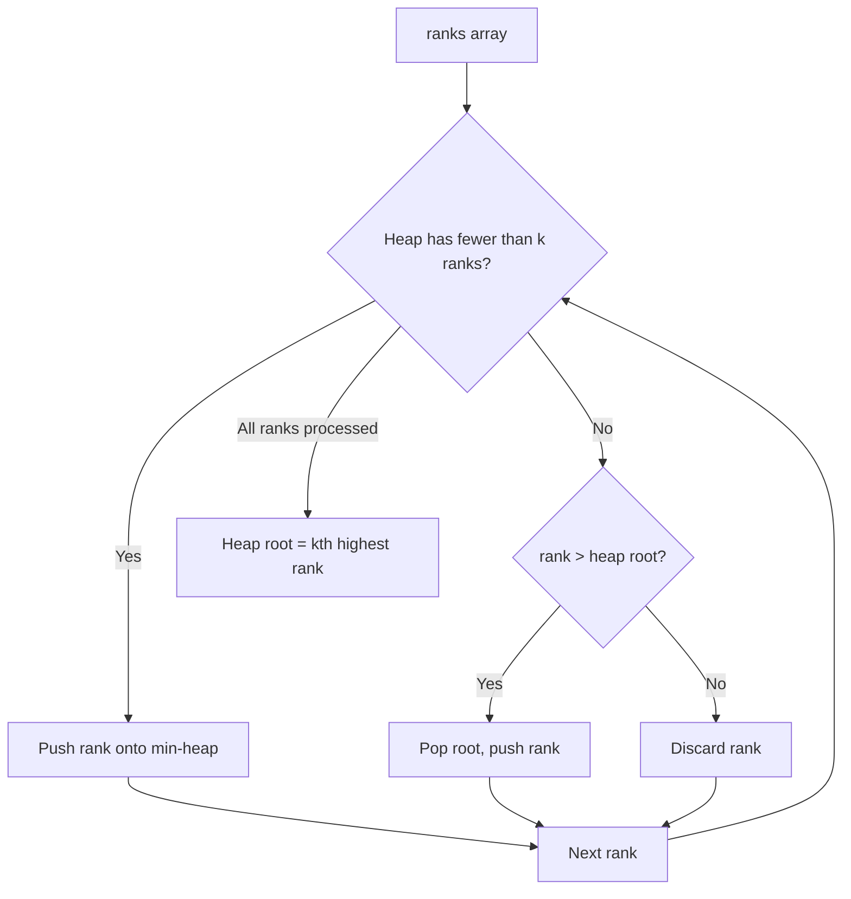

# Feature #7: Highest Rank

## The problem

Every Uber driver has a rank based on passenger reviews, stored in an unsorted array (a driver's rank sits at their index). Right now, the dispatch system always hands instant rides to the top-ranked driver — which means lower-ranked drivers rarely get picked, even though they need rides to build up their rank in the first place.

To fix this, instead of always grabbing the single highest rank, we want to grab the **k**th highest rank, where k comes from a hidden API and can range anywhere from 1 up to the size of the ranks array. Picking varying values of k spreads rides across drivers instead of always favoring the very top.

For example, given `ranks = [3, 2, 1, 5, 6, 4]` and `k = 2`, sorting descending gives `[6, 5, 4, 3, 2, 1]` — the 2nd highest rank is **5**.

## Solution

This is the same core trick as [Feature #1: Select Closest Drivers](01-feature-1-select-closest-drivers.md), just mirrored: there we wanted the k *smallest* distances using a max-heap; here we want the kth *largest* rank, which we can get with a **min-heap of size k**.

1. Push the first k ranks onto a min-heap.
2. For every remaining rank, compare it against the heap's root (currently the smallest of our k candidates).
3. If the new rank is bigger than the root, pop the root and push the new rank instead.
4. After scanning every rank, the heap holds the k *highest* ranks overall — and since it's a min-heap, its root is now the smallest of those k, which is exactly the kth highest rank in the whole array.

The heap never grows past size k, and by the end its root has "settled" into being precisely the boundary between the top k-1 ranks and everyone else.



## Code

```java
import java.util.*;

class Solution {
    // Finds the kth highest rank among all drivers, using a size-k min-heap.
    public static int kthHighestRank(int[] ranks, int k) {
        PriorityQueue<Integer> minHeap = new PriorityQueue<>();

        for (int i = 0; i < k; i++) {
            minHeap.offer(ranks[i]);
        }

        for (int i = k; i < ranks.length; i++) {
            if (ranks[i] > minHeap.peek()) {
                minHeap.poll();
                minHeap.offer(ranks[i]);
            }
        }

        return minHeap.peek();
    }

    public static void main(String[] args) {
        int[] ranks = {3, 2, 1, 5, 6, 4};
        System.out.println(kthHighestRank(ranks, 2));
        // 5
    }
}
```

## Complexity measures

Let **n** be the size of the ranks array and **k** the number of elements kept in the heap.

### Time Complexity

`O(n × log k)` — every rank does an `O(1)` comparison against the root, and a push/pop when it qualifies costs `O(log k)`.

### Space Complexity

`O(k)` — the heap never holds more than k ranks at once.
