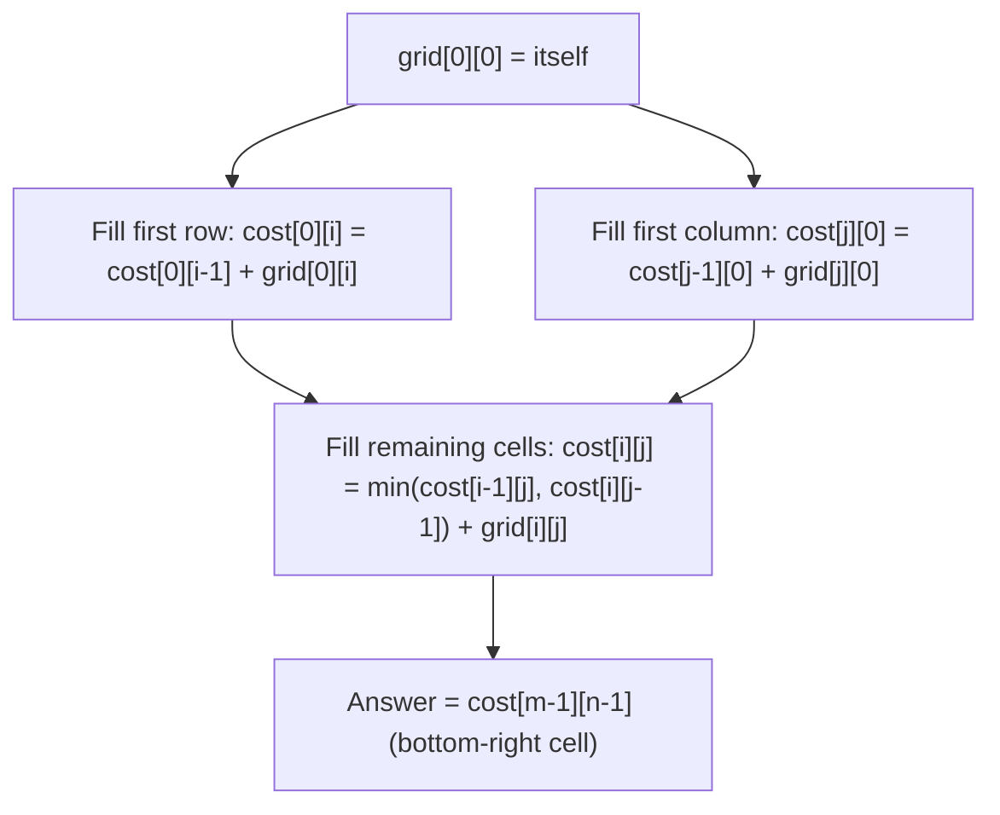

# Feature #8: Optimal Path

## The problem

Model the terrain between a driver and a passenger as a 2D grid, where each cell holds the cost of entering it. The driver starts at the top-left cell and can only move **right** or **down** at each step, ending at the bottom-right cell where the passenger is waiting. We want the path from start to end whose total cost is the smallest.

For example, given the grid:

```
[1, 3, 7]
[8, 5, 4]
[4, 9, 1]
```

the cheapest path is `1 → 3 → 5 → 4 → 1`, for a total cost of **14**.

## Solution

Since the driver can only move right or down, the cheapest way to reach *any* cell is simply the cheaper of the two cells that could feed into it: the one directly above, or the one directly to the left. That's a textbook bottom-up dynamic programming setup — solve small subproblems (the cheapest cost to reach earlier cells) and reuse them to solve bigger ones.

1. **First row:** there's only one way in — from the left — so each cell's cost is just the running sum of everything to its left: `cost[0][i] = cost[0][i-1] + grid[0][i]`.
2. **First column:** symmetric — the only way in is from above, so `cost[j][0] = cost[j-1][0] + grid[j][0]`.
3. **Every other cell:** it can be reached either from above or from the left, so take whichever is cheaper: `cost[i][j] = min(cost[i-1][j], cost[i][j-1]) + grid[i][j]`.
4. The answer ends up sitting in the bottom-right cell once the whole grid has been filled in this order.

We can even do this **in place**, overwriting `grid` itself as the cost table, since we never need a cell's original value again after computing its cost.



## Code

```java
class Solution {
    // Cheapest cost from the top-left to the bottom-right cell, moving only right or down.
    public static int optimalPath(int[][] grid) {
        int m = grid.length;
        int n = grid[0].length;

        // Fill the first row: only reachable by moving right.
        for (int col = 1; col < n; col++) {
            grid[0][col] += grid[0][col - 1];
        }

        // Fill the first column: only reachable by moving down.
        for (int row = 1; row < m; row++) {
            grid[row][0] += grid[row - 1][0];
        }

        // Every other cell: cheapest of "came from above" or "came from the left."
        for (int row = 1; row < m; row++) {
            for (int col = 1; col < n; col++) {
                grid[row][col] += Math.min(grid[row - 1][col], grid[row][col - 1]);
            }
        }

        return grid[m - 1][n - 1];
    }

    public static void main(String[] args) {
        int[][] grid = {
            {1, 3, 7},
            {8, 5, 4},
            {4, 9, 1}
        };
        System.out.println(optimalPath(grid));
        // 14
    }
}
```

## Complexity measures

Let **m** and **n** be the number of rows and columns in the grid.

### Time Complexity

`O(m × n)` — every cell is visited exactly once.

### Space Complexity

`O(1)` extra space — the grid is updated in place as the cost table, no auxiliary structure needed.
