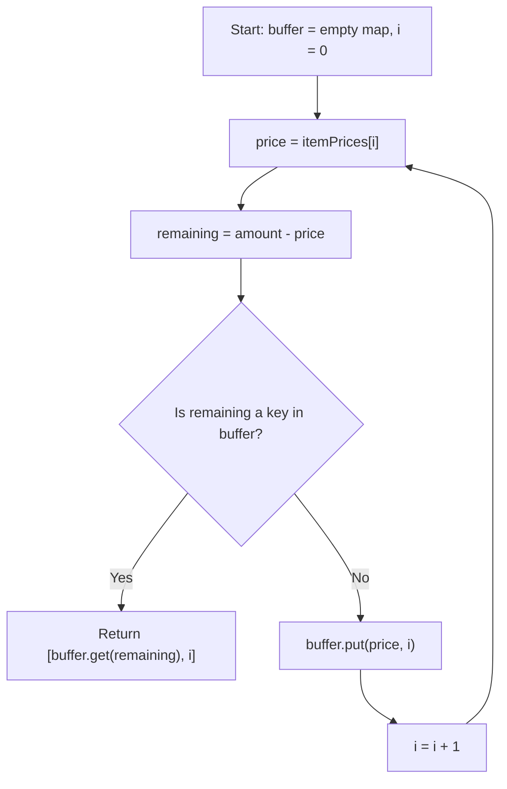

# Feature #1: Suggest Items for Free Delivery

## The problem

Amazon offers free delivery once a customer's cart total crosses a location-specific threshold. When a customer is just short of that threshold, we want to nudge them: show a pair of products that, added to the cart, would push the total exactly up to the free-shipping amount. Product managers specifically asked for a *pair* (not one, not three) — it feels like a better deal to customers, and it fits neatly in the limited screen space reserved for the suggestion.

So the input is a list of candidate products the customer is likely to buy (their wishlist plus items from past purchases), and a target amount `n` — the gap between the free-shipping threshold and the cart's current total.

For example, say the candidate prices are `{2, 30, 56, 34, 55, 10, 11, 20, 15, 60, 45, 39, 51}` and the customer needs to spend `61` more dollars to unlock free delivery. Scanning the list, `10 + 51 = 61` — so we'd suggest the products at those two positions, returning their indices: `{5, 12}`.

## Solution

This is the classic "two sum" shape: for every price, we're really asking "does its complement (the amount still needed to reach the target) already exist somewhere earlier in the list?" Checking that with a nested loop would cost `O(n²)`, but we don't need to search — we can remember.

The trick is to walk the list exactly once, and as we go, keep a hashmap of every price we've already seen, mapped to its index. Before adding a new price to that map, we first ask: "if I look up `amount - price` right now, is it already in there?" If yes, we've found our pair immediately — no need to look anywhere else. If no, we log this price for future lookups and keep going.

This works because a pair `(a, b)` with `a + b = amount` will always be discovered the moment we reach whichever of `a` or `b` comes *second* in the list — at that point the other one is guaranteed to already be sitting in the map.



## Code

```java
import java.util.*;

class Solution {
    // Returns the indices of two products whose prices sum to `amount`, or null if none exist.
    public static int[] suggestTwoProducts(int[] itemPrices, int amount) {
        // Maps a price we've already seen -> its index, so we can look up complements in O(1).
        HashMap<Integer, Integer> buffer = new HashMap<>();

        for (int i = 0; i < itemPrices.length; i++) {
            int price = itemPrices[i];
            int remaining = amount - price;

            if (buffer.containsKey(remaining)) {
                // The product that completes this pair was already seen earlier in the list.
                return new int[]{buffer.get(remaining), i};
            } else {
                buffer.put(price, i);
            }
        }
        return null;
    }

    public static void main(String[] args) {
        int[] itemPrices = {2, 30, 56, 34, 55, 10, 11, 20, 15, 60, 45, 39, 51};
        int amount = 61;
        System.out.println(Arrays.toString(suggestTwoProducts(itemPrices, amount)));
        // [5, 12]  (itemPrices[5] = 10, itemPrices[12] = 51, and 10 + 51 = 61)
    }
}
```

## Complexity measures

Let **n** be the number of candidate products.

### Time Complexity
`O(n)` — the list is scanned once, and every hashmap lookup/insert is `O(1)` on average.

### Space Complexity
`O(n)` — in the worst case, the hashmap ends up holding an entry for nearly every product before a match is found.
