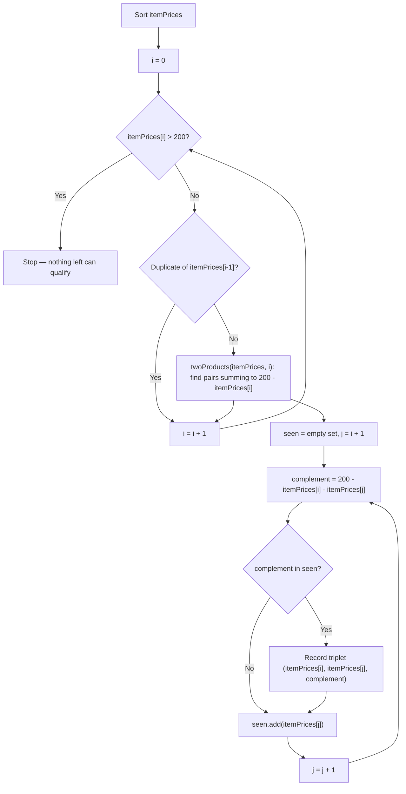

# Feature #2: Suggest Items for Special Offer

## The problem

Amazon ran a lucky-draw contest, and the winners each received a $200 shopping credit — redeemable on at most three products. We want to help these customers spend it well by suggesting *triplets* of products whose prices add up to exactly $200. Since a customer could pick any of several valid combinations, we want to surface as many valid triplets as possible, and the same product is allowed to appear in more than one suggested triplet.

Say the candidate prices are `{100, 75, 150, 200, 50, 65, 40, 30, 15, 25, 60}`. Hunting through the combinations, three triplets sum to 200: `{25, 100, 75}`, `{40, 100, 60}`, and `{60, 75, 65}`. Notice `100` and `60` each show up in two different triplets — that's fine, we want them all.

## Solution

Brute-forcing every triplet would cost `O(n³)`. We can do much better by borrowing the "two sum" trick from the previous feature, but applying it once per product.

First, sort the prices. Sorting buys us two things: we can stop early once a price exceeds 200 (nothing larger can be part of a valid triplet), and it groups duplicate prices next to each other so we can skip re-processing the same starting value.

Then, for each index `i` (the first product in a candidate triplet), we reduce the problem to a *two-sum* search over the rest of the list: find pairs whose sum is `200 - itemPrices[i]`. We do this with a `seen` set instead of a hashmap this time, since we only need to know "have I encountered a number that would complete a pair with the current one" — not its index. Walking forward with pointer `j`, we compute `complement = 200 - itemPrices[i] - itemPrices[j]`; if that complement is already in `seen`, we've found a valid triplet `(itemPrices[i], itemPrices[j], complement)`. Either way, we add `itemPrices[j]` to `seen` and move on.

The reason this doesn't degrade to `O(n³)`: the inner two-sum pass is a single `O(n)` sweep, and we run it `n` times (once per starting index) — so the whole thing is `O(n²)`.



## Code

```java
import java.util.*;

class Solution {
    // Finds every triplet of prices that sums to exactly $200. A product may appear in multiple triplets.
    static public int[][] suggestThreeProducts(int[] itemPrices) {
        ArrayList<int[]> res = new ArrayList<>();
        Arrays.sort(itemPrices);

        for (int i = 0; i < itemPrices.length; i++) {
            if (itemPrices[i] > 200) {
                break; // sorted, so every remaining price is too big to be part of a triplet
            }
            if (i == 0 || itemPrices[i - 1] != itemPrices[i]) {
                // Only run the two-sum search once per distinct starting price.
                twoProducts(itemPrices, i, res);
            }
        }
        return res.toArray(new int[res.size()][]);
    }

    // Finds pairs at indices > i that, together with itemPrices[i], sum to 200.
    public static void twoProducts(int[] itemPrices, int i, ArrayList<int[]> res) {
        HashSet<Integer> seen = new HashSet<>();
        int j = i + 1;
        while (j < itemPrices.length) {
            int complement = 200 - itemPrices[i] - itemPrices[j];
            if (seen.contains(complement)) {
                res.add(new int[]{itemPrices[i], itemPrices[j], complement});
                // Skip past duplicate values of itemPrices[j] to avoid repeating the same triplet.
                while (j + 1 < itemPrices.length && itemPrices[j] == itemPrices[j + 1]) {
                    j++;
                }
            }
            seen.add(itemPrices[j]);
            j++;
        }
    }

    public static void main(String[] args) {
        int[] itemPrices = {100, 75, 150, 200, 50, 65, 40, 30, 15, 25, 60};
        int[][] triplets = suggestThreeProducts(itemPrices);
        for (int[] t : triplets) {
            System.out.println(Arrays.toString(t));
        }
        // [25, 100, 75]
        // [40, 100, 60]
        // [60, 75, 65]
    }
}
```

## Complexity measures

Let **n** be the number of candidate products.

### Time Complexity
`O(n²)` — sorting costs `O(n log n)`, and the `twoProducts` helper (an `O(n)` sweep) is called up to `n` times.

### Space Complexity
`O(n)` — the `seen` set inside `twoProducts` can hold up to `n` prices in the worst case.
