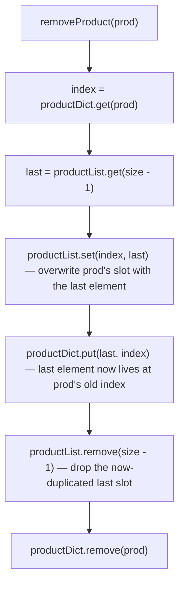

# Feature #3: Upselling Products

## The problem

During checkout, Amazon wants to upsell a single related product, picked uniformly at random from a pool of related products, to nudge the customer toward one more purchase. We need a data structure — keyed by product ID — that supports three operations, and every one of them must run in `O(1)`:

1. **Insert** a product ID into the pool.
2. **Remove** a product ID from the pool (products get deprecated over time).
3. **Get a random product ID** from the pool, with every product equally likely to be picked.

For example, if the pool currently contains product IDs `101` and `202`, inserting `303` should succeed and expand the pool; removing `101` afterward should shrink it back down; and a "get random" call should return `202` or `303` with equal probability, and never `101`.

## Solution

Look at the two "obvious" data structures and each one only gets us two-thirds of the way there:

- An **array/list** gives `O(1)` random access — pick a random index, return the value there. But *deleting* an arbitrary element from the middle of an array means shifting everything after it, which is `O(n)`.
- A **HashMap** gives `O(1)` insert and delete. But it has no notion of "index," so picking a *uniformly random* element means dumping all its keys into a list first — an `O(n)` operation.

Neither structure alone satisfies all three operations in `O(1)`. The fix is to run them side by side, so each one's strength covers the other's weakness:

- Keep the products in an **ArrayList** (`productList`) — this is what makes "get random" cheap: pick a random index in `[0, size)` and return `productList.get(index)`.
- Keep a **HashMap** (`productDict`) from product ID → its current index in `productList` — this is what makes delete cheap, because it tells us exactly where in the array a product lives without scanning for it.

Insertion is simple: append to the end of `productList`, and record that index in `productDict`.

Deletion is the clever part. Removing from the *middle* of an ArrayList is slow, but removing from the *end* is `O(1)`. So instead of removing the target product from wherever it sits, we **swap it with the last element** in the list, fix up `productDict` so the swapped-in product now points at its new index, and then pop the (now-duplicate) last slot off the list. The product we actually wanted gone is now sitting in the last slot, and popping the end is free.



## Code

```java
import java.util.*;

class UpsellProducts {
    Map<Integer, Integer> productDict; // product ID -> its index in productList
    List<Integer> productList;         // backing store, enables O(1) random pick
    Random rand = new Random();

    public UpsellProducts() {
        productDict = new HashMap<>();
        productList = new ArrayList<>();
    }

    /** Inserts a product. Returns true if it wasn't already present. */
    public boolean insertProduct(int prod) {
        if (productDict.containsKey(prod)) {
            return false;
        }
        productDict.put(prod, productList.size());
        productList.add(prod);
        return true;
    }

    /** Removes a product. Returns true if it was present. */
    public boolean removeProduct(int prod) {
        if (!productDict.containsKey(prod)) {
            return false;
        }
        int last = productList.get(productList.size() - 1);
        int index = productDict.get(prod);

        // Move the last element into the removed product's slot, then drop the tail.
        productList.set(index, last);
        productDict.put(last, index);
        productList.remove(productList.size() - 1);
        productDict.remove(prod);
        return true;
    }

    /** Returns a uniformly random product ID currently in the pool. */
    public int getRandomProduct() {
        return productList.get(rand.nextInt(productList.size()));
    }

    public static void main(String[] args) {
        UpsellProducts related = new UpsellProducts();
        System.out.println(related.insertProduct(101)); // true
        System.out.println(related.insertProduct(202)); // true
        System.out.println(related.insertProduct(101)); // false - already present
        System.out.println(related.removeProduct(101)); // true
        System.out.println(related.insertProduct(303)); // true
        System.out.println(related.getRandomProduct());
        // one of {202, 303} with equal probability (never 101 - it was removed)
    }
}
```

## Complexity measures

### Time Complexity
`getRandomProduct` is `O(1)` — a single random-index lookup. `insertProduct` and `removeProduct` are `O(1)` amortized — each does a constant number of HashMap and ArrayList operations, aside from the rare ArrayList resize.

### Space Complexity
`O(n)` — the structure holds one entry per product across both `productList` and `productDict`.
