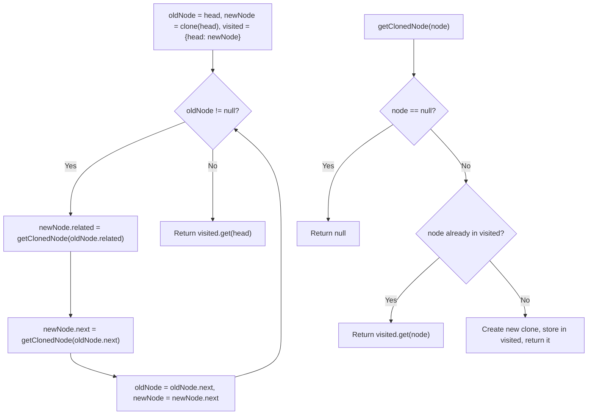

# Feature #4: Copy Product Data

## The problem

Amazon acquired a grocery shopping company and wants to migrate its product data. The affiliate's products are stored as a linked list, where each node holds:

- `prod`: the product's ID
- `next`: the next product in the list
- `related`: a pointer to whichever product is *most frequently bought alongside this one* (for example, the node for "bread" points to the node for "eggs") — this can also be empty if there isn't enough sales data yet

The task is to produce a **deep copy** of this list for the new store: a completely independent set of nodes, wired up with the same `next` and `related` structure, but sharing none of the original objects.

For example, imagine three products — bread, eggs, milk — linked in that order, where bread's `related` points to eggs, eggs' `related` points to milk, and milk's `related` points back to bread. The copy needs the same three-node chain and the same triangle of `related` pointers, but built entirely out of new `Node` objects.

## Solution

The hard part of this problem isn't copying `next` — that's just "walk the list, make a new node per node." The hard part is `related`, because it can point *forward* to a node we haven't created yet, or *backward* to one we already have. We need a way to say "give me the clone of node X" and get the right answer either way, whether or not X has been cloned yet.

The trick is a **HashMap from original node → its clone**. Whenever we need the cloned counterpart of some original node, we ask a helper: "have I made a clone of this one already?" If yes, hand back that clone. If no, create it, remember it in the map, and hand back the *new* clone. This turns "did I already do this" into an `O(1)` lookup instead of a fragile ordering assumption.

With that helper in hand, the main copy loop is straightforward: walk the original list one node at a time, and for the node currently under our new pointer, set its `related` to `getClonedNode(oldNode.related)` and its `next` to `getClonedNode(oldNode.next)`. Because `getClonedNode` always returns the *same* clone for the *same* original node (creating it lazily on first request), the resulting structure ends up wired exactly like the original — regardless of whether `related` happens to point forward or backward in the list.



## Code

```java
import java.util.*;

class Node {
    int prod;
    Node next;
    Node related;
    public Node(int prod) { this.prod = prod; }
}

class Solution {
    // Maps an original node to its already-created clone, so each node is only cloned once.
    public static HashMap<Node, Node> visited = new HashMap<>();

    public static Node copyProductRelations(Node head) {
        if (head == null) {
            return null;
        }

        Node oldNode = head;
        Node newNode = new Node(oldNode.prod);
        visited.put(oldNode, newNode);

        while (oldNode != null) {
            // Get (or lazily create) the clones referenced by related and next.
            newNode.related = getClonedNode(oldNode.related);
            newNode.next = getClonedNode(oldNode.next);

            oldNode = oldNode.next;
            newNode = newNode.next;
        }
        return visited.get(head);
    }

    // Returns the clone of `node`, creating and caching it on first request.
    public static Node getClonedNode(Node node) {
        if (node == null) {
            return null;
        }
        if (visited.containsKey(node)) {
            return visited.get(node);
        }
        Node clone = new Node(node.prod);
        visited.put(node, clone);
        return clone;
    }

    public static void main(String[] args) {
        // bread -> eggs -> milk, with related: bread->eggs, eggs->milk, milk->bread
        Node bread = new Node(1);
        Node eggs = new Node(2);
        Node milk = new Node(3);
        bread.next = eggs;
        eggs.next = milk;
        bread.related = eggs;
        eggs.related = milk;
        milk.related = bread;

        Node copyHead = copyProductRelations(bread);

        Node o = bread, c = copyHead;
        while (o != null) {
            System.out.println("prod=" + o.prod + ", is same object as original? " + (o == c)
                + ", related.prod=" + o.related.prod);
            o = o.next;
            c = c.next;
        }
        // prod=1, is same object as original? false, related.prod=2
        // prod=2, is same object as original? false, related.prod=3
        // prod=3, is same object as original? false, related.prod=1
    }
}
```

## Complexity measures

Let **n** be the number of nodes in the original list.

### Time Complexity
`O(n)` — a single pass over the original list, with `O(1)` amortized work per node via the `visited` map.

### Space Complexity
`O(n)` — the `visited` map holds one entry per original node, mapping it to its clone.
