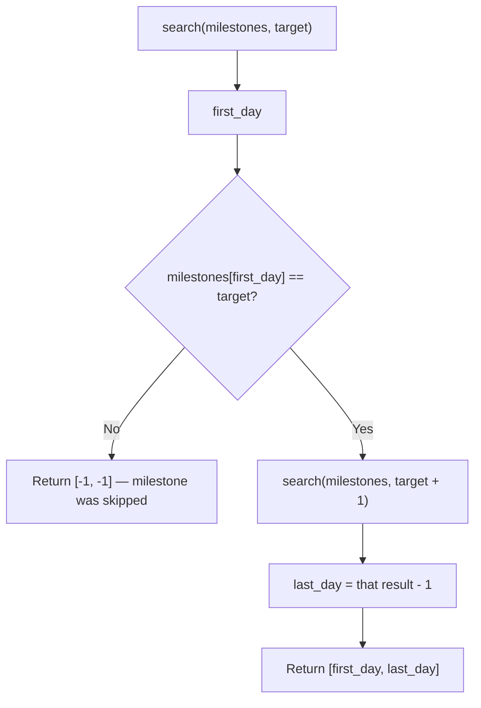

# Feature #5: Order Processing Milestones

## The problem

Amazon's quarterly report tracks the cumulative number of orders processed, rounded down to the nearest million and displayed as a milestone message — "1M+ orders processed," then "2M+ orders processed," and so on. Every day of the quarter, the current milestone gets appended to an array, so the array only ever stays flat or climbs.

Given that array of daily milestones, plus a specific milestone value, we want to find the **range of days** the system spent sitting at that milestone before jumping to the next one.

For example, suppose the fourteen-day array is `{0, 1, 1, 2, 2, 2, 3, 4, 4, 4, 5, 5, 6, 7}` and we're asked about milestone `4`. Scanning the array, the value `4` first appears at index 7 and last appears at index 9 (days are 0-indexed, so day 0 is the first day of the quarter). So the answer is `{7, 9}` — the system sat at "4M+ orders processed" from day 7 through day 9.

## Solution

Because the milestones array is sorted (non-decreasing), the naive way to find where a value starts and ends is a linear scan — but sorted data is a strong hint that binary search can do better, in `O(log n)` instead of `O(n)`.

The key building block is a `search()` function that answers a slightly different question than "is `n` in the array": it returns **the leftmost index at which `n` could be inserted while keeping the array sorted** (this is the standard "lower bound" binary search). Concretely, it narrows a `[first, last)` window: if the midpoint's value is `>= n`, the answer might be at the midpoint or earlier, so we pull `last` in; otherwise, the answer must be strictly later, so we push `first` up.

Once we have that primitive, finding the milestone's day range becomes two calls to it:

1. `search(milestones, target)` gives us the **first day** the target milestone appears — the leftmost position `target` could be inserted at.
2. If `milestones[first_day]` doesn't actually equal `target`, the milestone was skipped entirely that quarter (e.g., two milestones were crossed in a single day), so we return `{-1, -1}`.
3. Otherwise, to find the **last day**, we reuse the same trick: the leftmost position for `target + 1` is exactly one past the last day of `target` (since the array only holds whole milestones), so we call `search(milestones, target + 1)` and subtract 1.

This is the "find first and last position of a target in a sorted array" pattern — solved with two lower-bound searches instead of writing separate first/last logic.



## Code

```java
import java.util.*;

class Solution {
    // Returns the leftmost index at which `n` could be inserted to keep `milestones` sorted.
    public static int search(int[] milestones, int n) {
        int first = 0;
        int last = milestones.length;
        while (first < last) {
            int mid = (first + last) / 2;
            if (milestones[mid] >= n) {
                last = mid;
            } else {
                first = mid + 1;
            }
        }
        return first;
    }

    public static int[] milestoneDays(int[] milestones, int target) {
        int first_day = search(milestones, target);
        if (target == milestones[first_day]) {
            int last_day = search(milestones, target + 1) - 1;
            return new int[]{first_day, last_day};
        } else {
            return new int[]{-1, -1};
        }
    }

    public static void main(String[] args) {
        int[] milestones = {0, 1, 1, 2, 2, 2, 3, 4, 4, 4, 5, 5, 6, 7};
        int target = 4;
        System.out.println(Arrays.toString(milestoneDays(milestones, target)));
        // [7, 9]
    }
}
```

## Complexity measures

Let **n** be the number of days recorded so far this quarter.

### Time Complexity
`O(log n)` — two binary searches over the milestones array.

### Space Complexity
`O(1)` — no extra data structures are used beyond a constant number of index variables.
