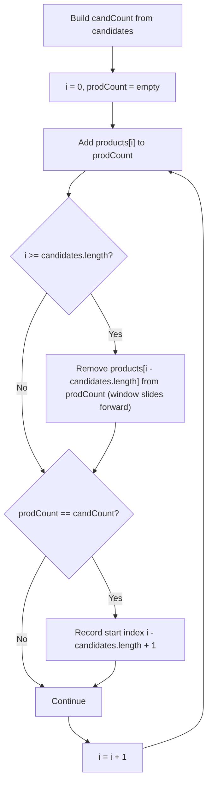

# Feature #6: Products Frequently Viewed Together

## The problem

Amazon wants to spot groups of products that get browsed back-to-back by the same user, on the theory that products viewed in quick succession are probably related — so if another user is looking at one of them, we can recommend the others.

We're given the full sequence of product IDs a user viewed, in order, plus a candidate set of products believed to be related. The task: find every place in the viewing sequence where *all* the candidate products appear consecutively, in any order, with nothing else mixed in between.

For example, say the viewed sequence is `{3, 2, 1, 5, 2, 1, 2, 1, 3, 4}` and the candidates are `{1, 2, 3}`. Looking through the sequence, positions 0–2 (`3, 2, 1`) contain exactly the candidates in some order, and so do positions 6–8 (`2, 1, 3`). So the function should return the starting indices of those runs: `{0, 6}`.

## Solution

"Same letters, any order, contiguous" should ring a bell — this is the same shape as finding anagram substrings, just with product IDs standing in for letters. And the tool for that is a **fixed-size sliding window** combined with two frequency maps.

First, build `candCount`: a map from each candidate ID to how many times it appears in the candidate list (this matters if a candidate could repeat). Then slide a window of exactly `candidates.length` positions across the viewed sequence, maintaining `prodCount`: a live frequency map of whatever's currently inside the window.

As the window slides one step to the right, we don't recompute `prodCount` from scratch — we just add the newly-entered product on the right and remove the product that just fell off the left (decrementing its count, and deleting the key entirely once it hits zero, so the maps can be compared for equality cleanly). That's what keeps each step `O(1)` instead of `O(m)`.

The check itself is simple: at every window position, if `prodCount` and `candCount` are exactly equal as maps, the current window is a permutation of the candidates — record its starting index. Since both maps are windows over strictly bounded key sets, comparing them is cheap.



## Code

```java
import java.util.*;

class Solution {
    // Returns the starting indices of every window in `products` that is a permutation of `candidates`.
    public static List<Integer> findSimilarity(int[] products, int[] candidates) {
        int prodN = products.length, candN = candidates.length;
        if (prodN < candN) return new ArrayList<>();

        Map<Integer, Integer> candCount = new HashMap<>();
        Map<Integer, Integer> prodCount = new HashMap<>();

        for (int i : candidates) {
            candCount.put(i, candCount.getOrDefault(i, 0) + 1);
        }

        List<Integer> output = new ArrayList<>();
        for (int i = 0; i < prodN; ++i) {
            // Add the product entering the window on the right.
            int enter = products[i];
            prodCount.put(enter, prodCount.getOrDefault(enter, 0) + 1);

            if (i >= candN) {
                // Remove the product falling off the window on the left.
                int leave = products[i - candN];
                if (prodCount.get(leave) == 1) {
                    prodCount.remove(leave);
                } else {
                    prodCount.put(leave, prodCount.get(leave) - 1);
                }
            }

            if (prodCount.equals(candCount)) {
                output.add(i - candN + 1);
            }
        }
        return output;
    }

    public static void main(String[] args) {
        int[] products = {3, 2, 1, 5, 2, 1, 2, 1, 3, 4};
        int[] candidates = {1, 2, 3};
        System.out.println(findSimilarity(products, candidates));
        // [0, 6]
    }
}
```

## Complexity measures

Let **n** be the size of the products sequence and **m** the size of the candidates list.

### Time Complexity
`O(n + m)` — building `candCount` takes `O(m)`, and sliding the window across `products` does `O(1)` amortized work per step for `O(n)` steps.

### Space Complexity
`O(m)` — in the worst case (all candidates distinct), both `candCount` and `prodCount` hold up to `m` entries.
