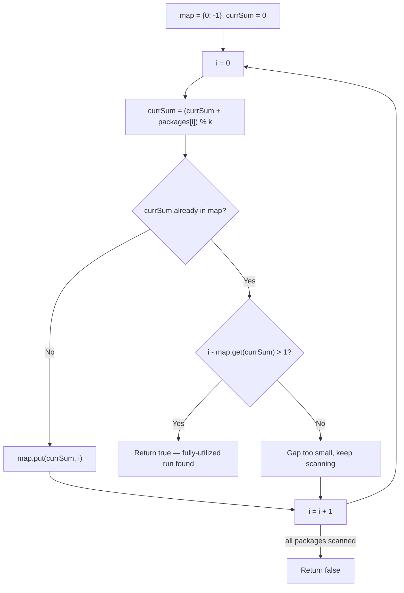

# Feature #7: Optimize Delivery Cost

## The problem

Amazon's logistics team works with a delivery carrier that prices trucks in fixed weight increments of `k` pounds: anything up to `k` lbs costs $10, anything between `k` and `2k` lbs costs $20, and so on. Whenever a shipment's total weight isn't an exact multiple of `k`, the last increment is being paid for but not fully used — money is being left on the table.

We want to check whether we can select a **contiguous run of two or more packages** (adjacent, because nearby packages go to nearby locations and are always shipped together) whose total weight is an exact multiple of `k` — meaning the carrier's pricing is being fully utilized with no waste.

For example, given package weights `{11, 42, 54, 44, 49, 26}` and `k = 10`, the answer is `True`: the subarray `{42, 54, 44}` sums to `140`, which is `14 * 10` — an exact multiple of `k`, using two or more adjacent packages.

## Solution

The direct approach — check every contiguous subarray's sum — is `O(n²)`. But "does some contiguous range sum to a multiple of k" is a strong signal to reach for **prefix sums plus the pigeonhole principle**, which gets this down to a single pass.

Here's the insight: let `prefixSum[i]` be the cumulative sum of packages from the start through index `i`. A subarray from index `j+1` to `i` has weight `prefixSum[i] - prefixSum[j]`. We want that difference to be a multiple of `k`, i.e., `(prefixSum[i] - prefixSum[j]) % k == 0`. That's algebraically the same as saying `prefixSum[i] % k == prefixSum[j] % k` — **two prefix sums leaving the same remainder when divided by k**.

So instead of tracking full prefix sums, we only need to track their *remainders mod k*, and remember the earliest index where each remainder was first seen (seeding remainder `0` at index `-1`, to correctly capture a prefix itself being a multiple of `k`). As we scan left to right, computing the running remainder in `O(1)` each step, the moment we see a remainder we've seen before, we know everything strictly between those two indices (inclusive of the current one) sums to a multiple of `k`. We just need to check that gap is at least 2 packages wide (`i - map.get(currSum) > 1`), since the problem requires two or more packages.

Walking through the example: weights `{11, 42, 54, 44, 49, 26}`, `k=10` give running sums `{11, 43, 57, 101, 150, 176}` and remainders `{1, 3, 7, 1, 0, 6}`. Remainder `1` shows up at index 0 and again at index 3 — the gap between them (`{42, 54, 44}`, indices 1–3) is our answer, and its sum, `140`, is indeed a multiple of 10.



## Code

```java
import java.util.*;

class Solution {
    // Returns true if some contiguous run of 2+ packages sums to an exact multiple of k.
    public static boolean checkDelivery(int[] packages, int k) {
        int currSum = 0;
        HashMap<Integer, Integer> map = new HashMap<>();
        map.put(0, -1); // seeds the case where a prefix itself is already a multiple of k

        for (int i = 0; i < packages.length; i++) {
            currSum += packages[i];
            if (k != 0) {
                currSum = currSum % k;
            }
            if (map.containsKey(currSum)) {
                // Same remainder seen before -> everything in between sums to a multiple of k.
                if (i - map.get(currSum) > 1) {
                    return true;
                }
            } else {
                map.put(currSum, i);
            }
        }
        return false;
    }

    public static void main(String[] args) {
        int[] packages = {11, 42, 54, 44, 49, 26};
        int k = 10;
        System.out.println(checkDelivery(packages, k));
        // true  ({42, 54, 44} sums to 140, a multiple of 10)
    }
}
```

## Complexity measures

Let **n** be the number of packages.

### Time Complexity
`O(n)` — a single pass over the packages array, with `O(1)` work per step.

### Space Complexity
`O(min(n, k))` — the remainder map can hold at most `k` distinct remainders, and never more entries than there are packages.
