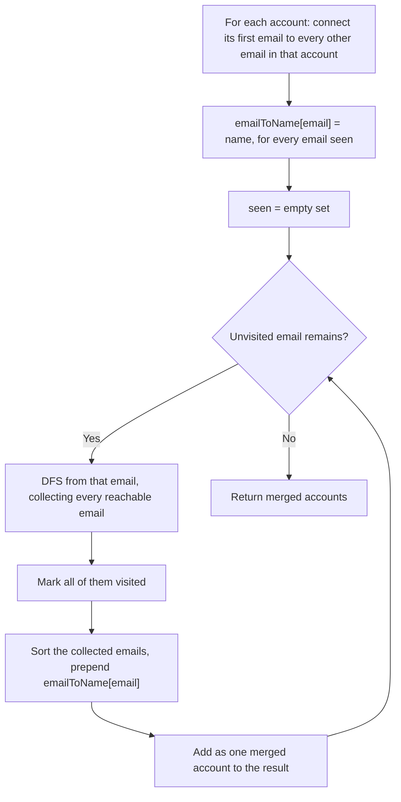

# Feature #8: Merge Recommendations

## The problem

Amazon acquired another company that has its own database of user profiles and product recommendation data. Before that data can be put to use, Amazon needs to figure out which accounts on the new site actually belong to existing Amazon customers — so the two profiles (and their recommendation histories) can be merged.

Each account is represented as `[name, email1, email2, ...]` — a name, followed by every email address associated with that account. Two accounts belong to the same real person if they share **at least one email** in common, even if the accounts were created under the same name coincidentally or with different subsets of that person's emails. Note that two accounts with the *same name* aren't necessarily the same person (names collide), but every account that genuinely belongs to one person will consistently use that person's name. A single person can also have more than two accounts scattered across the data.

The output should be the fully merged accounts: one entry per real person, with their name first and all of their emails (deduplicated, sorted) after it.

## Solution

This is a disguised graph problem: **connected components**. Think of every email address as a node. For each account, draw an edge between its first email and every other email listed in that same account — this captures "these emails belong together" without needing to compare accounts pairwise. Once the graph is built, two emails belong to the same person exactly when there's a path between them, i.e., they're in the same connected component. Along the way we also keep a side lookup from any email to the name on the account it came from (any account touching a given email used the correct name for that person, since the same person always registers under the same name).

From there, the algorithm is: pick any not-yet-visited email, and run a DFS (or BFS) from it to discover every email reachable through the graph — that whole reachable set is one person's complete list of emails. Mark all of them visited so we never process any of them again as a separate component. Sort that set of emails, prepend the person's name (looked up via any one of those emails), and that's one merged account. Repeat until every email has been visited.

The reason this correctly handles chains of accounts — e.g., account A shares an email with account B, which shares a *different* email with account C — is that DFS naturally follows the graph wherever it leads, so A, B, and C all end up merged into a single component even though A and C never directly shared an email.



## Code

```java
import java.util.*;

class Solution {
    public static List<List<String>> accountsMerge(String[][] accounts) {
        HashMap<String, String> emailToName = new HashMap<>();
        HashMap<String, Set<String>> graph = new HashMap<>();

        // Build an undirected graph: connect each account's first email to all its other emails.
        for (String[] acc : accounts) {
            String name = acc[0];
            for (int i = 1; i < acc.length; i++) {
                String email = acc[i];
                graph.computeIfAbsent(acc[1], x -> new HashSet<>()).add(email);
                graph.computeIfAbsent(email, x -> new HashSet<>()).add(acc[1]);
                emailToName.put(email, name);
            }
        }

        Set<String> seen = new HashSet<>();
        List<List<String>> ans = new ArrayList<>();

        for (String email : graph.keySet()) {
            if (!seen.contains(email)) {
                seen.add(email);
                // Iterative DFS to collect every email reachable from this one.
                Stack<String> stack = new Stack<>();
                stack.push(email);
                List<String> component = new ArrayList<>();

                while (!stack.isEmpty()) {
                    String node = stack.pop();
                    component.add(node);
                    for (String neighbor : graph.get(node)) {
                        if (!seen.contains(neighbor)) {
                            seen.add(neighbor);
                            stack.push(neighbor);
                        }
                    }
                }

                Collections.sort(component);
                component.add(0, emailToName.get(email));
                ans.add(component);
            }
        }
        return ans;
    }

    public static void main(String[] args) {
        String[][] accounts = {
            {"John", "johnsmith@mail.com", "john_newyork@mail.com"},
            {"John", "johnsmith@mail.com", "john00@mail.com"},
            {"Mary", "mary@mail.com"},
            {"John", "johnnybravo@mail.com"}
        };
        List<List<String>> merged = accountsMerge(accounts);
        for (List<String> account : merged) {
            System.out.println(account);
        }
        // [John, johnnybravo@mail.com]
        // [John, john00@mail.com, john_newyork@mail.com, johnsmith@mail.com]
        // [Mary, mary@mail.com]
    }
}
```

## Complexity measures

Let **n** be the total number of accounts and **m** be the total number of email addresses (counted with repetition) across all accounts.

### Time Complexity
`O(m + n)` — building the adjacency-list graph and running DFS over it both cost `O(|V| + |E|)`, where the vertices are the `m` email addresses and the edges come from the `n` accounts.

### Space Complexity
`O(m + n)` — the graph and `emailToName` map store on the order of `m` email entries, plus `O(n)` for the names, even when accounts have very few emails.
