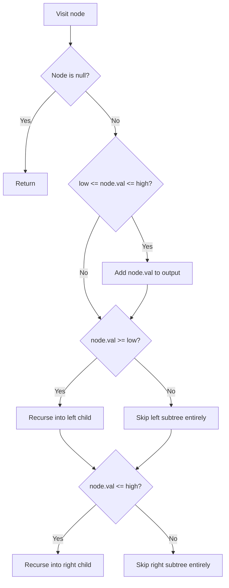

# Feature #9: Products in Price Range

## The problem

Amazon's product catalog is organized as a binary search tree, keyed by price — so for any node, everything cheaper sits in its left subtree and everything pricier sits in its right subtree. We want to power a search filter: given a `low` and `high` price, return every product priced within that range (inclusive on both ends).

For example, say prices `9, 6, 14, 20, 1, 30, 8, 17, 5` have been inserted into the BST in that order. If a user filters for products between `low = 7` and `high = 20`, the answer should be `{9, 8, 14, 20, 17}` — note that `6`, `1`, `5`, and `30` are excluded because they fall outside `[7, 20]`. Order doesn't matter, just the set of matching prices.

## Solution

A naive approach would visit every node and check whether its price falls in range — that always costs `O(n)`, even though a BST already tells us where *not* to look. The trick is to let the BST's ordering property prune entire subtrees.

We do a preorder-style traversal starting at the root. At each node:

1. If the node's price is within `[low, high]`, add it to the output.
2. Only recurse left if the node's price is `>= low` — if the price is already below `low`, everything in the left subtree (which is even smaller) can't possibly be in range either, so we skip it entirely.
3. Only recurse right if the node's price is `<= high` — symmetric reasoning: everything to the right is even bigger, so if the current node already exceeds `high`, the whole right subtree is out of range.

This pruning is what separates it from a plain traversal: in a lopsided tree, we can skip whole branches without ever visiting them, though in the worst case (e.g., the range covers the entire tree) we still touch every node.



## Code

```java
import java.util.*;

class Node {
    int val;
    Node leftChild, rightChild;
    Node(int val) { this.val = val; }
}

class BinarySearchTree {
    Node root;

    void insert(int val) {
        root = insertRec(root, val);
    }

    private Node insertRec(Node node, int val) {
        if (node == null) return new Node(val);
        if (val < node.val) node.leftChild = insertRec(node.leftChild, val);
        else node.rightChild = insertRec(node.rightChild, val);
        return node;
    }
}

class Solution {
    public static void preOrder(Node node, int low, int high, List<Integer> output) {
        if (node != null) {
            // Only collect this node's price if it's within range.
            if (node.val <= high && low <= node.val)
                output.add(node.val);
            // Prune the left subtree if this node is already below `low`.
            if (low <= node.val)
                preOrder(node.leftChild, low, high, output);
            // Prune the right subtree if this node is already above `high`.
            if (node.val <= high)
                preOrder(node.rightChild, low, high, output);
        }
    }

    public static List<Integer> productsInRange(Node root, int low, int high) {
        List<Integer> output = new ArrayList<Integer>();
        preOrder(root, low, high, output);
        return output;
    }

    public static void main(String[] args) {
        BinarySearchTree bst = new BinarySearchTree();
        bst.insert(9);
        bst.insert(6);
        bst.insert(14);
        bst.insert(20);
        bst.insert(1);
        bst.insert(30);
        bst.insert(8);
        bst.insert(17);
        bst.insert(5);

        System.out.println(productsInRange(bst.root, 7, 20));
        // [9, 8, 14, 20, 17]
    }
}
```

## Complexity measures

Let **n** be the number of products (nodes) in the tree.

### Time Complexity

`O(n)` — in the worst case (e.g., the range spans the whole tree), every node is visited exactly once.

### Space Complexity

`O(n)` — in the worst case every product falls in range and ends up in the output list (plus recursion stack depth up to `O(n)` for a skewed tree).
