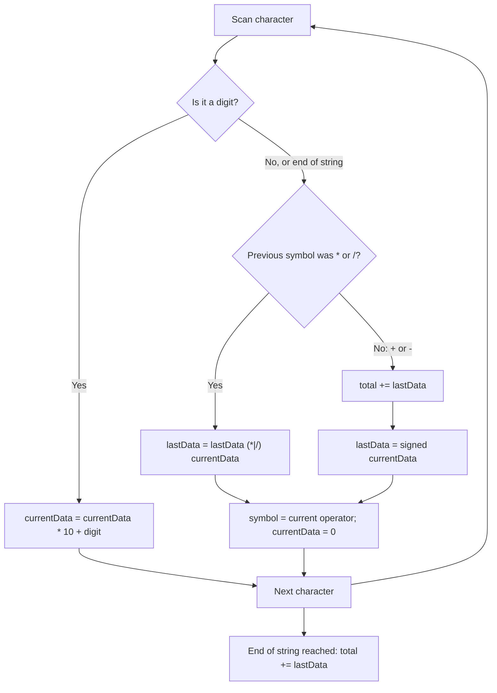

# Feature #10: Calculate the Total Cost of the Shopping Cart Items

## The problem

A customer's shopping cart is ready for checkout. Some items were bought in multiples (unit price times quantity), and some carry discounts — a flat amount off, or a fractional discount (like "half price"). Rather than modeling all of this as separate line items, the cart is handed to us as a single arithmetic expression string using whole numbers and the operators `+`, `-`, `*`, and `/`, with the usual operator precedence rules (`*` and `/` bind tighter than `+` and `-`).

For example: a customer bought one item for $2, another for $3 that gets a `1/7` discount, and gets $1 off their total as a loyalty perk. That's the string `"2 + 3 / 7 - 1"`. There's also a rounding rule: any fractional remainder from division is simply dropped — `3 / 7` floors to `0`, and `5 / 2` floors to `2`. So the total here works out to `2 + 0 - 1 = 1`.

## Solution

The naive way to evaluate an expression like this is to build two stacks (numbers and operators) and process precedence with backtracking. But because there are no parentheses here, we can get away with something much lighter: a single left-to-right scan that only ever needs to remember the *last* number it evaluated.

The key insight is how `+`/`-` differ from `*`/`/` in when they can be "settled":

- When we hit a `+` or `-`, we don't know yet whether the *next* number is going to be multiplied or divided into something — so we can't add it to the running total immediately. Instead, we stash it as `lastData`, tagged with its sign, and only fold it into `total` once we're sure no `*`/`/` is going to grab it first.
- When we hit a `*` or `/`, we know immediately: the pending `lastData` is combined with the current number right now, because these operators bind tighter than anything waiting in `total`.

So we walk the string collecting digits into `currentData`. Whenever we hit an operator (or reach the end of the string), we resolve the *previous* operator (`symbol`) against `lastData` and `currentData`:

- `symbol == '*'` or `'/'`: fold `currentData` into `lastData` right away (`lastData = lastData * currentData` or `lastData / currentData`).
- `symbol == '+'` or `'-'`: flush `lastData` into `total`, then let `currentData` (signed appropriately) become the new `lastData`, deferred until we know what's next.

At the end, one last flush of `lastData` into `total` gives the answer. This "remember one pending value, decide precedence on the fly" trick avoids any stack allocation entirely.



## Code

```java
class Solution {
    public static int calculateTotalAmount(String data) {
        if (data == null || data.isEmpty()) {
            return 0;
        }

        int size = data.length();

        // currentData accumulates the digits of the number being scanned.
        // lastData holds the most recently evaluated number, deferred in case
        // a higher-precedence operator (* or /) needs to grab it next.
        // total accumulates everything that's been fully settled (+ / -).
        int currentData = 0, lastData = 0, total = 0;

        // symbol tracks the operator that precedes currentData.
        char symbol = '+';

        for (int i = 0; i < size; i++) {
            char currentChar = data.charAt(i);

            if (Character.isDigit(currentChar)) {
                currentData = (currentData * 10) + (currentChar - '0');
            }

            // Resolve the previous operator once we hit a new operator,
            // or once we've reached the last character of the string.
            boolean isOperator = !Character.isDigit(currentChar) && !Character.isWhitespace(currentChar);
            if (isOperator || i == size - 1) {
                if (symbol == '*') {
                    lastData = lastData * currentData;
                } else if (symbol == '/') {
                    lastData = lastData / currentData; // integer division floors toward zero
                } else if (symbol == '+') {
                    total += lastData;
                    lastData = currentData;
                } else if (symbol == '-') {
                    total += lastData;
                    lastData = -currentData;
                }
                symbol = currentChar;
                currentData = 0;
            }
        }

        // Flush whatever is left pending after the scan ends.
        total += lastData;
        return total;
    }

    public static void main(String[] args) {
        System.out.println(calculateTotalAmount("2 + 3 / 7 - 1"));
        // 1  (2 + floor(3/7) - 1 = 2 + 0 - 1)
    }
}
```

## Complexity measures

Let **n** be the length of the shopping cart expression string.

### Time Complexity

`O(n)` — a single left-to-right pass over the string, with `O(1)` work per character.

### Space Complexity

`O(1)` — only a fixed handful of scalar variables (`currentData`, `lastData`, `total`, `symbol`) are used, regardless of input size.
