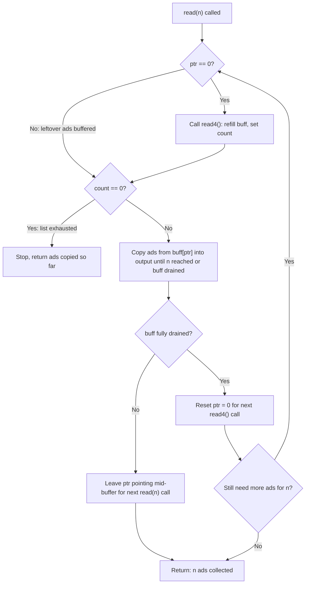

# Feature #11: Ad Serving

## The problem

A legacy ad-serving system exposes only one API: `read4()`, which fetches the next 4 ads from a user's personalized ad list and returns however many it actually found (fewer than 4 if the list is running out). This API was fine back when every screen was roughly the same size, but now our users show up on tiny phones and huge monitors — we need to serve however many ads `n` actually fit on a given screen, without touching the legacy backend.

So we need to build `read(n)`, which returns the next `n` ads by calling `read4()` as many times as necessary internally. The catch: `read(n)` can be called *repeatedly* by the same client (say, `read(4)` then later `read(3)`), and each call must pick up exactly where the last one left off — even if the previous `read4()` call fetched ads that weren't fully consumed yet.

For example, suppose the underlying ad list is `a, b, c, d, e, f, g, h, i, j, k`. A client calls `read(4)`, which should return `[a, b, c, d]`. Later, that same client calls `read(3)`, which should return `[e, f, g]` — continuing from where the last call stopped, not restarting from `a`.

## Solution

The tricky part isn't calling `read4()` — it's that a single `read4()` call might fetch more ads than the current `read(n)` call needs, and those leftover ads must be remembered for the *next* `read(n)` call. That means we need state that survives across calls, not just within one.

We keep a small buffer struct (`ptr`, `count`, `buff`) alive between invocations:

- `buff` holds the most recent batch of up to 4 ads returned by `read4()`.
- `count` is how many ads that batch actually contained.
- `ptr` is our bookmark into `buff` — how much of the current batch we've already handed out.

Each call to `read(n)` works like this: if `ptr` is `0`, our buffer is empty (either it's the very first call, or we fully drained the last batch), so we call `read4()` for a fresh batch. We then copy ads out of `buff` into the caller's output array until either we've supplied `n` ads or we've exhausted the current batch. If we exhaust the batch, we reset `ptr` to `0` so the *next* call knows to fetch again; if `read4()` itself ever returns `0` ads, the underlying list is empty and we stop for good.

Because `ptr`, `count`, and `buff` are held as fields rather than locals, they persist across separate `read(n)` calls — that's what lets a `read(4)` followed by a `read(3)` behave as one continuous stream instead of two independent reads.



## Code

```java
import java.util.*;

// Simulates the legacy ad-serving backend: read4() hands back up to 4 ads
// at a time from a fixed underlying list, tracking its own read position.
class Reader4 {
    private static List<Character> ads;
    private static int pointer = 0;

    public static void setAds(List<Character> allAds) {
        ads = allAds;
        pointer = 0;
    }

    public static List<Character> read4(List<Character> buff) {
        buff.clear();
        int count = 0;
        while (pointer < ads.size() && count < 4) {
            buff.add(ads.get(pointer));
            pointer++;
            count++;
        }
        return buff;
    }
}

// BufferState survives across separate read(n) calls, so leftover ads from
// one read4() batch aren't lost between invocations.
class BufferState {
    public List<Character> buff;
    public int ptr;
    public int count;

    BufferState(int ptr, int count) {
        this.ptr = ptr;
        this.count = count;
        this.buff = new ArrayList<Character>();
    }
}

class Solution {
    static BufferState state = new BufferState(0, 0);

    public static int read(List<Character> buffer, int n) {
        int i = 0;

        while (i < n) {
            // Buffer is empty (fresh call or fully drained last time) — refill it.
            if (state.ptr == 0) {
                state.buff = Reader4.read4(state.buff);
                state.count = state.buff.size();
            }
            // The underlying ad list has nothing left to give.
            if (state.count == 0) {
                break;
            }
            // Drain from the buffered batch until we've supplied n ads or run out.
            while (i < n && state.ptr < state.count) {
                buffer.add(state.buff.get(state.ptr));
                state.ptr++;
                i++;
            }
            // Fully drained this batch — reset so the next read4() call refills it.
            if (state.ptr >= state.count) {
                state.ptr = 0;
            }
        }

        return i;
    }

    public static void main(String[] args) {
        List<Character> allAds = new ArrayList<>();
        for (char c : "abcdefghijk".toCharArray()) allAds.add(c);
        Reader4.setAds(allAds);

        List<Character> buffer1 = new ArrayList<>();
        int firstRead = read(buffer1, 4);
        List<Character> buffer2 = new ArrayList<>();
        int secondRead = read(buffer2, 3);

        System.out.println(firstRead + " " + buffer1);
        // 4 [a, b, c, d]
        System.out.println(secondRead + " " + buffer2);
        // 3 [e, f, g]  (continues from where the first call left off)
    }
}
```

## Complexity measures

Let **n** be the total number of ads retrieved across calls.

### Time Complexity

`O(n)` — every ad is fetched via `read4()` exactly once and copied into a buffer exactly once, and both operations are `O(1)` per ad.

### Space Complexity

`O(1)` — the buffer only ever holds up to 4 ads at a time, independent of `n`.
