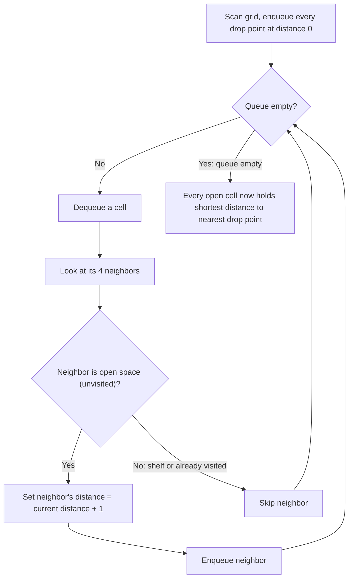

# Feature #12: Warehouse and Drop Points

## The problem

An Amazon warehouse is modeled as a rectangular grid. Some cells are shelves (blocked, marked `-1`), some are drop points that connect to delivery vans (marked `0`), and the rest are open corridors (marked as "infinity," `2^31 - 1`, meaning "distance not yet known"). Robots roam the corridors, pick items off shelves, and need to walk to the *nearest* drop point to hand them off.

Rather than computing a route on the fly every time a robot needs one, we want to precompute, for every open corridor cell, its distance to the nearest drop point — once, up front — so robots can just look up the answer.

For example, take this `4x4` warehouse (`I` stands for the "infinity" open-space marker):

```
I  -1   0   I
I   I   I  -1
I  -1   I  -1
0  -1   I   I
```

After precomputing, every open cell should hold its shortest distance to *any* drop point:

```
3  -1   0   1
2   2   1  -1
1  -1   2  -1
0  -1   3   4
```

## Solution

The natural instinct is to run a shortest-path search *from* each open cell *to* the nearest drop point. But that means launching a separate search per open cell — wasteful, since many of those searches would retrace the same ground.

The trick is to flip the direction of the search: instead of searching outward from every open cell, search outward from *all the drop points at once*. We throw every drop point into a BFS queue simultaneously and expand outward one step at a time. Because BFS explores everything at distance `d` before anything at distance `d + 1`, the very first time we reach any given open cell, we're guaranteed to be reaching it by the shortest possible path from *some* drop point — we just don't know (or care) which one.

Concretely: seed the queue with every drop point (distance `0`). Repeatedly pop a cell, look at its four neighbors, and for any neighbor that's still marked as open space (unvisited), set its distance to current-distance-plus-one and push it onto the queue. Shelves are simply never enqueued, so the search naturally routes around them. Once the queue empties, every open cell has been overwritten with its true shortest distance.



## Code

```java
import java.util.*;

class Solution {
    private static final int openSpace = Integer.MAX_VALUE;
    private static final int dropPoint = 0;
    private static final List<int[]> directions = Arrays.asList(
        new int[] { 1,  0},
        new int[] {-1,  0},
        new int[] { 0,  1},
        new int[] { 0, -1}
    );

    public static void warehouseAndDropPoints(int[][] warehouse) {
        int m = warehouse.length;
        if (m == 0) {
            return;
        }
        int n = warehouse[0].length;

        // Seed the BFS queue with every drop point at once — this is what
        // lets us compute all shortest distances in a single sweep.
        Queue<int[]> q = new LinkedList<>();
        for (int row = 0; row < m; row++) {
            for (int col = 0; col < n; col++) {
                if (warehouse[row][col] == dropPoint) {
                    q.add(new int[] { row, col });
                }
            }
        }

        while (!q.isEmpty()) {
            int[] point = q.poll();
            int row = point[0], col = point[1];

            for (int[] dir : directions) {
                int r = row + dir[0];
                int c = col + dir[1];

                // Skip out-of-bounds cells, shelves, and already-visited cells.
                if (r < 0 || r >= m || c < 0 || c >= n || warehouse[r][c] != openSpace) {
                    continue;
                }

                // First time we reach this cell is via the shortest path (BFS property).
                warehouse[r][c] = warehouse[row][col] + 1;
                q.add(new int[] { r, c });
            }
        }
    }

    public static void main(String[] args) {
        int I = openSpace;
        int[][] warehouse = {
            { I, -1,  0,  I},
            { I,  I,  I, -1},
            { I, -1,  I, -1},
            { 0, -1,  I,  I}
        };

        warehouseAndDropPoints(warehouse);

        for (int[] row : warehouse) {
            System.out.println(Arrays.toString(row));
        }
        // [3, -1, 0, 1]
        // [2, 2, 1, -1]
        // [1, -1, 2, -1]
        // [0, -1, 3, 4]
    }
}
```

## Complexity measures

Let **m** and **n** be the number of rows and columns in the warehouse grid.

### Time Complexity

`O(mn)` — each cell is enqueued and dequeued at most once, since we only ever revisit a cell if it's still marked as open (unvisited), regardless of how many drop points seeded the search.

### Space Complexity

`O(mn)` — the BFS queue holds at most one entry per cell in the grid.
