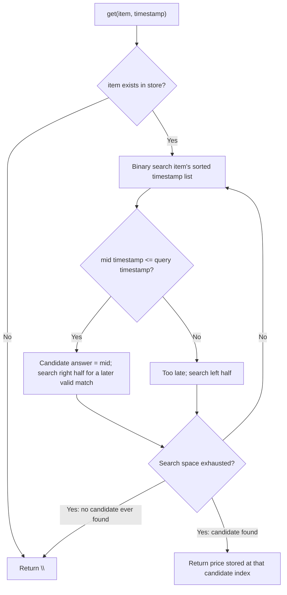

# Feature #13: Time-Based Item Price Store

## The problem

Item prices on Amazon change over time. When a customer returns something, they should be refunded the price that was in effect *at the time they bought it* — not today's price. So we need a data structure that remembers every price an item has ever had, tagged with the timestamp it took effect, and lets us ask: "what was this item's price at time `t`?"

New prices are always set with strictly increasing timestamps (an item's price history only ever moves forward in time). A price holds until it's explicitly changed. For example, if an Echo Dot was set to `"50"` at timestamp `1`, then changed to `"40"` at timestamp `3`:

- Asking for the price at timestamp `2` should return `"50"` (the most recent price at or before time `2`).
- Asking for the price at timestamp `4` should return `"40"` (the most recent price at or before time `4`).
- Asking for the price at timestamp `0` should return `""` (no price had been set yet).

## Solution

For each item, we keep two parallel lists: one of timestamps, one of the prices set at those timestamps. Because prices are always set with strictly increasing timestamps, each item's timestamp list comes pre-sorted for free — we never have to sort it ourselves.

`set(item, price, timestamp)` is the easy half: just append to both lists (a hash map lookup plus a list append, so `O(1)`).

`get(item, timestamp)` is the interesting half: we want the *rightmost* timestamp in the sorted list that is `<= timestamp`. Scanning linearly would be `O(n)` per query, but since the list is sorted, binary search finds it in `O(log n)`: at each step, if the midpoint's timestamp is `<= timestamp`, it's a *candidate* answer, but there might be an even later valid timestamp further right — so we remember it and keep searching right. If the midpoint's timestamp is too late, we search left instead. Whichever candidate survives to the end of the search is the highest timestamp not exceeding the query — exactly the price we need to refund.



## Code

```java
import java.util.*;

class TimeMap {
    HashMap<String, List<String>> prices;
    HashMap<String, List<Integer>> timestamps;

    public TimeMap() {
        prices = new HashMap<>();
        timestamps = new HashMap<>();
    }

    // Stores `price` for `item`, effective from `timestamp` onward.
    // Timestamps for a given item are assumed strictly increasing across calls.
    public void set(String item, String price, int timestamp) {
        if (prices.containsKey(item)) {
            List<Integer> itemTimestamps = timestamps.get(item);
            List<String> itemPrices = prices.get(item);

            if (timestamp < itemTimestamps.get(itemTimestamps.size() - 1)) {
                System.out.println("Timestamp must be greater than " + itemTimestamps.get(itemTimestamps.size() - 1));
            } else if (!price.equals(itemPrices.get(itemPrices.size() - 1))) {
                itemPrices.add(price);
                itemTimestamps.add(timestamp);
            }
        } else {
            prices.put(item, new ArrayList<>(List.of(price)));
            timestamps.put(item, new ArrayList<>(List.of(timestamp)));
        }
    }

    // Returns the price set for `item` at the largest timestamp <= the query timestamp,
    // or "" if no such price exists.
    public String get(String item, int timestamp) {
        if (!prices.containsKey(item)) {
            return "";
        }
        List<Integer> itemTimestamps = timestamps.get(item);
        List<String> itemPrices = prices.get(item);
        int idx = search(itemTimestamps, timestamp);
        return idx == -1 ? "" : itemPrices.get(idx);
    }

    // Binary search for the rightmost timestamp <= the query timestamp.
    private int search(List<Integer> itemTimestamps, int timestamp) {
        int lo = 0, hi = itemTimestamps.size() - 1, ans = -1;
        while (lo <= hi) {
            int mid = lo + (hi - lo) / 2;
            if (itemTimestamps.get(mid) <= timestamp) {
                ans = mid;       // candidate found — but a later one might still qualify
                lo = mid + 1;
            } else {
                hi = mid - 1;
            }
        }
        return ans;
    }

    public static void main(String[] args) {
        TimeMap timeMap = new TimeMap();
        timeMap.set("echo-dot", "50", 1);
        timeMap.set("echo-dot", "40", 3);

        System.out.println(timeMap.get("echo-dot", 2));
        // 50
        System.out.println(timeMap.get("echo-dot", 4));
        // 40
        System.out.println(timeMap.get("echo-dot", 0));
        // "" (empty string, no price set yet at time 0)
    }
}
```

## Complexity measures

### Time Complexity

`set`: `O(1)` — a hash map lookup plus a list append.
`get`: `O(log n)` — binary search over the sorted timestamp list, where `n` is the number of prices recorded for that item.

### Space Complexity

`O(n)` — the store holds every price ever set for every item, since designing the whole structure (not just its methods) requires keeping the full history.
