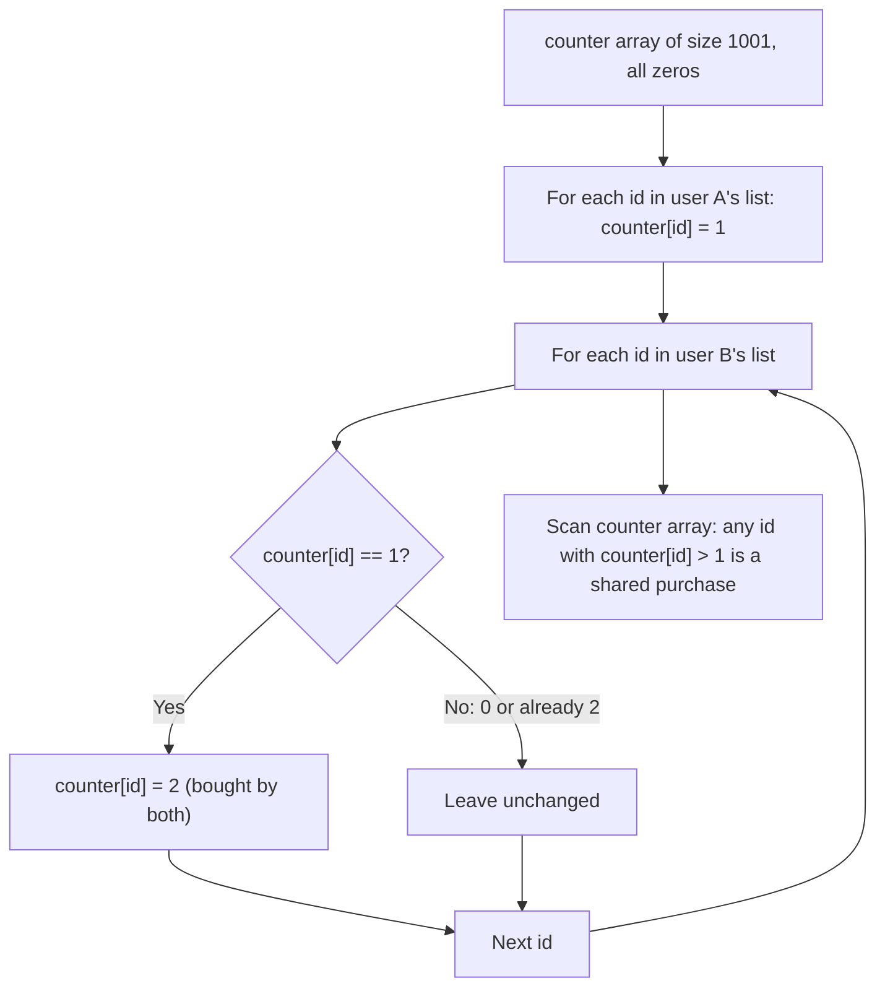

# Feature #14: Find Similar Products

## The problem

To recommend products to a group of users with similar taste, we first need a way to measure how similar two users' shopping habits actually are. Given the list of product IDs two users recently purchased, we want to find the products *both* of them bought — the overlap between their two purchase lists. Each user can buy up to 1000 distinct products, and a product that appears twice in someone's list only needs to show up once in the result.

For example, if user A bought products `{12, 45, 78, 45, 90}` and user B bought `{45, 90, 90, 33}`, the products they both purchased are `{45, 90}`.

## Solution

The obvious approach is to check every product in user A's list against user B's entire list — but that's `O(n × m)` since each check against the second list is itself a linear scan. We can do better by trading that repeated scanning for a single lookup table.

Since the problem guarantees product IDs are bounded (at most 1000 distinct products per user), we can use a fixed-size counter array indexed directly by product ID, instead of a general-purpose hash set. This turns "is this ID in the other list" from a scan into an array lookup:

1. Walk user A's list. For every product ID, mark `counter[id] = 1` — "user A bought this."
2. Walk user B's list. For every product ID, if `counter[id]` is already `1`, bump it to `2` — "both users bought this."
3. Walk the counter array once. Any index with a value greater than `1` is a shared purchase — collect it.

Because the array is indexed by product ID directly (rather than being searched), each of the three passes is a straight linear scan with `O(1)` work per element — no nested loop, no scanning one list per item of the other.



## Code

```java
import java.util.*;

class Solution {
    public static List<Integer> intersection(int[] productsIds1, int[] productsIds2) {
        // Bounded by the problem: at most 1000 distinct product IDs per user.
        int[] counter = new int[1001];

        // Mark every product user 1 bought.
        for (int id : productsIds1) {
            counter[id] = 1;
        }

        // Bump to 2 anything user 2 also bought — a confirmed shared purchase.
        for (int id : productsIds2) {
            if (counter[id] == 1) {
                counter[id] = 2;
            }
        }

        List<Integer> similarPurchases = new ArrayList<Integer>();
        for (int id = 0; id < counter.length; id++) {
            if (counter[id] > 1) {
                similarPurchases.add(id);
            }
        }

        return similarPurchases;
    }

    public static void main(String[] args) {
        int[] user1 = {12, 45, 78, 45, 90};
        int[] user2 = {45, 90, 90, 33};

        System.out.println(intersection(user1, user2));
        // [45, 90]
    }
}
```

## Complexity measures

Let **n** and **m** be the lengths of the two purchase lists.

### Time Complexity

`O(n + m)` — one linear pass over each list, plus a fixed `O(1001)` pass over the counter array, which collapses to `O(n + m)`.

### Space Complexity

`O(1)` — the counter array's size (1001) is fixed by the problem's constraints, independent of `n` and `m`.
