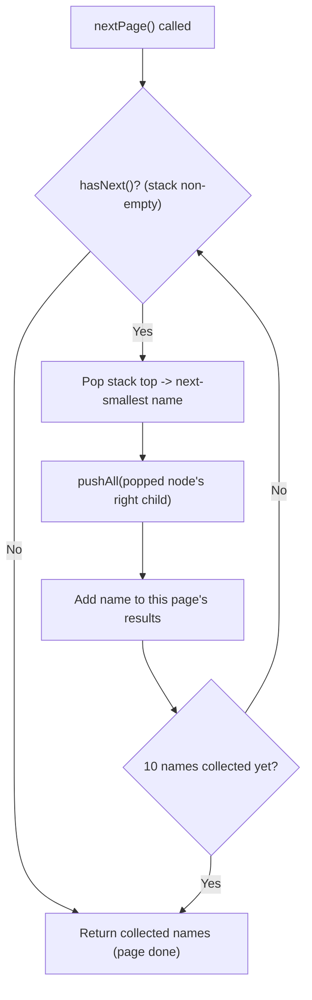

# Feature #1: Display Meeting Lobby

## The problem

Zoom's meeting lobby has a "Gallery Mode" that lists every participant's name, always in alphabetical order. Since people join and leave meetings all the time, the underlying data structure is a binary search tree (BST) keyed on name — that way, an in-order traversal always hands back the names in sorted order without needing to re-sort anything.

But a meeting can have far more participants than fit on one screen, so the gallery is paginated: only ten names show at a time. Every time the UI asks for "the next page," we need to hand back the next ten names in alphabetical order — remembering where we left off from the previous call.

For example, given a BST containing these 15 names — Albert, Antoinette, Anya, Caryl, Cassie, Charity, Cherlyn, Elia, Elvira, Iliana, Jeanette, Kandice, Lala, Latasha, Lyn — the first page should return the first ten names alphabetically: `["Albert", "Antoinette", "Anya", "Caryl", "Cassie", "Charity", "Cherlyn", "Elia", "Elvira", "Iliana"]`. The second call should return the remaining five: `["Jeanette", "Kandice", "Lala", "Latasha", "Lyn"]`. Every call after that returns an empty list.

## Solution

The classic way to visit a BST's nodes in sorted order is an in-order traversal (left, node, right). The catch here is that we can't do one traversal in a single shot — we need to *pause* after ten names and resume exactly where we stopped when the next page is requested. A plain recursive traversal doesn't pause; we need an iterative one that keeps its place between calls.

That's what a manual stack buys us. Instead of recursion, we push nodes onto our own stack, walking down the leftmost branch of whatever subtree we're looking at. The BST property guarantees the topmost item on that stack is always the next-smallest name we haven't returned yet.

1. **Constructor:** take the BST root, create an empty stack, and push the entire leftmost branch (root, its left child, its left child's left child, and so on) onto the stack.
2. **`pushAll(node)`:** the helper that does that leftmost-branch push — starting from a given node, keep pushing and moving left until there's no more left child.
3. **`hasNext()`:** the stack is non-empty exactly when there's another name left to return.
4. **`nextName()`:** pop the top of the stack (that's the next-smallest name), then call `pushAll()` on its *right* child — because once we've visited a node, the next-smallest name lives somewhere in its right subtree, following the same leftmost-branch rule.
5. **`nextPage()`:** call `nextName()` up to ten times, stopping early if `hasNext()` ever turns false, and return whatever was collected.

Because the stack persists as a field on the object between calls, each `nextPage()` call picks up exactly where the previous one left off — no need to re-traverse from the root.



## Code

```java
import java.util.*;

class DisplayLobby {
    // Standard BST node keyed on participant name.
    static class Node {
        String val;
        Node left, right;
        Node(String val) { this.val = val; }
    }

    private final Deque<Node> stack = new ArrayDeque<>();

    public DisplayLobby(Node root) {
        pushAll(root);
    }

    // Pushes the leftmost branch starting at `node` — the BST's next-smallest
    // unvisited names, from bottom (smallest) to top of stack.
    private void pushAll(Node node) {
        while (node != null) {
            stack.push(node);
            node = node.left;
        }
    }

    public boolean hasNext() {
        return !stack.isEmpty();
    }

    public String nextName() {
        Node node = stack.pop();
        pushAll(node.right); // next-smallest now lives in this subtree
        return node.val;
    }

    public List<String> nextPage() {
        List<String> page = new ArrayList<>();
        for (int i = 0; i < 10 && hasNext(); i++) {
            page.add(nextName());
        }
        return page;
    }

    public static void main(String[] args) {
        // Build a BST containing 15 participant names.
        String[] insertOrder = {
            "Elia", "Caryl", "Antoinette", "Albert", "Anya", "Cassie", "Charity",
            "Cherlyn", "Elvira", "Iliana", "Jeanette", "Latasha", "Kandice", "Lala", "Lyn"
        };
        Node root = new Node(insertOrder[0]);
        for (int i = 1; i < insertOrder.length; i++) {
            insert(root, insertOrder[i]);
        }

        DisplayLobby lobby = new DisplayLobby(root);
        System.out.println(lobby.nextPage());
        // [Albert, Antoinette, Anya, Caryl, Cassie, Charity, Cherlyn, Elia, Elvira, Iliana]
        System.out.println(lobby.nextPage());
        // [Jeanette, Kandice, Lala, Latasha, Lyn]
        System.out.println(lobby.nextPage());
        // []
    }

    private static void insert(Node node, String name) {
        if (name.compareTo(node.val) < 0) {
            if (node.left == null) node.left = new Node(name); else insert(node.left, name);
        } else {
            if (node.right == null) node.right = new Node(name); else insert(node.right, name);
        }
    }
}
```

## Complexity measures

Let **n** be the total number of participants in the tree.

### Time Complexity

Each individual call is `O(1)` *amortized*. Looking at `pushAll()` in isolation, it looks like `O(n)` in the worst case (a fully skewed tree), but across the *entire* traversal it only ever pushes each node once, total. So the true cost of visiting all n names is `O(n)` overall, which works out to `O(1)` amortized per `nextName()` call — and `nextPage()` is just ten of those, still `O(1)` amortized.

### Space Complexity

`O(n)` — the stack can hold up to the height of the tree's leftmost spine at any moment, and across the object's lifetime it processes every node once, so in the worst case (a skewed tree) it holds close to n nodes.
