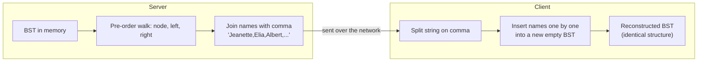

# Feature #2: Serialize and Deserialize Participant Data

## The problem

Just like the previous feature, Zoom keeps participant names in a binary search tree on both the server and the client — that's what makes the alphabetical display cheap to maintain. But a BST is a graph of pointers in memory; it can't be sent over a network as-is. Before the server can push participant data to a client, it needs to flatten the tree into a string. When the client receives that string, it needs to rebuild a BST that has exactly the same structure as the original.

So we need two functions: a `serialize()` that turns a BST into a string, and a `deserialize()` that turns that string back into the original tree.

For example, given a BST rooted at "Jeanette" (with "Elia" and its children on the left, and "Latasha" and its children on the right), one valid serialized form is the string `"Jeanette,Elia,Albert,Elvira,Latasha,Kandice,Maggie"`. Feeding that string into `deserialize()` should reconstruct a tree identical to the original.

## Solution

There's no single "correct" serialization format — any format works as long as `deserialize(serialize(tree))` reproduces the original tree. The trick for a *binary search tree* specifically (as opposed to a general binary tree) is picking a traversal order that lets us rebuild the exact shape just from BST insertion rules, without needing to record `null` markers for empty children.

**Pre-order traversal (node, then left, then right) is exactly that traversal.** Here's why: the first name in a pre-order list is always the root. Every name after it that's alphabetically smaller belongs somewhere in the left subtree, and every name that's larger belongs somewhere in the right subtree — and that's precisely how a plain BST-insert() operation routes new values. So if we serialize with pre-order and deserialize by inserting names one at a time into a fresh BST (in the same order they were serialized), we reconstruct the identical tree, without ever needing to write down where the empty branches are.

**`serialize(root)`:**
1. Run a pre-order walk: visit the current node, then recurse left, then recurse right, appending each name to a list as we go.
2. Join the list into a single comma-delimited string.

**`deserialize(data)`:**
1. Split the string on the delimiter to get back the list of names, in original pre-order.
2. Insert them one at a time into a new BST, in that same order — the first name becomes the root, and every subsequent name goes through ordinary BST insertion.
3. Return the resulting root.



## Code

```java
import java.util.*;

class Translator {
    static class Node {
        String val;
        Node left, right;
        Node(String val) { this.val = val; }

        // Standard BST insertion — routes by alphabetical comparison.
        void insert(String name) {
            if (name.compareTo(val) < 0) {
                if (left == null) left = new Node(name); else left.insert(name);
            } else {
                if (right == null) right = new Node(name); else right.insert(name);
            }
        }
    }

    public String serialize(Node root) {
        List<String> names = new ArrayList<>();
        preOrder(root, names);
        return String.join(",", names);
    }

    private void preOrder(Node node, List<String> names) {
        if (node != null) {
            names.add(node.val);
            preOrder(node.left, names);
            preOrder(node.right, names);
        }
    }

    public Node deserialize(String data) {
        String[] names = data.split(",");
        Node root = null;
        for (String name : names) {
            if (root == null) {
                root = new Node(name);
            } else {
                root.insert(name);
            }
        }
        return root;
    }

    public static void main(String[] args) {
        Node root = new Node("Jeanette");
        root.left = new Node("Elia");
        root.left.left = new Node("Albert");
        root.left.right = new Node("Elvira");
        root.right = new Node("Latasha");
        root.right.left = new Node("Kandice");
        root.right.right = new Node("Maggie");

        Translator translator = new Translator();
        String serialized = translator.serialize(root);
        System.out.println(serialized);
        // Jeanette,Elia,Albert,Elvira,Latasha,Kandice,Maggie

        Node rebuilt = translator.deserialize(serialized);
        System.out.println(translator.serialize(rebuilt));
        // Jeanette,Elia,Albert,Elvira,Latasha,Kandice,Maggie  (matches original)
    }
}
```

## Complexity measures

Let **n** be the number of participants (nodes) in the tree.

### Time Complexity

`O(n)` for both functions — `serialize()` visits every node exactly once during the pre-order walk, and `deserialize()` performs one BST insertion per name.

### Space Complexity

`O(n)` for both — `serialize()` builds a list and string proportional to the number of names, and `deserialize()` allocates a new node per name to rebuild the tree.
