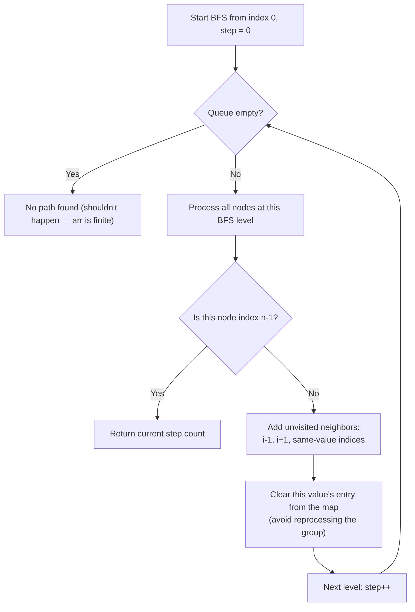

# Feature #3: Meeting Activity

## The problem

To help remote teams unwind, Zoom wants to add mini-games players can enjoy during a meeting. The pilot game is a timed guessing puzzle: the player sees a staircase of `n` steps, numbered `0` to `n - 1`, and each step has a number written on it. A sprite starts at the bottom (step 0) and needs to reach the top (step `n - 1`) in as few jumps as possible, following these rules:

- From step `i`, jump to step `i + 1` (if it exists).
- From step `i`, jump to step `i - 1` (if it exists).
- From step `i`, jump to *any* step `j` where the number written on it matches step `i`'s number (`arr[i] == arr[j]`), even if it's far away.

Given the step values `[2, 5, 7, 5, 3, 4]`, the answer is 4 jumps. One way to see it: step 0 (value 2) → step 1 (value 5) → step 3 (value 5, via the "same value" rule) → step 4 (value 3) → step 5 (value 4). That's 4 jumps to go from index 0 to index 5.

## Solution

This is really a shortest-path problem on an unweighted graph — and shortest path in an unweighted graph is exactly what breadth-first search (BFS) is built for. Every step index is a node; edges connect adjacent indices (the `i + 1` / `i - 1` rule) and also connect every pair of indices that share the same value.

The trick that keeps this efficient: don't discover "same value" neighbors by scanning the whole array each time — precompute a hash table once that maps each value to the list of indices holding it, so those jumps are an `O(1)` lookup away.

1. **Build the value → indices map** up front: one pass over the array, grouping indices by their step value.
2. **BFS from index 0**, level by level (this is what guarantees the *first* time we reach index `n - 1`, we've done so in the minimum number of jumps).
3. At each node, gather its neighbors: `i - 1`, `i + 1`, and every index sharing `arr[i]`'s value.
4. Track visited indices so we never revisit a step.
5. **Key optimization:** once we've explored all the same-valued neighbors for a given value, remove that value's entry from the hash table entirely. If two nodes share a value, they're already connected to each other's neighbors through that first exploration — re-exploring the same value group from a second node would just re-scan indices we've already handled (or already visited), so we clear it out to keep each value group's edges processed exactly once across the whole search.
6. The moment we pop index `n - 1` off the queue, the current BFS depth is the answer.



## Code

```java
import java.util.*;

class Solution {
    public static int minSteps(int[] k) {
        int n = k.length;
        if (n <= 1) {
            return 0;
        }

        // Group indices by the value written on their step.
        Map<Integer, List<Integer>> valueToIndices = new HashMap<>();
        for (int i = 0; i < n; i++) {
            valueToIndices.computeIfAbsent(k[i], v -> new ArrayList<>()).add(i);
        }

        Deque<Integer> queue = new ArrayDeque<>();
        queue.add(0);
        boolean[] visited = new boolean[n];
        visited[0] = true;
        int step = 0;

        while (!queue.isEmpty()) {
            int levelSize = queue.size();
            for (int s = 0; s < levelSize; s++) {
                int node = queue.poll();
                if (node == n - 1) {
                    return step;
                }

                List<Integer> neighbors = new ArrayList<>();
                if (valueToIndices.containsKey(k[node])) {
                    neighbors.addAll(valueToIndices.get(k[node]));
                    valueToIndices.remove(k[node]); // this value group is fully explored now
                }
                if (node + 1 < n) neighbors.add(node + 1);
                if (node - 1 >= 0) neighbors.add(node - 1);

                for (int next : neighbors) {
                    if (!visited[next]) {
                        visited[next] = true;
                        queue.add(next);
                    }
                }
            }
            step++;
        }
        return -1; // unreachable for a finite array, but keeps the compiler happy
    }

    public static void main(String[] args) {
        int[] k = {2, 5, 7, 5, 3, 4};
        System.out.println(minSteps(k));
        // 4
    }
}
```

## Complexity measures

Let **n** be the number of steps on the staircase.

### Time Complexity

`O(n)` — every index is visited (and enqueued) at most once, and each value group in the hash map is expanded exactly once across the whole search, since we delete it right after using it.

### Space Complexity

`O(n)` — the value-to-indices map, the visited array, and the BFS queue each hold at most n entries.
