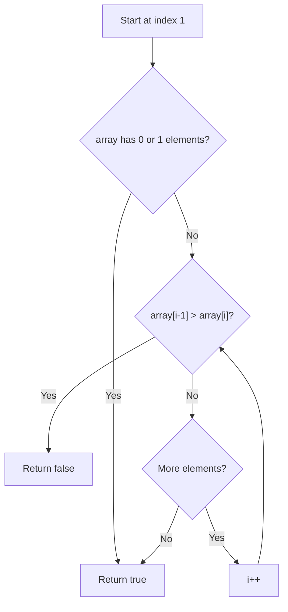

# Feature #4: Validate Sorted Participants Data

## The problem

Following on from the last two features: participant data travels from server to client as a serialized BST, and gets deserialized back into a tree on arrival. Before trusting that reconstructed data, we want a sanity check — did the transmission actually preserve the correct order?

We'll assume the server sends over the participant names as an in-order listing (an array of strings, already meant to be alphabetically increasing). Our job is to confirm the array really is sorted — if it is, the underlying tree it came from is a valid BST; if any pair is out of order, something went wrong along the way.

For example, `["Caryl", "Elia", "Elvira", "Jeanette", "Lala", "Latasha", "Lyn"]` is correctly sorted, so it validates. An array like `["Caryl", "Lala", "Elia"]` would fail, since "Lala" comes after "Elia" alphabetically but appears before it in the array.

## Solution

This one is refreshingly direct: a sequence is sorted in increasing order exactly when every adjacent pair satisfies `previous <= next`. We don't need to look at the tree at all — just walk the array once and compare each name to the one right before it.

1. If the array has zero or one elements, it's trivially sorted — return true.
2. Otherwise, walk the array from index 1 onward, comparing `array[i - 1]` to `array[i]` alphabetically (via `String.compareTo`).
3. The moment we find a pair where the previous name is alphabetically *greater* than the current one, we know the order was broken — return false immediately.
4. If we make it through the whole array without finding a bad pair, the data is valid — return true.



## Code

```java
class Solution {
    public static boolean validateData(String[] array, int n) {
        if (n == 0 || n == 1) {
            return true; // trivially sorted
        }
        for (int i = 1; i < n; i++) {
            if (array[i - 1].compareTo(array[i]) > 0) {
                return false; // found an out-of-order pair
            }
        }
        return true;
    }

    public static void main(String[] args) {
        String[] array = {"Caryl", "Elia", "Elvira", "Jeanette", "Lala", "Latasha", "Lyn"};
        System.out.println(validateData(array, array.length) ? "Valid BST" : "Invalid BST");
        // Valid BST
    }
}
```

## Complexity measures

Let **n** be the number of names in the array and **m** the length of the longest name.

### Time Complexity

`O(m × n)` — the loop runs n times, and each `compareTo()` call between two strings costs up to `O(m)` in the worst case.

### Space Complexity

`O(1)` — the comparison happens in place; no extra structures are allocated.
