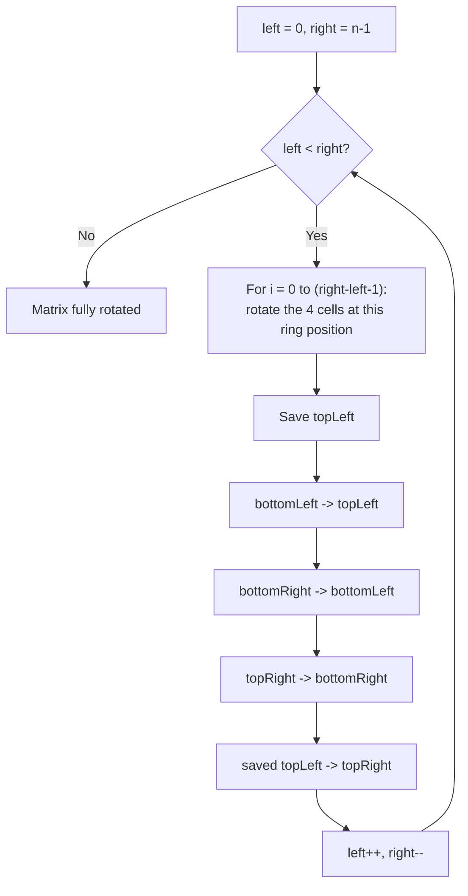

# Feature #5: Auto Rotate in Mobile Devices

## The problem

Zoom supports a huge range of devices, and a lot of users join meetings from their phones — where the screen can flip between portrait and landscape at any moment. Each participant's profile picture is stored as a grid of pixels (an `n x n` matrix), and when the phone orientation changes, we want to rotate that picture 90 degrees clockwise, in place, without allocating a second matrix to hold the result.

For example, rotating

```
1 2 3
4 5 6
7 8 9
```

90 degrees clockwise should produce

```
7 4 1
8 5 2
9 6 3
```

## Solution

Rotating a matrix 90 degrees clockwise is really about rotating rings of cells — the outermost ring, then the ring inside it, and so on inward. For a single ring, each 90-degree clockwise rotation moves every cell four positions away: top-left goes to top-right's old spot, top-right goes to bottom-right's old spot, bottom-right goes to bottom-left's old spot, and bottom-left goes to top-left's old spot. If we do that four-way swap for every cell along one ring, and then repeat for the next ring in, the whole matrix is rotated — with no extra matrix needed.

1. Track a shrinking square boundary with `left`/`right` (and, since the matrix is square, `top = left`, `bottom = right`).
2. For each position `i` along the top edge of the current ring (from `left` to just before `right`):
   - Save the top-left cell in a temp variable.
   - Move the bottom-left cell into the top-left spot.
   - Move the bottom-right cell into the bottom-left spot.
   - Move the top-right cell into the bottom-right spot.
   - Move the saved temp (original top-left) into the top-right spot.
3. Shrink the boundary (`left++`, `right--`) and repeat for the next ring in, until `left >= right`.

Four cells move together in a single rotation step, which is why one loop iteration handles a whole "set" of four corresponding positions at once.



## Code

```java
import java.util.*;

class Solution {
    public static void autoRotate(int[][] matrix) {
        int left = 0;
        int right = matrix.length - 1;

        while (left < right) {
            // `right - left` is the current ring's side length minus 1.
            for (int i = 0; i < right - left; i++) {
                int top = left;
                int bottom = right;
                int topLeft = matrix[top][left + i];

                // bottomLeft -> topLeft
                matrix[top][left + i] = matrix[bottom - i][left];
                // bottomRight -> bottomLeft
                matrix[bottom - i][left] = matrix[bottom][right - i];
                // topRight -> bottomRight
                matrix[bottom][right - i] = matrix[top + i][right];
                // saved topLeft -> topRight
                matrix[top + i][right] = topLeft;
            }
            left++;
            right--;
        }
    }

    public static void main(String[] args) {
        int[][] picture = {
            {1, 2, 3},
            {4, 5, 6},
            {7, 8, 9}
        };
        autoRotate(picture);
        for (int[] row : picture) {
            System.out.println(Arrays.toString(row));
        }
        // [7, 4, 1]
        // [8, 5, 2]
        // [9, 6, 3]
    }
}
```

## Complexity measures

Let **n** be the number of cells in the matrix (i.e., the matrix is `√n x √n`).

### Time Complexity

`O(n)` — every cell is visited and moved exactly once, across all rings.

### Space Complexity

`O(1)` — the rotation happens in place, using only a single temp variable per four-cell swap.
