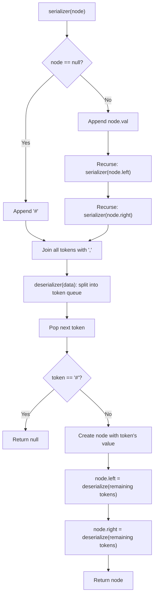

# DIY: Serialize and Deserialize Binary Tree

## Problem statement

Given a binary tree, implement two functions:

- `serializer(root)`: serializes the binary tree into a string.
- `deserializer(data)`: deserializes that string back into a binary tree, identical in shape and values to the original.

There's no fixed format for the serialized string — any format works, as long as `deserializer(serializer(root))` reconstructs the same tree.

### Input

The input for `serializer()` is the root node of a binary tree of integers. The input for `deserializer()` is whatever string `serializer()` produced. Given this tree:

```
        1
       / \
      2   3
         / \
        4   5
```

```java
String data = serializer(root);
Node newRoot = deserializer(data);
```

### Output

`serializer()` returns a string (format is up to you). `deserializer()` returns the root of a binary tree reconstructed from that string, matching the original in both shape and values.

## Coding exercise

Implement `serializer(Node node)` and `deserializer(String data)`, given a `Node` with `int val`, `Node left`, and `Node right`.

This is closely related to [Feature #2: Serialize and Deserialize Participant Data](02-feature-2-serialize-and-deserialize-participant-data.md) — but with an important twist. Feature #2 could get away with plain pre-order plus BST re-insertion because a *binary search tree*'s shape is fully determined by its values and the BST ordering rule. A general binary tree has no such rule — two different trees can hold the exact same values in the exact same pre-order sequence. So this time we need to explicitly record where the empty (`null`) children are, so `deserializer()` knows exactly where each branch ends.

## Solution

Pre-order traversal still works — visit node, then left, then right — but now we must write down a placeholder (`"#"`) every time we hit a `null` child, instead of silently skipping it. That placeholder is what lets `deserializer()` know when to stop descending down a branch, since without a BST's ordering rule to guide reconstruction, the null markers are the only thing that pins down the shape.

**`serializer(root)`:**
1. Pre-order walk: if the current node is `null`, append `"#"` and stop this branch.
2. Otherwise append the node's value, then recurse into the left child, then the right child.
3. Join everything with a delimiter (comma) into one string.

**`deserializer(data)`:**
1. Split the string into a queue of tokens, keeping their original order.
2. Recursively rebuild: pop a token — if it's `"#"`, this branch is `null`; otherwise create a node with that value, then recursively rebuild its left child from the remaining tokens, then its right child.
3. Because we consume tokens in the same pre-order sequence they were written, the recursion naturally rebuilds the identical shape.



## Code

```java
import java.util.*;

class Solution {
    static class Node {
        int val;
        Node left, right;
        Node(int val) { this.val = val; }
    }

    public static String serializer(Node node) {
        StringBuilder sb = new StringBuilder();
        preOrder(node, sb);
        // drop the trailing delimiter
        return sb.length() > 0 ? sb.substring(0, sb.length() - 1) : "";
    }

    private static void preOrder(Node node, StringBuilder sb) {
        if (node == null) {
            sb.append("#,");
            return;
        }
        sb.append(node.val).append(",");
        preOrder(node.left, sb);
        preOrder(node.right, sb);
    }

    public static Node deserializer(String data) {
        Deque<String> tokens = new ArrayDeque<>(Arrays.asList(data.split(",")));
        return buildTree(tokens);
    }

    private static Node buildTree(Deque<String> tokens) {
        String token = tokens.poll();
        if (token == null || token.equals("#")) {
            return null;
        }
        Node node = new Node(Integer.parseInt(token));
        node.left = buildTree(tokens);
        node.right = buildTree(tokens);
        return node;
    }

    public static void main(String[] args) {
        Node root = new Node(1);
        root.left = new Node(2);
        root.right = new Node(3);
        root.right.left = new Node(4);
        root.right.right = new Node(5);

        String data = serializer(root);
        System.out.println(data);
        // 1,2,#,#,3,4,#,#,5,#,#

        Node newRoot = deserializer(data);
        System.out.println(serializer(newRoot));
        // 1,2,#,#,3,4,#,#,5,#,#  (matches original)
    }
}
```

## Complexity measures

Let **n** be the number of nodes in the tree.

- **Time:** `O(n)` for both functions — `serializer()` visits every node (and every null child slot) once, and `deserializer()` processes each token exactly once.
- **Space:** `O(n)` for both — the string/token list has `O(n)` entries, and the recursion stack depth is `O(n)` in the worst case (a skewed tree).
