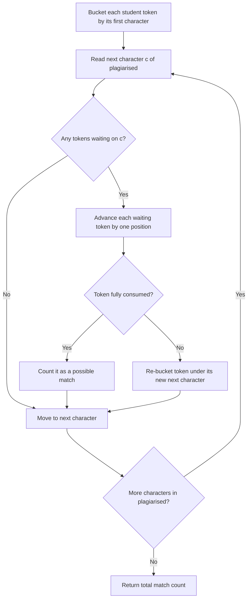

# Feature #1: Possible Matches

## The problem

We have a set of documents, each submitted by a different student and already converted into a string of tokens. We're handed one *plagiarised* token string and need to know: how many students in the class could this have been copied from?

The catch is disguise. A cheater rarely copies word-for-word — they'll sprinkle in dummy tokens (extra statements, renamed variables, harmless comments) to break up the copied text. So "copied from student X" doesn't mean "X's tokens appear verbatim inside plagiarised" — it means "X's tokens appear *in order* inside plagiarised, possibly with other characters wedged in between." That's exactly the definition of a **subsequence**.

For example, say four students submitted token strings `a`, `bb`, `acd`, and `ace`, and the suspect string is `plagiarised = "abcde"`. Is `ace` a subsequence of `abcde`? Yes — `a`, then skip `b`, then `c`, skip `d`, then `e`. So `ace` (and `a`, and `acd`) are all possible sources; `bb` is not, since `abcde` only has one `b`.

## Solution

`plagiarised` can be huge — potentially a lot of tokenized code — so we want to check all the students' strings in a **single pass** over `plagiarised`, rather than re-scanning it once per student.

The trick: instead of asking "does student X's string match?", track *every* student's progress simultaneously, bucketed by the next character each one is waiting for.

1. Build a `waitingList`, keyed by character. Initially, each student's word sits in the bucket for its *first* character — it's "waiting" to see that character next.
2. Walk `plagiarised` one character at a time. When we hit character `c`, take every word currently waiting for `c` and advance it by one position.
   - If that word still has characters left, move it into the bucket for its *new* next character.
   - If that was the word's last character, it's a full match — count it.
3. After one pass over `plagiarised`, the running count is the number of possible source students.

Walking through `plagiarised = "abcde"` with students `{a, bb, acd, ace}`:

- Start: bucket `a` → `{a, acd, ace}`, bucket `b` → `{bb}`.
- See `a`: `a` finishes (match!). `acd` and `ace` both advance to waiting on `c`.
- See `b`: `bb` advances to waiting on its second `b` — but `plagiarised` never has a second `b`, so `bb` is stuck forever, never matches.
- See `c`: `acd` and `ace` both advance — `acd` now waits on `d`, `ace` now waits on `e`.
- See `d`: `acd` finishes (match!).
- See `e`: `ace` finishes (match!).

Total: 3 matches (`a`, `acd`, `ace`). `bb` never got there.



## Code

```java
import java.util.*;

class Solution {

    // Tracks how far one student's token string has matched into plagiarised so far.
    static class Progress {
        final String word;
        int pos;
        Progress(String word) { this.word = word; this.pos = 0; }
    }

    public static int possibleMatches(String plagiarised, String[] students) {
        // waitingList[c] holds every student token currently waiting to see character c next.
        List<Progress>[] waitingList = new List[128];
        for (int c = 0; c < 128; c++) {
            waitingList[c] = new ArrayList<>();
        }

        for (String word : students) {
            waitingList[word.charAt(0)].add(new Progress(word));
        }

        int matches = 0;
        for (char c : plagiarised.toCharArray()) {
            List<Progress> waiting = waitingList[c];
            waitingList[c] = new ArrayList<>();
            for (Progress p : waiting) {
                p.pos++;
                if (p.pos == p.word.length()) {
                    matches++; // this student's whole token string is a subsequence of plagiarised
                } else {
                    waitingList[p.word.charAt(p.pos)].add(p);
                }
            }
        }
        return matches;
    }

    public static void main(String[] args) {
        String plagiarised = "abcde";
        String[] students = {"a", "bb", "acd", "ace"};

        System.out.println("The content was copied from " + possibleMatches(plagiarised, students) + " students");
        // The content was copied from 3 students
    }
}
```

## Complexity measures

Let **s** be the length of `plagiarised` and **w** be the total length of all strings in `students` combined.

### Time Complexity

`O(s + w)` — every character of `plagiarised` is visited once, and every character of every student token is moved between buckets at most once.

### Space Complexity

`O(w)` — the `waitingList` buckets, across all characters, never hold more than one `Progress` entry per character of every student token.
