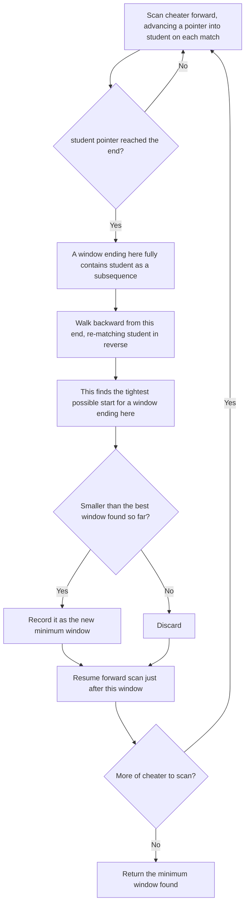

# Feature #2: Return Match

## The problem

Feature #1 only tells us *how many* students could be a source. Now we need to actually show the evidence: given a suspected cheater's tokens and a specific student's original tokens, find the **exact portion of the cheater's string** that matches — so a reviewer can point at it directly.

Same rule as before: the student's tokens must appear as a subsequence inside the cheater's string, since the cheater may have inserted extra tokens to disguise the copy. But now there's a wrinkle — there can be *multiple* windows in the cheater's string that all contain the student's tokens as a subsequence, and we want the **smallest** one, since that's the tightest possible evidence of copying.

For example, if `student = "ab"` and `cheater = "acab"`, then `"acab"` itself contains `ab` as a subsequence (skip `c`), but so does the smaller substring `"ab"` at the end. We want the smallest: `"ab"`.

## Solution

Scanning forward once isn't enough by itself — the *first* match we find scanning left to right isn't necessarily the *smallest*. So we combine a forward scan with a backward shrink:

1. Walk `cheater` left to right. Keep a pointer into `student`; whenever the current `cheater` character equals the character `student` is waiting for, advance that pointer.
2. The moment the `student` pointer reaches the end (a full subsequence match has just been completed), we know a window ending at the current position exists — but it might not be minimal, since the match may have wasted characters near its start.
3. From that ending position, walk **backward**, matching `student` in reverse. This finds the *latest possible* start for the window that still covers all of `student` — trimming off any wasted leading characters.
4. Compare this window's length against the smallest one found so far, and keep whichever is smaller.
5. Continue the forward scan from just after the ending position, repeating steps 1–4, until `cheater` is exhausted.

Walking through `cheater = "quiqutit"` (indices `0..7`: `q u i q u t i t`), `student = "quit"`:

- The forward scan finds its first complete match at index `5` (`q` at 0, `u` at 1, `i` at 2, `t` at 5) — a window ending at index `6`. Walking backward from there finds no shorter start, so the first candidate window is `"quiqut"` (indices `0..6`, length 6).
- The scan resumes and finds a second complete match at index `7` (using the `q` at index 3, `u` at 4, `i` at 6, `t` at 7). Walking backward from index 7 trims the wasted characters at the front, landing on start index `3` — giving the window `"qutit"` (indices `3..8`, length 5).
- `5 < 6`, so `"qutit"` replaces `"quiqut"` as the minimum window. The scan then reaches the end of `cheater`, and `"qutit"` is the final answer.



## Code

```java
class Solution {

    public static String match(String cheater, String student) {
        String window = "";
        int j = 0;
        int min = cheater.length() + 1;

        for (int i = 0; i < cheater.length(); i++) {
            if (cheater.charAt(i) == student.charAt(j)) {
                j++;
                if (j == student.length()) {
                    // Just completed a forward match ending at i. Shrink it from the back.
                    int end = i + 1;
                    j--;
                    while (j >= 0) {
                        if (cheater.charAt(i) == student.charAt(j)) {
                            j--;
                        }
                        i--;
                    }
                    j++;
                    i++;
                    if (end - i < min) {
                        min = end - i;
                        window = cheater.substring(i, end);
                    }
                }
            }
        }
        return window;
    }

    public static void main(String[] args) {
        String cheater = "quiqutit";
        String student = "quit";

        System.out.println(match(cheater, student));
        // qutit
    }
}
```

## Complexity measures

Let **s** be the length of `cheater` and **t** be the length of `student`.

### Time Complexity

`O(s * t)` — in the worst case, every position in `cheater` can trigger a full backward shrink pass over up to `t` characters.

### Space Complexity

`O(1)` — beyond the returned substring, only a fixed handful of index variables are used.
