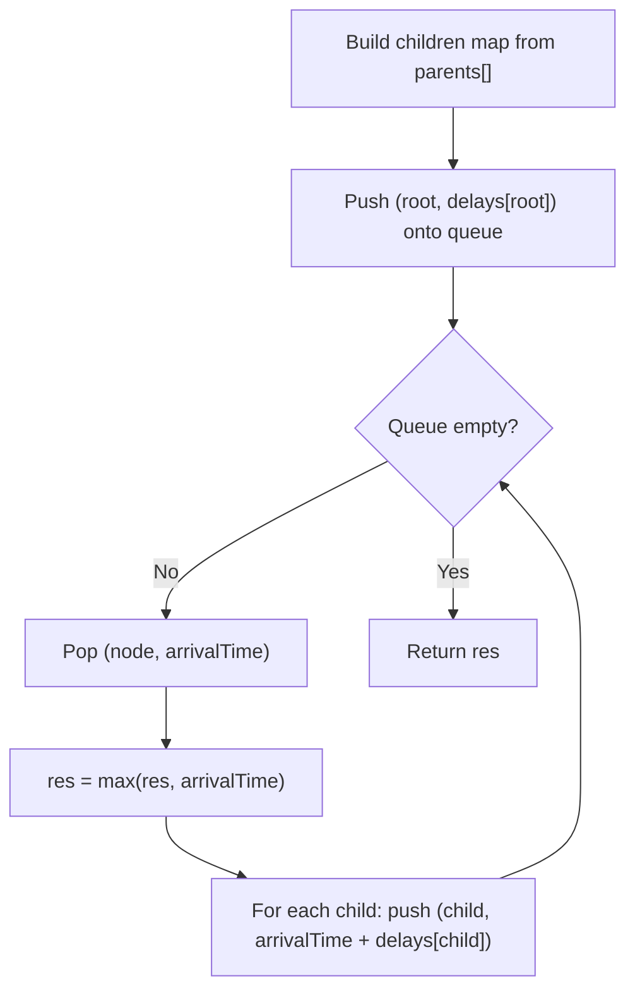

# Feature #1: Total Time

## The problem

Ethernet LANs are built with redundant connections between switches, but Ethernet only works on a loop-free topology. So the switches run the Spanning Tree Protocol (STP), which computes a minimum spanning tree over the network and disables the links that would create loops. Every message is then forwarded only along the links that survive in that spanning tree.

The main server sits at the root of this tree. The clients sit at the leaves. Every other node is a switch that forwards the message onward. Each link is labeled with a delay — the number of seconds it takes a message to cross from one end to the other — and even the root server experiences a delay broadcasting the very first hop. Given this tree, we need to find the total time before every client has received the message.

We're given two arrays: `parents` and `delays`. Each index is a device ID; `parents[i]` holds the ID of the device that `i` receives its message from (the root's own entry is `-1`), and `delays[i]` holds the delay for the link feeding into device `i`. For example, with 15 devices where device 0 is the root:

```
parents : {-1, 0, 0, 1, 1, 2, 2, 3, 3, 4, 4, 5, 5, 6, 6}
delays  : { 1, 1, 1, 1, 1, 1, 1, 0, 0, 0, 0, 0, 0, 0, 0}
```

Devices 7 through 14 are the clients (leaves), so their own delay is 0 — they don't forward the message any further. The answer for this tree is `3`: the message reaches the root in 1 second, the next level in 2, and the leaves in 3.

## Solution

We need the maximum time along any root-to-leaf path, summing delays level by level as we descend. Since the tree structure is described by parent pointers rather than a proper adjacency list, the first job is to flip it around: build a map from each device to its children.

Once we have that, a breadth-first traversal does the rest. Push the root onto a queue carrying its own transmission delay as the "time so far." Each time we pop a device, we know the time at which it received the message — so we push each of its children with that time plus the child's own link delay. Track the running maximum of every time value we ever see; that maximum, once the queue empties, is the total time.



## Code

```java
import java.util.*;

class TotalTime {
    public static int totalTime(int mainServerId, int[] parents, int[] delays) {
        int n = parents.length;
        if (n <= 1) {
            return 0;
        }

        Map<Integer, List<Integer>> children = new HashMap<>();
        for (int i = 0; i < n; i++) {
            int parent = parents[i];
            if (parent != -1) {
                children.computeIfAbsent(parent, k -> new ArrayList<>()).add(i);
            }
        }

        int res = 0;
        Queue<int[]> queue = new ArrayDeque<>();
        queue.add(new int[]{mainServerId, delays[mainServerId]});

        while (!queue.isEmpty()) {
            int[] current = queue.poll();
            int nodeId = current[0];
            int arrivalTime = current[1];
            res = Math.max(res, arrivalTime);

            for (int child : children.getOrDefault(nodeId, Collections.emptyList())) {
                queue.add(new int[]{child, arrivalTime + delays[child]});
            }
        }
        return res;
    }

    public static void main(String[] args) {
        int[] parents = {-1, 0, 0, 1, 1, 2, 2, 3, 3, 4, 4, 5, 5, 6, 6};
        int[] delays  = { 1, 1, 1, 1, 1, 1, 1, 0, 0, 0, 0, 0, 0, 0, 0};
        System.out.println(totalTime(0, parents, delays));
        // 3
    }
}
```

## Complexity measures

Let **n** be the number of devices in the tree.

### Time Complexity

`O(n)` — building the children map visits each device once, and the BFS visits each device exactly once as well.

### Space Complexity

`O(n)` — the children map holds n - 1 entries total (one per non-root device), and the queue holds at most n devices across the traversal.
