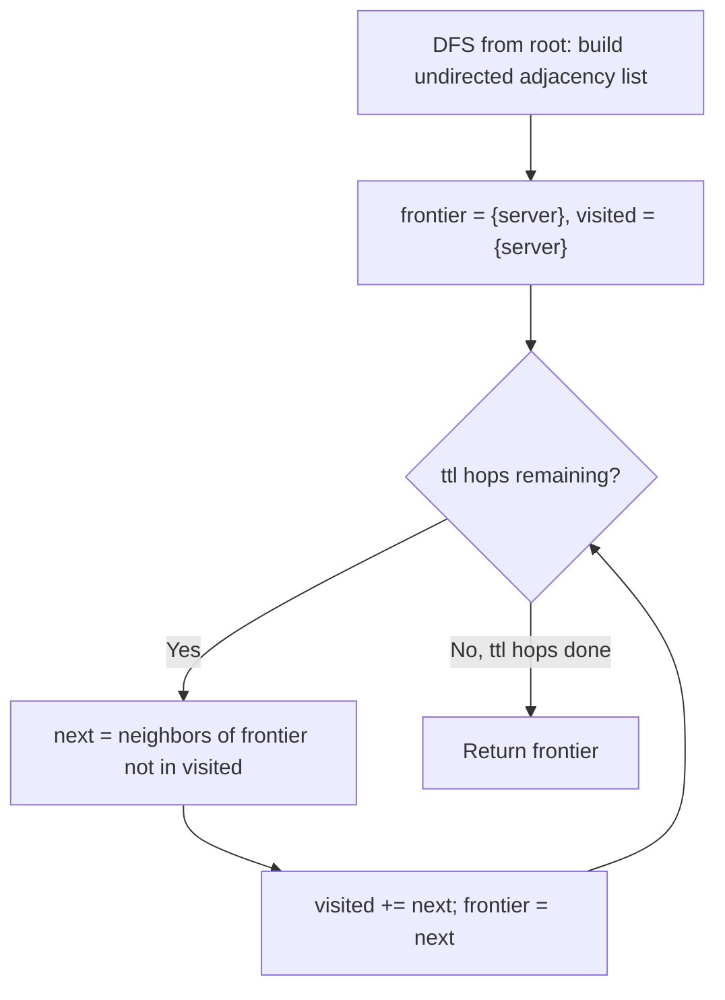

# Feature #2: TTL Expiry

## The problem

To keep messages from flooding the network forever, every message carries a time-to-live (TTL): the number of hops it's allowed to travel away from the server before it's dropped. The server can sit at *any* node of the network — not necessarily the root — and the network itself is shaped like an n-ary tree. Given the server's position and a TTL value, we need to find every device where the message's TTL runs out — that is, every device exactly TTL hops away from the server.

For example, take this tree:

```
        1
      / | \
     2  3  4
    / \      \
   5   6      7
```

If the server is node `3` and the TTL is `2`, the message travels: `3 -> 1` (1 hop), then `1 -> 2` and `1 -> 4` (2 hops). So the devices where the TTL expires are `2` and `4`.

## Solution

A message doesn't just flow downward from a server — it can flow toward the server's parent just as easily as toward its children, since the server might be buried anywhere in the tree. So the first step is to stop thinking of this as a rooted tree and start thinking of it as a plain undirected graph: one DFS pass over the tree builds an adjacency list where every edge is recorded in both directions.

With that adjacency list in hand, this becomes ordinary BFS, layer by layer, starting from the server. We keep a "current frontier" of nodes exactly `k` hops away, and on each of the `ttl` iterations we expand it outward by one hop, always skipping nodes we've already visited so we never walk back the way we came. After `ttl` iterations, whatever's left in the frontier is exactly the set of devices where the TTL expires — we don't care about the nodes we passed through on the way, only the final layer.



## Code

```java
import java.util.*;

class TTLExpiry {
    static class TreeNode {
        int val;
        List<TreeNode> children = new ArrayList<>();
        TreeNode(int val) { this.val = val; }
    }

    public static List<Integer> getDevices(TreeNode root, TreeNode server, int ttl) {
        Map<Integer, List<Integer>> neighbors = new HashMap<>();
        dfs(null, root, neighbors);

        List<Integer> frontier = new ArrayList<>();
        frontier.add(server.val);
        Set<Integer> visited = new HashSet<>(frontier);

        for (int hop = 0; hop < ttl; hop++) {
            List<Integer> next = new ArrayList<>();
            for (int node : frontier) {
                for (int neighbor : neighbors.get(node)) {
                    if (!visited.contains(neighbor)) {
                        next.add(neighbor);
                    }
                }
            }
            visited.addAll(next);
            frontier = next;
        }
        return frontier;
    }

    private static void dfs(TreeNode parent, TreeNode node, Map<Integer, List<Integer>> neighbors) {
        if (node == null) {
            return;
        }
        neighbors.putIfAbsent(node.val, new ArrayList<>());
        if (parent != null) {
            neighbors.get(parent.val).add(node.val);
            neighbors.get(node.val).add(parent.val);
        }
        for (TreeNode child : node.children) {
            dfs(node, child, neighbors);
        }
    }

    public static void main(String[] args) {
        TreeNode n1 = new TreeNode(1);
        TreeNode n2 = new TreeNode(2);
        TreeNode n3 = new TreeNode(3);
        TreeNode n4 = new TreeNode(4);
        TreeNode n5 = new TreeNode(5);
        TreeNode n6 = new TreeNode(6);
        TreeNode n7 = new TreeNode(7);
        n1.children.addAll(List.of(n2, n3, n4));
        n2.children.addAll(List.of(n5, n6));
        n4.children.add(n7);

        System.out.println(getDevices(n1, n3, 2));
        // [2, 4]
    }
}
```

## Complexity measures

Let **n** be the number of devices in the network.

### Time Complexity

`O(n)` — the DFS visits every node once to build the adjacency list, and the BFS across all `ttl` layers visits every node at most once total (a node only ever enters `frontier` the first time it's discovered).

### Space Complexity

`O(n)` — the adjacency list stores two entries per edge, and there are n - 1 edges in a tree, so that's `O(n)`. The `visited` set and successive `frontier` lists also hold at most n device IDs combined.
