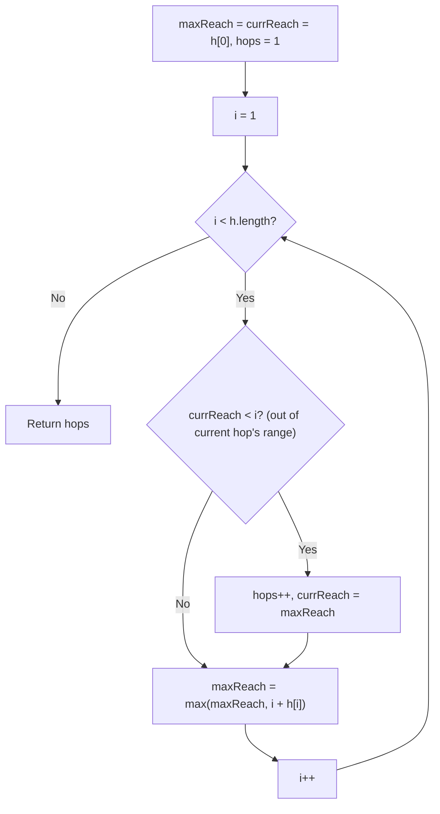

# Feature #3: Minimum Hops

## The problem

We've placed routers in a straight chain to form a linear network topology. Each router has its own TTL-like reach — router `i` can forward a packet at most `h[i]` hops forward (think of it as "at most `h[i]` positions to the right"). A packet has just arrived at the first router and needs to reach the last one. We want to get it there using as few transmissions — as few intermediate routers — as possible.

We're given an array where the router's position is its index, and the value at that index is its maximum forward reach. For example, with `h = {4, 1, 1, 3, 1, 1, 1}`, the fewest hops needed to get from router 0 to router 6 is `2`: router 0 can reach up to 4 hops forward, so jump straight to router 3 (which is still within reach), and from router 3 (reach 3) jump straight to router 6, the last one.

## Solution

At every router, the *furthest* position it could forward to is `i + h[i]`. The greedy insight is: we don't have to decide our next hop the moment we arrive at a router — we can look ahead at every router we pass through during the current hop's range and remember whichever one offers the single furthest reach, then jump there.

So we track two things as we scan the array once: `currReach`, the furthest position reachable using the hops we've already committed to, and `maxReach`, the furthest position reachable if we picked the best possible router to jump to next, computed from everything we've scanned so far. As soon as our scan index passes `currReach`, that means we've exhausted the current hop's range and must commit to another hop — so we increment the hop counter and set `currReach = maxReach`, i.e., we commit to whichever router offered the best next jump.



## Code

```java
class MinimumHops {
    public static int minimumHops(int[] reach) {
        if (reach.length < 2) {
            return 0;
        }

        int maxReach = reach[0];
        int currReach = reach[0];
        int hops = 1;

        for (int i = 1; i < reach.length; i++) {
            if (currReach < i) {
                hops++;
                currReach = maxReach;
            }
            maxReach = Math.max(maxReach, reach[i] + i);
        }
        return hops;
    }

    public static void main(String[] args) {
        int[] reach = {4, 1, 1, 3, 1, 1, 1};
        System.out.println("Minimum hops to the final router: " + minimumHops(reach));
        // Minimum hops to the final router: 2
    }
}
```

## Complexity measures

Let **n** be the number of routers in the chain.

### Time Complexity

`O(n)` — a single pass over the array, doing constant work at each index.

### Space Complexity

`O(1)` — only a handful of scalar variables are used regardless of input size.
