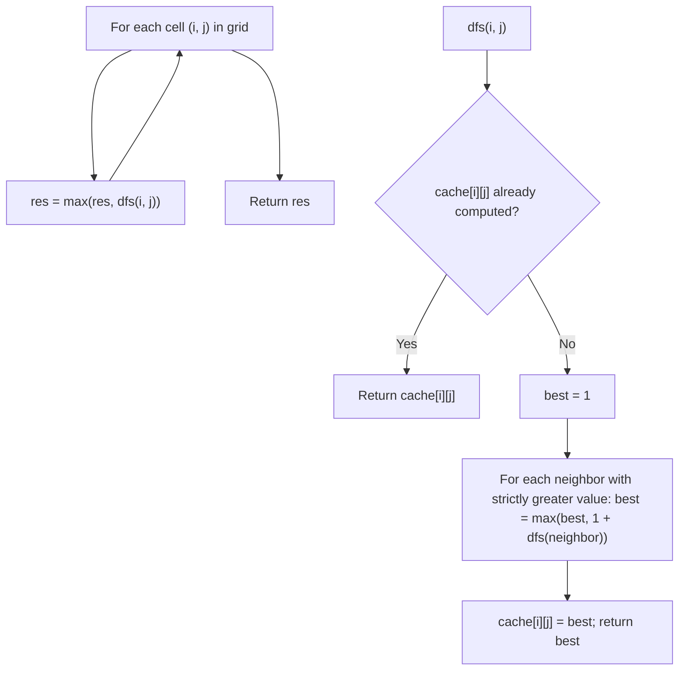

# Feature #4: Maximum Routers

## The problem

Picture routers wired up in a rectangular grid, each with an ID. A router can forward an important packet to any of its four neighbors — up, down, left, right — but only if that neighbor's ID is *strictly higher* than its own. We can inject the packet into any single router we like, and no router may receive the packet more than once. The goal: choose the starting router that lets the packet reach the maximum possible number of routers.

For example, given this 2 x 2 grid of router IDs:

```
1 2
4 3
```

Starting at the router with ID `1`, the packet can travel `1 -> 2 -> 3 -> 4` (each step to a strictly higher ID), reaching all `4` routers — the best possible outcome here.

## Solution

From any cell, we can move to a neighbor only if that neighbor's value is strictly greater than the current cell's — exactly the "longest increasing path" shape. A plain DFS from every cell, exploring every strictly-increasing direction and taking the max, would work, but it's wildly wasteful: the same cell gets recomputed over and over as different DFS calls path through it, blowing up to exponential time.

The fix is memoization. Once we know the longest reachable chain of routers starting from a given cell, that answer never changes — it only depends on the grid, not on how we arrived there. So we cache it: the first time we compute `dfs(i, j)`, we store the result; every subsequent time any other DFS call reaches `(i, j)`, it's a cache hit, no re-exploration needed. With every cell computed at most once, we simply run this cached DFS from every cell in the grid and keep the running maximum.



## Code

```java
class MaximumRouters {
    private static final int[][] DIRECTIONS = {{-1, 0}, {1, 0}, {0, -1}, {0, 1}};

    public static int maximumRouters(int[][] grid) {
        if (grid.length == 0) {
            return 0;
        }

        int rows = grid.length, cols = grid[0].length;
        int[][] cache = new int[rows][cols];
        int res = 0;

        for (int i = 0; i < rows; i++) {
            for (int j = 0; j < cols; j++) {
                res = Math.max(res, dfs(grid, i, j, cache));
            }
        }
        return res;
    }

    private static int dfs(int[][] grid, int i, int j, int[][] cache) {
        if (cache[i][j] != 0) {
            return cache[i][j];
        }

        int best = 1; // the router itself, with no forward hop
        for (int[] d : DIRECTIONS) {
            int ni = i + d[0], nj = j + d[1];
            if (ni >= 0 && nj >= 0 && ni < grid.length && nj < grid[0].length
                    && grid[ni][nj] > grid[i][j]) {
                best = Math.max(best, 1 + dfs(grid, ni, nj, cache));
            }
        }

        cache[i][j] = best;
        return best;
    }

    public static void main(String[] args) {
        int[][] grid = {
            {1, 2},
            {4, 3}
        };
        System.out.println(maximumRouters(grid));
        // 4
    }
}
```

## Complexity measures

Let **m** be the number of rows and **n** the number of columns of the grid.

### Time Complexity

`O(m x n)` — memoization guarantees every cell's `dfs` call does its real work exactly once; every later visit to that cell is an `O(1)` cache lookup.

### Space Complexity

`O(m x n)` — for the cache array (and the recursion stack, which in the worst case is bounded by the total number of cells too).
