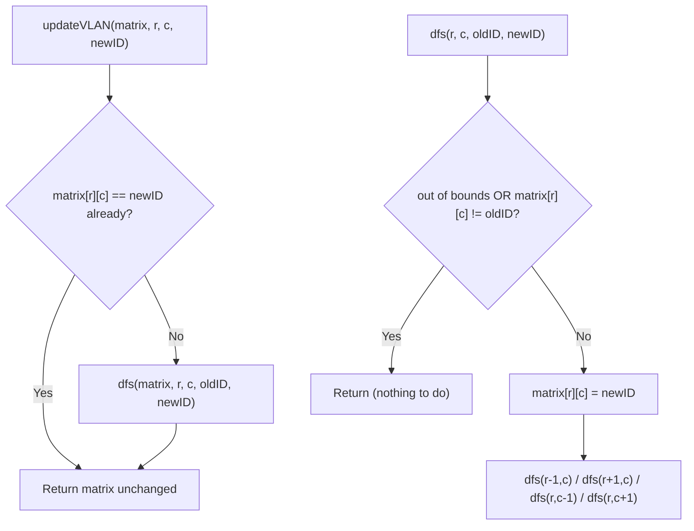

# Feature #5: Update VLAN ID

## The problem

Network switches are wired up in a rectangular grid, and each one is configured with a VLAN ID. Periodically, we need to change these IDs. A VLAN ID change request starts at one switch and propagates outward: a switch will only accept the change from a neighbor — up, down, left, or right — if that neighbor shares its *current* VLAN ID. The change keeps spreading this way until every reachable switch with the original ID has been updated.

We're given a grid of VLAN IDs, the row and column where the change starts, and the new ID to apply. For example, given:

```
1 1 1
1 1 0
1 0 1
```

starting at `(1, 1)` (which currently holds ID `1`) with a new ID of `2`, every `1`-valued switch reachable from `(1, 1)` through other `1`s gets updated:

```
2 2 2
2 2 0
2 0 1
```

The lone `1` at the bottom-right corner is not 4-directionally connected to the others, so it's untouched.

## Solution

This is the same four-direction neighbor exploration we saw in [Feature #4: Maximum Routers](04-feature-4-maximum-routers.md), just with a different acceptance rule: instead of "strictly greater," a neighbor joins the propagation only if it currently holds the *same* VLAN ID as the switch we started from.

We recursively visit the starting switch, update its ID, then recurse into its four neighbors — but only into neighbors that still hold the old ID. Since we update a switch's ID the moment we visit it, checking "does this neighbor still hold the old ID" doubles as our visited-check: once a switch is updated, it no longer matches the old ID, so we naturally never revisit it or loop forever.



## Code

```java
class UpdateVLAN {
    public static int[][] updateVLAN(int[][] matrix, int r, int c, int newID) {
        int currentID = matrix[r][c];
        if (currentID == newID) {
            return matrix;
        }
        dfs(matrix, r, c, currentID, newID);
        return matrix;
    }

    private static void dfs(int[][] matrix, int r, int c, int currentID, int newID) {
        if (r < 0 || c < 0 || r >= matrix.length || c >= matrix[0].length
                || matrix[r][c] != currentID) {
            return; // out of bounds, or already updated / never had the old ID
        }

        matrix[r][c] = newID;

        dfs(matrix, r - 1, c, currentID, newID); // up
        dfs(matrix, r + 1, c, currentID, newID); // down
        dfs(matrix, r, c - 1, currentID, newID); // left
        dfs(matrix, r, c + 1, currentID, newID); // right
    }

    public static void main(String[] args) {
        int[][] matrix = {
            {1, 1, 1},
            {1, 1, 0},
            {1, 0, 1}
        };
        int[][] updated = updateVLAN(matrix, 1, 1, 2);
        for (int[] row : updated) {
            System.out.println(java.util.Arrays.toString(row));
        }
        // [2, 2, 2]
        // [2, 2, 0]
        // [2, 0, 1]
    }
}
```

## Complexity measures

Let **n** be the number of switches in the grid.

### Time Complexity

`O(n)` — in the worst case, every switch shares the original VLAN ID and gets visited exactly once.

### Space Complexity

`O(n)` — the recursion stack can grow as deep as the number of connected switches in the worst case (e.g., a grid that's one long snaking chain of the same ID).
